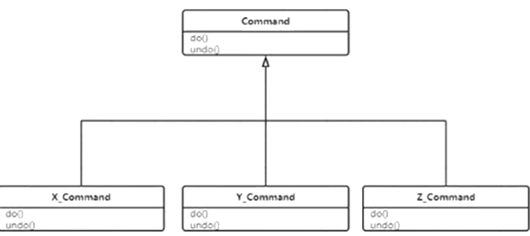

# Command

封装命令

结合cor实现undo撤销



封装各种命令类Command

```java
public abstract class Command {
    public abstract void doit(); //exec run

    public abstract void undo();
}
```

```java
public class Content {
    String msg = "hello everybody ";

}
```

```java
public class CopyCommand extends Command {
    Content c;

    public CopyCommand(Content c) {
        this.c = c;
    }

    @Override
    public void doit() {
        c.msg = c.msg + c.msg;
    }

    @Override
    public void undo() {
        c.msg = c.msg.substring(0, c.msg.length() / 2);
    }
}
```

```java
public class DeleteCommand extends Command {
    Content c;
    String deleted;

    public DeleteCommand(Content c) {
        this.c = c;
    }

    @Override
    public void doit() {
        deleted = c.msg.substring(0, 5);
        c.msg = c.msg.substring(5, c.msg.length());
    }

    @Override
    public void undo() {
        c.msg = deleted + c.msg;
    }
}
```

```java
public class InsertCommand extends Command {
    Content c;
    String strToInsert = "http://www.mashibing.com";

    public InsertCommand(Content c) {
        this.c = c;
    }

    @Override
    public void doit() {
        c.msg = c.msg + strToInsert;
    }

    @Override
    public void undo() {
        c.msg = c.msg.substring(0, c.msg.length() - strToInsert.length());
    }
}
```

```java
public class Main {
    public static void main(String[] args) {
        Content c = new Content();

        Command insertCommand = new InsertCommand(c);
        insertCommand.doit();
        insertCommand.undo();

        Command copyCommand = new CopyCommand(c);
        insertCommand.doit();
        insertCommand.undo();

        Command deleteCommand = new DeleteCommand(c);
        deleteCommand.doit();
        deleteCommand.undo();

        List<Command> commands = new ArrayList<>();
        commands.add(new InsertCommand(c));
        commands.add(new CopyCommand(c));
        commands.add(new DeleteCommand(c));

        for (Command comm : commands) {
            comm.doit();
        }


        System.out.println(c.msg);

        for (int i = commands.size() - 1; i >= 0; i--) {
            commands.get(i).undo();
        }


        System.out.println(c.msg);
    }
}
```