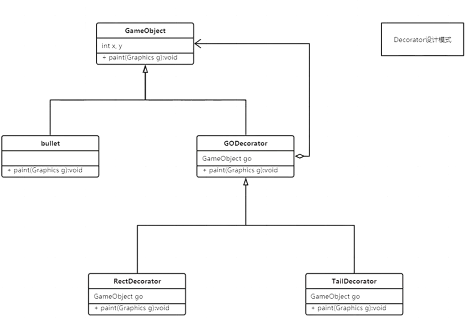

# Decorator（很少用到）

首先想到继承，但是如果装饰的东西太多就需要写好多子类，而且没有办法将不同的装饰组合到一起，所以装饰器继承父类并拥有父类的引用（聚合），在装饰类下继承进行装饰的添加。



### 游戏物体类GameObject

```java
public abstract class GameObject {
   public int x, y;
   
   public abstract void paint(Graphics g);

   public abstract int getWidth();
   public abstract int getHeigth();
}
```

### 装饰器类GODecorator

```java
public abstract class GODecorator extends GameObject {
    GameObject go;

    public GODecorator(GameObject go) {
        this.go = go;
    }
    @Override
    public  abstract void paint(Graphics g);

}
```

### 方块装饰类RectDecorator

```java
public class RectDecorator  extends  GODecorator{

    public RectDecorator(GameObject go) {
        super(go);
    }

    @Override
    public void paint(Graphics g) {

        this.x = go.x;
        this.y = go.y;

        go.paint(g);
        Color c = g.getColor();
        g.setColor(Color.WHITE);
        g.drawRect(super.go.x,super.go.y,super.go.getWidth()+2,super.go.getHeigth()+2);
        g.setColor(c);
    }
    @Override
    public int getWidth() {
        return super.go.getWidth();
    }

    @Override
    public int getHeigth() {
        return super.go.getHeigth();
    }
}
```

### 尾巴装饰类TailDecorator

```java
public class TailDecorator extends  GODecorator{

    public TailDecorator(GameObject go) {
        super(go);
    }

    @Override
    public void paint(Graphics g) {
        this.x = go.x;
        this.y = go.y;

        go.paint(g);
        Color c = g.getColor();
        g.setColor(Color.WHITE);
        g.drawLine(super.go.x,super.go.y,super.go.x + getWidth(),super.go.y + getHeigth());
        g.setColor(c);
    }
    @Override
    public int getWidth() {
        return super.go.getWidth();
    }

    @Override
    public int getHeigth() {
        return super.go.getHeigth();
    }
}
```

### 使用

```java
GameModel.getInstance().add(
      new RectDecorator(
            new TailDecorator(new Bullet(bX, bY, t.dir, t.group))));//装饰类嵌套使用
```

### 应用

IO流，包装类Reader 、Stream 