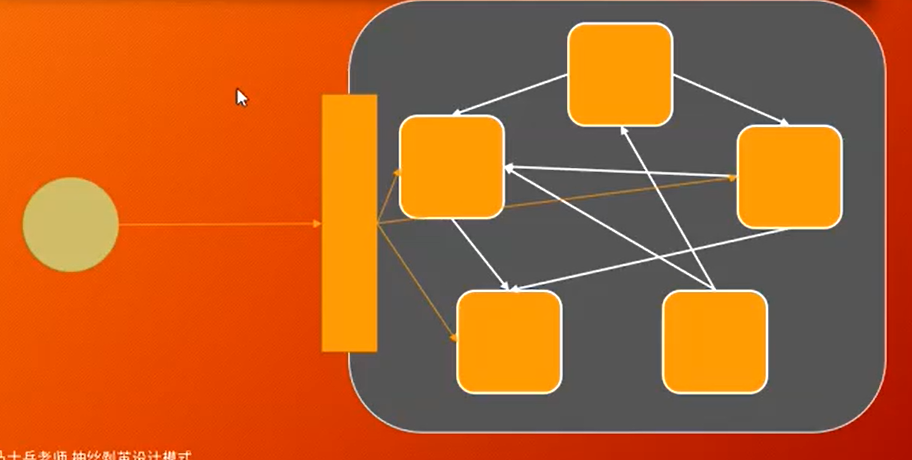

# Facade



门面调节复杂的关系

### 解决添加新游戏物体的问题

1.TF - Facade

​		Frame -> 展示

​		GameModel - > 内部逻辑计算

### GameModel门面

游戏中物体的大管家，tankframe中只需要持有GameModel即可

```java
public class GameModel {

   Tank myTank = new Tank(200, 400, Dir.DOWN, Group.GOOD, this);

   List<Bullet> bullets = new ArrayList<>();
   List<Tank> tanks = new ArrayList<>();
   List<Explode> explodes = new ArrayList<>();

   public GameModel() {
      int initTankCount = Integer.parseInt((String) PropertyMgr.get("initTankCount"));

      // 初始化敌方坦克
      for (int i = 0; i < initTankCount; i++) {
         tanks.add(new Tank(50 + i * 80, 200, Dir.DOWN, Group.BAD, this));
      }
   }

   public void paint(Graphics g) {
      Color c = g.getColor();
      g.setColor(Color.WHITE);
      g.drawString("子弹的数量:" + bullets.size(), 10, 60);
      g.drawString("敌人的数量:" + tanks.size(), 10, 80);
      g.drawString("爆炸的数量:" + explodes.size(), 10, 100);
      g.setColor(c);

      myTank.paint(g);
      for (int i = 0; i < bullets.size(); i++) {
         bullets.get(i).paint(g);
      }

      for (int i = 0; i < tanks.size(); i++) {
         tanks.get(i).paint(g);
      }

      for (int i = 0; i < explodes.size(); i++) {
         explodes.get(i).paint(g);
      }

      for (int i = 0; i < bullets.size(); i++) {
         for (int j = 0; j < tanks.size(); j++)
            bullets.get(i).collideWith(tanks.get(j));
      }

   }

   public Tank getMainTank() {
      return myTank;
   }

}
```