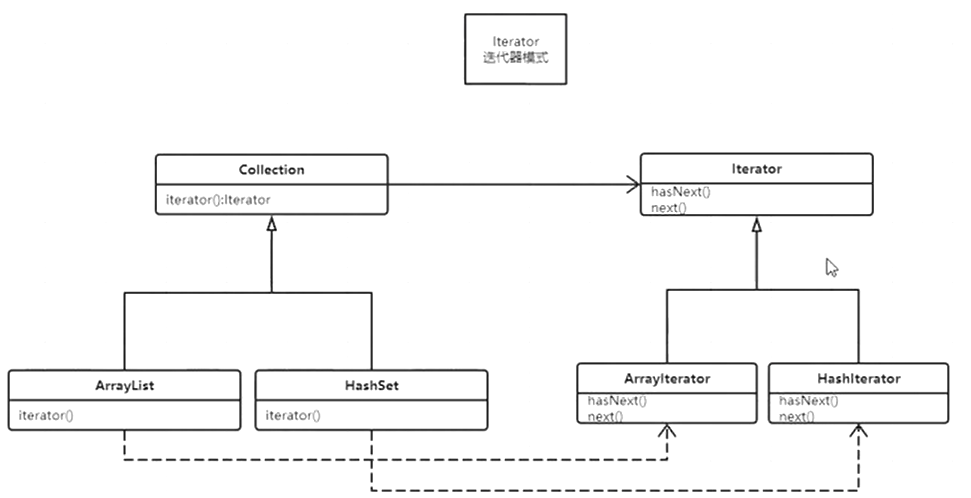

# Iterator

### 构建一个容器，可以添加对象数组实现

```java
/**
 * 构建一个容器，可以添加对象
 */

public class Main {
    public static void main(String[] args) {
        ArrayList_ list = new ArrayList_();
        for (int i = 0; i < 15; i++) {
            list.add(new String("s" + i));
        }
        System.out.println(list.size());
    }
}


/**
 * 相比数组，这个容器不用考虑边界问题，可以动态扩展
 */
class ArrayList_ {
    Object[] objects = new Object[10];
    //objects中下一个空的位置在哪儿,或者说，目前容器中有多少个元素
    private int index = 0;

    public void add(Object o) {
        if (index == objects.length) {
            Object[] newObjects = new Object[objects.length * 2];
            System.arraycopy(objects, 0, newObjects, 0, objects.length);
            objects = newObjects;
        }

        objects[index] = o;
        index++;
    }

    public int size() {
        return index;
    }
}
```

### 链表实现

```java
/**
 * v1:构建一个容器，可以添加对象
 * v2:用链表来实现一个容器
 */

public class Main {
    public static void main(String[] args) {
        LinkedList_ list = new LinkedList_();
        for (int i = 0; i < 15; i++) {
            list.add(new String("s" + i));
        }
        System.out.println(list.size());
    }
}


/**
 * 相比数组，这个容器不用考虑边界问题，可以动态扩展
 */
class LinkedList_ {
    Node head = null;
    Node tail = null;
    //目前容器中有多少个元素
    private int size = 0;

    public void add(Object o) {
        Node n = new Node(o);
        n.next = null;

        if (head == null) {
            head = n;
            tail = n;
        }

        tail.next = n;
        tail = n;
        size++;
    }

    private class Node {
        private Object o;
        Node next;

        public Node(Object o) {
            this.o = o;
        }
    }

    public int size() {
        return size;
    }
}
```

### 继承Collection切换两种实现

```java
/**
 * v1:构建一个容器，可以添加对象
 * v2:用链表来实现一个容器
 * v3:添加容器的共同接口，实现容器的替换
 */

public class Main {
    public static void main(String[] args) {
        Collection_ list = new ArrayList_();
        for (int i = 0; i < 15; i++) {
            list.add(new String("s" + i));
        }
        System.out.println(list.size());
    }
}
```

```java
public interface Collection_ {
    void add(Object o);

    int size();
}
```

### 尝试遍历

```java
package com.mashibing.dp.Iterator.v4;

/**
 * v1:构建一个容器，可以添加对象
 * v2:用链表来实现一个容器
 * v3:添加容器的共同接口，实现容器的替换
 * v4:如何对容器遍历呢？
 */

public class Main {
    public static void main(String[] args) {
        Collection_ list = new ArrayList_();
        for (int i = 0; i < 15; i++) {
            list.add(new String("s" + i));
        }
        System.out.println(list.size());


        ArrayList_ al = (ArrayList_) list;
        for (int i = 0; i < al.size(); i++) {
            //如果用这种遍历方式，就不能实现通用了
        }
    }
}
```

### 通用遍历每个容器实现它自己的遍历

定义迭代器接口

```java
public interface Iterator_ {
    boolean hasNext();

    Object next();
}
```

聚合迭代器接口

```java
public interface Collection_ {
    void add(Object o);

    int size();

    Iterator_ iterator();
}
```

```java
/**
 * v1:构建一个容器，可以添加对象
 * v2:用链表来实现一个容器
 * v3:添加容器的共同接口，实现容器的替换
 * v4:如何对容器遍历呢？
 * v4:用一种统一的遍历方式，要求每一个容器都要提供Iterator的实现类
 * 作业：实现LinkedList的Iterator
 */

public class Main {
    public static void main(String[] args) {
        Collection_ list = new ArrayList_();
        for (int i = 0; i < 15; i++) {
            list.add(new String("s" + i));
        }
        System.out.println(list.size());

        //这个接口的调用方式：
        Iterator_ it = list.iterator();
        while (it.hasNext()) {
            Object o = it.next();
            System.out.println(o);
        }
    }
}
```

arraylist实现

```java
/**
 * 相比数组，这个容器不用考虑边界问题，可以动态扩展
 */
class ArrayList_ implements Collection_ {
    Object[] objects = new Object[10];
    //objects中下一个空的位置在哪儿,或者说，目前容器中有多少个元素
    private int index = 0;

    public void add(Object o) {
        if (index == objects.length) {
            Object[] newObjects = new Object[objects.length * 2];
            System.arraycopy(objects, 0, newObjects, 0, objects.length);
            objects = newObjects;
        }

        objects[index] = o;
        index++;
    }

    public int size() {
        return index;
    }

    @Override
    public Iterator_ iterator() {
        return new ArrayListIterator();
    }

    private class ArrayListIterator implements Iterator_ {

        private int currentIndex = 0;

        @Override
        public boolean hasNext() {
            if (currentIndex >= index) return false;
            return true;
        }

        @Override
        public Object next() {
            Object o = objects[currentIndex];
            currentIndex++;
            return o;
        }
    }


}
```



### JDK泛型实现

```java
/**
 * v1:构建一个容器，可以添加对象
 * v2:用链表来实现一个容器
 * v3:添加容器的共同接口，实现容器的替换
 * v4:如何对容器遍历呢？
 * v4:用一种统一的遍历方式，要求每一个容器都要提供Iterator的实现类
 * 作业：实现LinkedList的Iterator
 * v6:JDK的容器实现
 * v7:实现泛型版本
 */

public class Main {
    public static void main(String[] args) {
        Collection_<String> list = new ArrayList_<>();
        for (int i = 0; i < 15; i++) {
            list.add(new String("s" + i));
        }
        System.out.println(list.size());

        //这个接口的调用方式：
        Iterator_<String> it = list.iterator();
        while (it.hasNext()) {
            String o = it.next();
            System.out.println(o);
        }
    }
}
```

```java
public interface Iterator_<E> { //Element //Type //K //Value V Tank
    boolean hasNext();

    E next(); //Tank next() Iterator_<Tank> it = ... Tank t = it.next();
}
```

```java
/**
 * 相比数组，这个容器不用考虑边界问题，可以动态扩展
 */
class ArrayList_<E> implements Collection_<E> {
    E[] objects = (E[]) new Object[10];
    //objects中下一个空的位置在哪儿,或者说，目前容器中有多少个元素
    private int index = 0;

    public void add(E o) {
        if (index == objects.length) {
            E[] newObjects = (E[]) new Object[objects.length * 2];
            System.arraycopy(objects, 0, newObjects, 0, objects.length);
            objects = newObjects;
        }

        objects[index] = o;
        index++;
    }

    public int size() {
        return index;
    }

    @Override
    public Iterator_<E> iterator() {
        return new ArrayListIterator();
    }

    private class ArrayListIterator<E> implements Iterator_<E> {

        private int currentIndex = 0;

        @Override
        public boolean hasNext() {
            if (currentIndex >= index) return false;
            return true;
        }

        @Override
        public E next() {
            E o = (E) objects[currentIndex];
            currentIndex++;
            return o;
        }
    }

}
```

