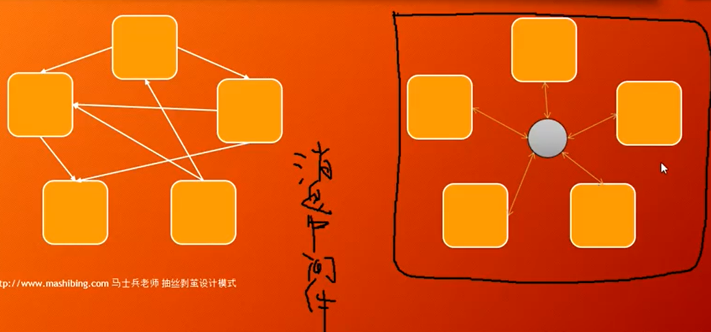

# 调停者Mediator

服务只和mediator打交道，服务互相之间不打交道



应用：消息中间件MQ，解耦

### GameModel

```java
public class GameModel {

   Tank myTank = new Tank(200, 400, Dir.DOWN, Group.GOOD, this);
   private List<GameObject> objects = new ArrayList<>();

   public GameModel() {
      int initTankCount = Integer.parseInt((String) PropertyMgr.get("initTankCount"));

      // 初始化敌方坦克
      for (int i = 0; i < initTankCount; i++) {
         add(new Tank(50 + i * 80, 200, Dir.DOWN, Group.BAD, this));
      }
   }

   public void add(GameObject go){
      this.objects.add(go);
   }

   public void remove(GameObject go){
      this.objects.remove(go);
   }

   public void paint(Graphics g) {
      Color c = g.getColor();
      g.setColor(Color.WHITE);
      g.setColor(c);

      myTank.paint(g);
      for (int i = 0; i < objects.size(); i++) {
         objects.get(i).paint(g);
      }
   }

   public Tank getMainTank() {
      return myTank;
   }

}
```

抽象出所有游戏物体的父类GameObject，每种物体继承GameObject并持有GameModel的引用，GameModel中里持有一个各种物体的集合，当添加新的物体时只需调用add方法