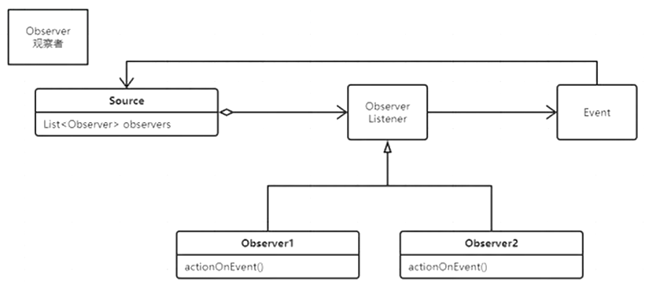

# 观察者Observer

**角色**

观察者：观察被观察者的不同事件进行反应

被观察者：调用观察者的方法进行处理

事件：被观察者的动作



### 初步加入观察者

```java
/**
 * 加入观察者，Dad观察者耦合高
 */

class Child {
    private boolean cry = false;
    private Dad d = new Dad();

    public boolean isCry() {
        return cry;
    }

    public void wakeUp() {
        cry = true;
        d.feed();
    }
}

class Dad {
    public void feed() {
        System.out.println("dad feeding...");
    }
}

public class Main {
    public static void main(String[] args) {
        Child c = new Child();
        //do sth
        c.wakeUp();
    }
}
```

### 加入多个观察者

```java
/**
 * 加入多个观察者dad，dog，mum
 */

class Child {
    private boolean cry = false;
    private Dad dad = new Dad();
    private Mum mum = new Mum();
    private Dog dog = new Dog();


    public boolean isCry() {
        return cry;
    }

    public void wakeUp() {
        cry = true;
        dad.feed();
        dog.wang();
        mum.hug();
    }
}

class Dad {
    public void feed() {
        System.out.println("dad feeding...");
    }
}

class Mum {
    public void hug() {
        System.out.println("mum hugging...");
    }
}

class Dog {
    public void wang() {
        System.out.println("dog wang...");
    }
}

public class Main {
    public static void main(String[] args) {
        Child c = new Child();
        //do sth
        c.wakeUp();
    }
}
```

### 观察者与被观察者分离（解耦）

```java
/**
 * 分离观察者与被观察者
 */

class Child {
    private boolean cry = false;
    private List<Observer> observers = new ArrayList<>();

    {
        observers.add(new Dad());
        observers.add(new Mum());
        observers.add(new Dog());
    }


    public boolean isCry() {
        return cry;
    }

    public void wakeUp() {
        cry = true;
        for (Observer o : observers) {
            o.actionOnWakeUp();
        }
    }
}

interface Observer {
    void actionOnWakeUp();
}

class Dad implements Observer {
    public void feed() {
        System.out.println("dad feeding...");
    }

    @Override
    public void actionOnWakeUp() {
        feed();
    }
}

class Mum implements Observer {
    public void hug() {
        System.out.println("mum hugging...");
    }

    @Override
    public void actionOnWakeUp() {
        hug();
    }
}

class Dog implements Observer {
    public void wang() {
        System.out.println("dog wang...");
    }

    @Override
    public void actionOnWakeUp() {
        wang();
    }
}

public class Main {
    public static void main(String[] args) {
        Child c = new Child();
        //do sth
        c.wakeUp();
    }
}
```

### 根据不同事件进行处理

```java
/**
 * 有很多时候，观察者需要根据事件的具体情况来进行处理
 */

class Child {
    private boolean cry = false;
    private List<Observer> observers = new ArrayList<>();

    {
        observers.add(new Dad());
        observers.add(new Mum());
        observers.add(new Dog());
    }


    public boolean isCry() {
        return cry;
    }

    public void wakeUp() {
        cry = true;

        wakeUpEvent event = new wakeUpEvent(System.currentTimeMillis(), "bed");

        for (Observer o : observers) {
            o.actionOnWakeUp(event);
        }
    }
}

//事件类 fire Event
class wakeUpEvent {
    long timestamp;
    String loc;

    public wakeUpEvent(long timestamp, String loc) {
        this.timestamp = timestamp;
        this.loc = loc;
    }
}

interface Observer {
    void actionOnWakeUp(wakeUpEvent event);
}

class Dad implements Observer {
    public void feed() {
        System.out.println("dad feeding...");
    }

    @Override
    public void actionOnWakeUp(wakeUpEvent event) {
        feed();
    }
}

class Mum implements Observer {
    public void hug() {
        System.out.println("mum hugging...");
    }

    @Override
    public void actionOnWakeUp(wakeUpEvent event) {
        hug();
    }
}

class Dog implements Observer {
    public void wang() {
        System.out.println("dog wang...");
    }

    @Override
    public void actionOnWakeUp(wakeUpEvent event) {
        wang();
    }
}

public class Main {
    public static void main(String[] args) {
        Child c = new Child();
        //do sth
        c.wakeUp();
    }
}
```

### 处理事件的时候需要获得事件源

```java
/**
 * 有很多时候，观察者需要根据事件的具体情况来进行处理
 * 大多数时候，我们处理事件的时候，需要事件源对象
 */

class Child {
    private boolean cry = false;
    private List<Observer> observers = new ArrayList<>();

    {
        observers.add(new Dad());
        observers.add(new Mum());
        observers.add(new Dog());
    }


    public boolean isCry() {
        return cry;
    }

    public void wakeUp() {
        cry = true;

        wakeUpEvent event = new wakeUpEvent(System.currentTimeMillis(), "bed", this);

        for (Observer o : observers) {
            o.actionOnWakeUp(event);
        }
    }
}

class wakeUpEvent {
    long timestamp;
    String loc;
    Child source;

    public wakeUpEvent(long timestamp, String loc, Child source) {
        this.timestamp = timestamp;
        this.loc = loc;
        this.source = source;
    }
}

interface Observer {
    void actionOnWakeUp(wakeUpEvent event);
}

class Dad implements Observer {
    public void feed() {
        System.out.println("dad feeding...");
    }

    @Override
    public void actionOnWakeUp(wakeUpEvent event) {
        feed();
    }
}

class Mum implements Observer {
    public void hug() {
        System.out.println("mum hugging...");
    }

    @Override
    public void actionOnWakeUp(wakeUpEvent event) {
        hug();
    }
}

class Dog implements Observer {
    public void wang() {
        System.out.println("dog wang...");
    }

    @Override
    public void actionOnWakeUp(wakeUpEvent event) {
        wang();
    }
}

public class Main {
    public static void main(String[] args) {
        Child c = new Child();
        //do sth
        c.wakeUp();
    }
}
```

### 事件继承

```java
/**
 * 有很多时候，观察者需要根据事件的具体情况来进行处理
 * 大多数时候，我们处理事件的时候，需要事件源对象
 * 事件也可以形成继承体系
 */

class Child {
    private boolean cry = false;
    private List<Observer> observers = new ArrayList<>();

    {
        observers.add(new Dad());
        observers.add(new Mum());
        observers.add(new Dog());
        observers.add((e) -> {
            System.out.println("ppp");
        });
        //hook callback function
    }


    public boolean isCry() {
        return cry;
    }

    public void wakeUp() {
        cry = true;

        wakeUpEvent event = new wakeUpEvent(System.currentTimeMillis(), "bed", this);

        for (Observer o : observers) {
            o.actionOnWakeUp(event);
        }
    }
}

abstract class Event<T> {
    abstract T getSource();
}

class wakeUpEvent extends Event<Child> {
    long timestamp;
    String loc;
    Child source;

    public wakeUpEvent(long timestamp, String loc, Child source) {
        this.timestamp = timestamp;
        this.loc = loc;
        this.source = source;
    }

    @Override
    Child getSource() {
        return source;
    }
}

interface Observer {
    void actionOnWakeUp(wakeUpEvent event);
}

class Dad implements Observer {
    public void feed() {
        System.out.println("dad feeding...");
    }

    @Override
    public void actionOnWakeUp(wakeUpEvent event) {
        feed();
    }
}

class Mum implements Observer {
    public void hug() {
        System.out.println("mum hugging...");
    }

    @Override
    public void actionOnWakeUp(wakeUpEvent event) {
        hug();
    }
}

class Dog implements Observer {
    public void wang() {
        System.out.println("dog wang...");
    }

    @Override
    public void actionOnWakeUp(wakeUpEvent event) {
        wang();
    }
}

public class Main {
    public static void main(String[] args) {
        Child c = new Child();
        //do sth
        c.wakeUp();
    }
}
```

### 应用

```java
public class TestFrame extends Frame {
    public void launch() {
        Button b = new Button("press me");
        b.addActionListener(new MyActionListener());
        b.addActionListener(new MyActionListener2());
        this.add(b);
        this.pack();

        this.addWindowListener(new WindowAdapter() {

            @Override
            public void windowClosing(WindowEvent e) {
                System.exit(0);
            }

        });
        this.setLocation(400, 400);
        this.setVisible(true);
    }

    public static void main(String[] args) {
        new TestFrame().launch();
    }

    private class MyActionListener implements ActionListener { //Observer

        public void actionPerformed(ActionEvent e) {
            ((Button) e.getSource()).setLabel("press me again!");
            System.out.println("button pressed!");
        }

    }

    private class MyActionListener2 implements ActionListener {

        public void actionPerformed(ActionEvent e) {
            System.out.println("button pressed 2!");
        }

    }
}
```

```java
public class Test {
    public static void main(String[] args) {
        Button b = new Button();
        b.addActionListener(new MyActionListener());
        b.addActionListener(new MyActionListener2());
        b.buttonPressed();
    }
}

class Button {

    private List<ActionListener> actionListeners = new ArrayList<ActionListener>();

    public void buttonPressed() {
        ActionEvent e = new ActionEvent(System.currentTimeMillis(), this);
        for (int i = 0; i < actionListeners.size(); i++) {
            ActionListener l = actionListeners.get(i);
            l.actionPerformed(e);
        }
    }

    public void addActionListener(ActionListener l) {
        actionListeners.add(l);
    }
}

interface ActionListener {
    public void actionPerformed(ActionEvent e);
}

class MyActionListener implements ActionListener {

    public void actionPerformed(ActionEvent e) {
        System.out.println("button pressed!");
    }

}

class MyActionListener2 implements ActionListener {

    public void actionPerformed(ActionEvent e) {
        System.out.println("button pressed 2!");
    }

}

class ActionEvent {

    long when;
    Object source;

    public ActionEvent(long when, Object source) {
        super();
        this.when = when;
        this.source = source;
    }


    public long getWhen() {
        return when;
    }

    public Object getSource() {
        return source;
    }

}
```

## 钩子函数 hook callback function

这件事一发生自动执行（本质就是Observer）

## 总结

Observer、Listener、Hook、Callback本质都是观察者模式