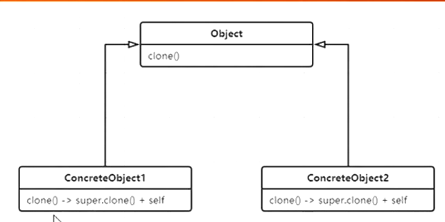

# Prototype

克隆一个类



java自带原型模式，需要实现Cloneable接口 ，重写Clone方法

浅克隆，引用会影响

```java
public class Test {
    public static void main(String[] args) throws Exception {
        Person p1 = new Person();
        Person p2 = (Person) p1.clone();
        System.out.println(p2.age + " " + p2.score);
        System.out.println(p2.loc);

        System.out.println(p1.loc == p2.loc);//true 指向相同的location
        p1.loc.street = "sh";
        System.out.println(p2.loc);

    }
}

class Person implements Cloneable {//标记性接口，不用实现
    int age = 8;
    int score = 100;

    Location loc = new Location("bj", 22);

    @Override
    public Object clone() throws CloneNotSupportedException {
        return super.clone();
    }
}

class Location {
    String street;
    int roomNo;

    @Override
    public String toString() {
        return "Location{" +
                "street='" + street + '\'' +
                ", roomNo=" + roomNo +
                '}';
    }

    public Location(String street, int roomNo) {
        this.street = street;
        this.roomNo = roomNo;
    }
}
```

深克隆

```java
/**
 * 深克隆的处理
 */
public class Test {
    public static void main(String[] args) throws Exception {
        Person p1 = new Person();
        Person p2 = (Person) p1.clone();
        System.out.println(p2.age + " " + p2.score);
        System.out.println(p2.loc);

        System.out.println(p1.loc == p2.loc);
        p1.loc.street = "sh";
        System.out.println(p2.loc);


    }
}

class Person implements Cloneable {
    int age = 8;
    int score = 100;

    Location loc = new Location("bj", 22);

    @Override
    public Object clone() throws CloneNotSupportedException {
        Person p = (Person) super.clone();
        p.loc = (Location) loc.clone();
        return p;
    }
}

class Location implements Cloneable {//实现Cloneable
    String street;
    int roomNo;

    @Override
    public String toString() {
        return "Location{" +
                "street='" + street + '\'' +
                ", roomNo=" + roomNo +
                '}';
    }

    public Location(String street, int roomNo) {
        this.street = street;
        this.roomNo = roomNo;
    }

    @Override
    public Object clone() throws CloneNotSupportedException {
        return super.clone();
    }
}
```

String不需要克隆

```java
/**
 * String需要进一步深克隆吗？ 不需要
 */
public class Test {
    public static void main(String[] args) throws Exception {
        Person p1 = new Person();
        Person p2 = (Person) p1.clone();
        System.out.println(p2.age + " " + p2.score);
        System.out.println(p2.loc);

        System.out.println(p1.loc == p2.loc);
        p1.loc.street = "sh";
        System.out.println(p2.loc);

        p1.loc.street.replace("sh", "sz");
        System.out.println(p2.loc.street);
    }
}

class Person implements Cloneable {
    int age = 8;
    int score = 100;

    Location loc = new Location("bj", 22);

    @Override
    public Object clone() throws CloneNotSupportedException {
        Person p = (Person) super.clone();
        p.loc = (Location) loc.clone();
        return p;
    }
}

class Location implements Cloneable {
    String street;
    int roomNo;

    @Override
    public String toString() {
        return "Location{" +
                "street='" + street + '\'' +
                ", roomNo=" + roomNo +
                '}';
    }

    public Location(String street, int roomNo) {
        this.street = street;
        this.roomNo = roomNo;
    }

    @Override
    public Object clone() throws CloneNotSupportedException {
        return super.clone();
    }
}
```

```java
/**
 * String需要进一步深克隆吗？
 */
public class Test {
    public static void main(String[] args) throws Exception {
        Person p1 = new Person();
        Person p2 = (Person) p1.clone();
        System.out.println("p1.loc == p2.loc? " + (p1.loc == p2.loc));

        p1.loc.street.reverse();
        System.out.println(p2.loc.street);//p1影响p2，因为new出来的
    }
}

class Person implements Cloneable {
    int age = 8;
    int score = 100;

    Location loc = new Location(new StringBuilder("bj"), 22);

    @Override
    public Object clone() throws CloneNotSupportedException {
        Person p = (Person) super.clone();
        p.loc = (Location) loc.clone();
        return p;
    }
}

class Location implements Cloneable {
    StringBuilder street;
    int roomNo;

    @Override
    public String toString() {
        return "Location{" +
                "street='" + street + '\'' +
                ", roomNo=" + roomNo +
                '}';
    }

    public Location(StringBuilder street, int roomNo) {
        this.street = street;
        this.roomNo = roomNo;
    }

    @Override
    public Object clone() throws CloneNotSupportedException {
        return super.clone();
    }
}
```