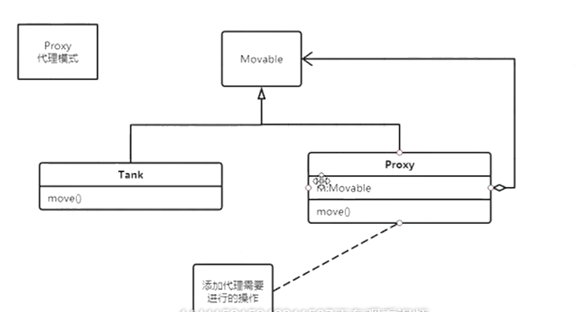
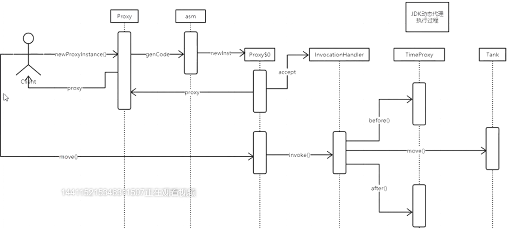
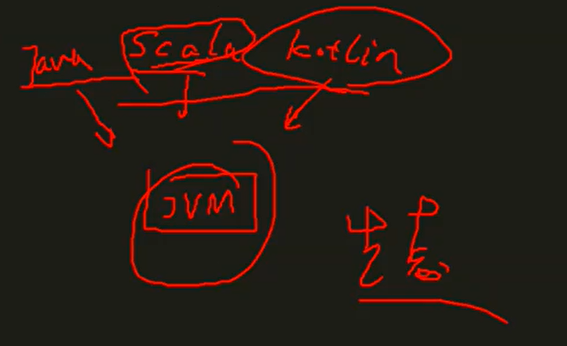

# Proxy




### 记录坦克的移动时间

```java
/**
 * 问题：我想记录坦克的移动时间
 * 最简单的办法：修改代码，记录时间
 * 问题2：如果无法改变方法源码呢？ benchmark
 */
public class Tank implements Movable {

    /**
     * 模拟坦克移动了一段儿时间
     */
    @Override
    public void move() {
        long start = System.currentTimeMillis();

        System.out.println("Tank moving claclacla...");
        try {
            Thread.sleep(new Random().nextInt(10000));
        } catch (InterruptedException e) {
            e.printStackTrace();
        }

        long end = System.currentTimeMillis();
        System.out.println(end - start);
    }

    public static void main(String[] args) {
        new Tank().move();
    }
}

interface Movable {
    void move();
}
```

### 用继承？

```java
/**
 * 问题：我想记录坦克的移动时间
 * 最简单的办法：修改代码，记录时间
 * 问题2：如果无法改变方法源码呢？
 * 用继承？
 */
public class Tank implements Movable {

    /**
     * 模拟坦克移动了一段儿时间
     */
    @Override
    public void move() {
        System.out.println("Tank moving claclacla...");
        try {
            Thread.sleep(new Random().nextInt(10000));
        } catch (InterruptedException e) {
            e.printStackTrace();
        }
    }

    public static void main(String[] args) {
        new Tank2().move();
    }
}

class Tank2 extends Tank {
    @Override
    public void move() {
        long start = System.currentTimeMillis();
        super.move();
        long end = System.currentTimeMillis();
        System.out.println(end - start);
    }
}

interface Movable {
    void move();
}
```

### 使用代理

```java
/**
 * 问题：我想记录坦克的移动时间
 * 最简单的办法：修改代码，记录时间
 * 问题2：如果无法改变方法源码呢？
 * 用继承？
 * v05:使用代理
 */
public class Tank implements Movable {

    /**
     * 模拟坦克移动了一段儿时间
     */
    @Override
    public void move() {
        System.out.println("Tank moving claclacla...");
        try {
            Thread.sleep(new Random().nextInt(10000));
        } catch (InterruptedException e) {
            e.printStackTrace();
        }
    }

    public static void main(String[] args) {
        new TankTimeProxy(new Tank()).move();
    }
}

class TankTimeProxy implements Movable {

    Tank tank;

    public TankTimeProxy(Tank tank) {
        this.tank = tank;
    }

    @Override
    public void move() {
        long start = System.currentTimeMillis();
        tank.move();
        long end = System.currentTimeMillis();
        System.out.println(end - start);
    }
}

interface Movable {
    void move();
}
```

### 使用不同代理

```java
/**
 * 问题：我想记录坦克的移动时间
 * 最简单的办法：修改代码，记录时间
 * 问题2：如果无法改变方法源码呢？
 * 用继承？
 * v05:使用代理
 * v06:代理有各种类型
 * 问题：如何实现代理的各种组合？继承？Decorator?
 */
public class Tank implements Movable {

    /**
     * 模拟坦克移动了一段儿时间
     */
    @Override
    public void move() {
        System.out.println("Tank moving claclacla...");
        try {
            Thread.sleep(new Random().nextInt(10000));
        } catch (InterruptedException e) {
            e.printStackTrace();
        }
    }

    public static void main(String[] args) {
        new TankTimeProxy().move();
    }
}

class TankTimeProxy implements Movable {
    Tank tank;

    @Override
    public void move() {
        long start = System.currentTimeMillis();
        tank.move();
        long end = System.currentTimeMillis();
        System.out.println(end - start);
    }
}

class TankLogProxy implements Movable {
    Tank tank;

    @Override
    public void move() {
        System.out.println("start moving...");
        tank.move();
        System.out.println("stopped!");
    }
}

interface Movable {
    void move();
}
```

### 静态代理聚合movable

```java
/**
 * 问题：我想记录坦克的移动时间
 * 最简单的办法：修改代码，记录时间
 * 问题2：如果无法改变方法源码呢？
 * 用继承？
 * v05:使用代理
 * v06:代理有各种类型
 * 问题：如何实现代理的各种组合？继承？Decorator?
 * v07:代理的对象改成Movable类型-越来越像decorator了
 */
public class Tank implements Movable {

    /**
     * 模拟坦克移动了一段儿时间
     */
    @Override
    public void move() {
        System.out.println("Tank moving claclacla...");
        try {
            Thread.sleep(new Random().nextInt(10000));
        } catch (InterruptedException e) {
            e.printStackTrace();
        }
    }

    public static void main(String[] args) {

        Tank t = new Tank();
        TankTimeProxy ttp = new TankTimeProxy(t);
        TankLogProxy tlp = new TankLogProxy(ttp);
        tlp.move();

//        new TankLogProxy(
//                new TankTimeProxy(
//                        new Tank()
//                )
//        ).move();
    }
}

class TankTimeProxy implements Movable {
    Movable m;

    public TankTimeProxy(Movable m) {
        this.m = m;
    }

    @Override
    public void move() {
        long start = System.currentTimeMillis();
        m.move();
        long end = System.currentTimeMillis();
        System.out.println(end - start);
    }
}

class TankLogProxy implements Movable {
    Movable m;

    public TankLogProxy(Movable m) {
        this.m = m;
    }

    @Override
    public void move() {
        System.out.println("start moving...");
        m.move();
        long end = System.currentTimeMillis();
        System.out.println("stopped!");
    }
}

interface Movable {
    void move();
}
```

### 动态代理

```java
/**
 * 问题：我想记录坦克的移动时间
 * 最简单的办法：修改代码，记录时间
 * 问题2：如果无法改变方法源码呢？
 * 用继承？
 * v05:使用代理
 * v06:代理有各种类型
 * 问题：如何实现代理的各种组合？继承？Decorator?
 * v07:代理的对象改成Movable类型-越来越像decorator了
 * v08:如果有stop方法需要代理...
 * 如果想让LogProxy可以重用，不仅可以代理Tank，还可以代理任何其他可以代理的类型 Object
 * （毕竟日志记录，时间计算是很多方法都需要的东西），这时该怎么做呢？
 * 分离代理行为与被代理对象
 * 使用jdk的动态代理
 */
public class Tank implements Movable {

    /**
     * 模拟坦克移动了一段儿时间
     */
    @Override
    public void move() {
        System.out.println("Tank moving claclacla...");
        try {
            Thread.sleep(new Random().nextInt(10000));
        } catch (InterruptedException e) {
            e.printStackTrace();
        }
    }

    public static void main(String[] args) {
        Tank tank = new Tank();

        //reflection 通过二进制字节码分析类的属性和方法
		//类加载器使用被代理类的加载器
        Movable m = (Movable) Proxy.newProxyInstance(Tank.class.getClassLoader(),
                new Class[]{Movable.class}, //tank.class.getInterfaces()
                new LogHander(tank)
        );

        m.move();
    }
}

class LogHander implements InvocationHandler {

    Tank tank;

    public LogHander(Tank tank) {
        this.tank = tank;
    }

    //getClass.getMethods[]
    
    @Override
    public Object invoke(Object proxy, Method method, Object[] args) throws Throwable {
        System.out.println("method " + method.getName() + " start..");
        Object o = method.invoke(tank, args);
        System.out.println("method " + method.getName() + " end!");
        return o;
    }
}


interface Movable {
    void move();
}
```

### 动态代理实现过程

```java
package com.mashibing.dp.proxy.v10;


import java.lang.reflect.InvocationHandler;
import java.lang.reflect.Method;
import java.lang.reflect.Proxy;
import java.util.Arrays;
import java.util.Random;

/**
 * 问题：我想记录坦克的移动时间
 * 最简单的办法：修改代码，记录时间
 * 问题2：如果无法改变方法源码呢？
 * 用继承？
 * v05:使用代理
 * v06:代理有各种类型
 * 问题：如何实现代理的各种组合？继承？Decorator?
 * v07:代理的对象改成Movable类型-越来越像decorator了
 * v08:如果有stop方法需要代理...
 * 如果想让LogProxy可以重用，不仅可以代理Tank，还可以代理任何其他可以代理的类型
 * （毕竟日志记录，时间计算是很多方法都需要的东西），这时该怎么做呢？
 * 分离代理行为与被代理对象
 * 使用jdk的动态代理
 * <p>
 * v09: 横切代码与业务逻辑代码分离 AOP
 * v10: 通过反射观察生成的代理对象
 * jdk反射生成代理必须面向接口，这是由Proxy的内部实现决定的
 */
public class Tank implements Movable {

    /**
     * 模拟坦克移动了一段儿时间
     */
    @Override
    public void move() {
        System.out.println("Tank moving claclacla...");
        try {
            Thread.sleep(new Random().nextInt(10000));
        } catch (InterruptedException e) {
            e.printStackTrace();
        }
    }

    public static void main(String[] args) {
        Tank tank = new Tank();
		//把生成的代理类保存下来
         //如果没有效果替换成sun.misc.ProxyGenerator.saveGeneratedFiles （1.8 ）JDK版本不同
        System.getProperties().put("jdk.proxy.ProxyGenerator.saveGeneratedFiles", "true");

        Movable m = (Movable) Proxy.newProxyInstance(Tank.class.getClassLoader(),
                new Class[]{Movable.class}, //tank.class.getInterfaces()
                new TimeProxy(tank)
        );

        m.move();

    }
}

class TimeProxy implements InvocationHandler {
    Movable m;

    public TimeProxy(Movable m) {
        this.m = m;
    }

    public void before() {
        System.out.println("method start..");
    }

    public void after() {
        System.out.println("method stop..");
    }
	//Object proxy 是动态生成的代理对象
    @Override
    public Object invoke(Object proxy, Method method, Object[] args) throws Throwable {
        //Arrays.stream(proxy.getClass().getMethods()).map(Method::getName).forEach(System.out::println);

        //AOP
        before();
        Object o = method.invoke(m, args);
        after();
        return o;
    }

}

interface Movable {
    void move();
}
```

动态生成的类

```java
//IDEA 反编译文件
import java.lang.reflect.InvocationHandler;
import java.lang.reflect.Method;
import java.lang.reflect.Proxy;
import java.lang.reflect.UndeclaredThrowableException;

//实现了Movable接口
final class $Proxy0 extends Proxy implements Movable {
    private static Method m1;
    private static Method m3;
    private static Method m2;
    private static Method m0;

    //new时传入InvocationHandler
    //Proxy类的 protected InvocationHandler h;

    public $Proxy0(InvocationHandler var1) throws  {
        super(var1);
    }

    public final boolean equals(Object var1) throws  {
        try {
            return (Boolean)super.h.invoke(this, m1, new Object[]{var1});
        } catch (RuntimeException | Error var3) {
            throw var3;
        } catch (Throwable var4) {
            throw new UndeclaredThrowableException(var4);
        }
    }

    //代理的方法
    //Proxy类的 protected InvocationHandler h;

    public final void move() throws  {
        try {
            //m3 就是move方法
            super.h.invoke(this, m3, (Object[])null);
        } catch (RuntimeException | Error var2) {
            throw var2;
        } catch (Throwable var3) {
            throw new UndeclaredThrowableException(var3);
        }
    }

    public final String toString() throws  {
        try {
            return (String)super.h.invoke(this, m2, (Object[])null);
        } catch (RuntimeException | Error var2) {
            throw var2;
        } catch (Throwable var3) {
            throw new UndeclaredThrowableException(var3);
        }
    }

    public final int hashCode() throws  {
        try {
            return (Integer)super.h.invoke(this, m0, (Object[])null);
        } catch (RuntimeException | Error var2) {
            throw var2;
        } catch (Throwable var3) {
            throw new UndeclaredThrowableException(var3);
        }
    }

    static {
        try {
            m1 = Class.forName("java.lang.Object").getMethod("equals", Class.forName("java.lang.Object"));
            m3 = Class.forName("com.mashibing.dp.proxy.v10.Movable").getMethod("move");
            m2 = Class.forName("java.lang.Object").getMethod("toString");
            m0 = Class.forName("java.lang.Object").getMethod("hashCode");
        } catch (NoSuchMethodException var2) {
            throw new NoSuchMethodError(var2.getMessage());
        } catch (ClassNotFoundException var3) {
            throw new NoClassDefFoundError(var3.getMessage());
        }
    }
}
```

### 当有多个方法时

```java
@Override
    public Object invoke(Object proxy, Method method, Object[] args) throws Throwable {
        String name = method.getName();//获取方法名做if判断
        Object o=null;
        if (name == "stop") {
            before();
            o = method.invoke(m, args);
            after();
        }
        return o;
    }

}

interface Movable {
    void move();
    void stop();
}
```

### JDK动态代理



### Proxy.getInstance()源码分析asm实现（参考JDK11，下图是JDK8）

```java
public static Object newProxyInstance(ClassLoader loader,
                                      Class<?>[] interfaces,
                                      InvocationHandler h)
    throws IllegalArgumentException
{
    //非空检查
    Objects.requireNonNull(h);

    final Class<?>[] intfs = interfaces.clone();
    
    //安全检查
    final SecurityManager sm = System.getSecurityManager();
    if (sm != null) {
        checkProxyAccess(Reflection.getCallerClass(), loader, intfs);
    }

    /*
     * Look up or generate the designated proxy class.寻找生成代理类
     */
    Class<?> cl = getProxyClass0(loader, intfs);

    /*
     * Invoke its constructor with the designated invocation handler.
     */
    try {
        if (sm != null) {
            checkNewProxyPermission(Reflection.getCallerClass(), cl);
        }

        //getConstructor
        final Constructor<?> cons = cl.getConstructor(constructorParams);
        final InvocationHandler ih = h;
        if (!Modifier.isPublic(cl.getModifiers())) {
            AccessController.doPrivileged(new PrivilegedAction<Void>() {
                public Void run() {
                    cons.setAccessible(true);
                    return null;
                }
            });
        }
        return cons.newInstance(new Object[]{h});
    } catch (IllegalAccessException|InstantiationException e) {
        throw new InternalError(e.toString(), e);
    } catch (InvocationTargetException e) {
        Throwable t = e.getCause();
        if (t instanceof RuntimeException) {
            throw (RuntimeException) t;
        } else {
            throw new InternalError(t.toString(), t);
        }
    } catch (NoSuchMethodException e) {
        throw new InternalError(e.toString(), e);
    }
}
```

动态语言

在运行的时候直接改变类里面的属性和方法，java因为asm才被称为动态语言，反射只能找到类的属性和方法，asm改变



不写java代码只要能生成字节码的语言

### Instrument实现动态代理

钩子函数，JDK中任何一个class load内存的时候被拦截（比asm还强大，使用繁琐）


### Cglib（Code Generate Library）

需要引入依赖

Cglib

底层asm

```java
import net.sf.cglib.proxy.Enhancer;
import net.sf.cglib.proxy.MethodInterceptor;
import net.sf.cglib.proxy.MethodProxy;

import java.lang.reflect.Method;
import java.util.Random;

/**
 * CGLIB实现动态代理不需要接口
 */
public class Main {
    public static void main(String[] args) {
        Enhancer enhancer = new Enhancer();
        enhancer.setSuperclass(Tank.class);
        enhancer.setCallback(new TimeMethodInterceptor());// == InvocationHandler
        Tank tank = (Tank) enhancer.create();
        tank.move();
    }
}

class TimeMethodInterceptor implements MethodInterceptor {

    @Override
    public Object intercept(Object o, Method method, Object[] objects, MethodProxy methodProxy) throws Throwable {
		//动态生成Tank类的子类o
        System.out.println(o.getClass().getSuperclass().getName());
        System.out.println("before");
        Object result = null;
        result = methodProxy.invokeSuper(o, objects);
        System.out.println("after");
        return result;
    }
}

class Tank {
    public void move() {
        System.out.println("Tank moving claclacla...");
        try {
            Thread.sleep(new Random().nextInt(10000));
        } catch (InterruptedException e) {
            e.printStackTrace();
        }
    }
}
```

**缺陷**：如果Tank类被final修饰就不能使用

# ASM

### 读一个没有源代码的class类

```java
public class ClassPrinter extends ClassVisitor {
    public ClassPrinter() {
        super(ASM4);
    }

    @Override
    public void visit(int version, int access, String name, String signature, String superName, String[] interfaces) {
        System.out.println(name + " extends " + superName + "{");
    }

    @Override
    public FieldVisitor visitField(int access, String name, String descriptor, String signature, Object value) {
        System.out.println("    " + name);
        return null;
    }

    @Override
    public MethodVisitor visitMethod(int access, String name, String descriptor, String signature, String[] exceptions) {
        System.out.println("    " + name + "()");
        return null;
    }

    @Override
    public void visitEnd() {

        System.out.println("}");
    }

    public static void main(String[] args) throws IOException {
        ClassPrinter cp = new ClassPrinter();
        //ClassReader cr = new ClassReader("java.lang.Runnable");
        ClassReader cr = new ClassReader(
                ClassPrinter.class.getClassLoader().getResourceAsStream("com/mashibing/dp/ASM/T1.class"));


        cr.accept(cp, 0);
    }
}
```

不写源代码，直接生成class文件，用于别的语言生成class

```java
public class ClassWriteTest {
    public static void main(String[] args) {
        ClassWriter cw = new ClassWriter(0);
        cw.visit(V1_5, ACC_PUBLIC + ACC_ABSTRACT + ACC_INTERFACE,
                "pkg/Comparable", null, "java/lang/Object",
                null);
        cw.visitField(ACC_PUBLIC + ACC_FINAL + ACC_STATIC, "LESS", "I",
                null, -1).visitEnd();
        cw.visitField(ACC_PUBLIC + ACC_FINAL + ACC_STATIC, "EQUAL", "I",
                null, 0).visitEnd();
        cw.visitField(ACC_PUBLIC + ACC_FINAL + ACC_STATIC, "GREATER", "I",
                null, 1).visitEnd();
        cw.visitMethod(ACC_PUBLIC + ACC_ABSTRACT, "compareTo",
                "(Ljava/lang/Object;)I", null, null).visitEnd();
        cw.visitEnd();
        byte[] b = cw.toByteArray();

        MyClassLoader myClassLoader = new MyClassLoader();
        Class c = myClassLoader.defineClass("pkg.Comparable", b);
        System.out.println(c.getMethods()[0].getName());
    }
}
```

## Asm生成动态代理

```java
public class ClassTransformerTest {
    public static void main(String[] args) throws Exception {
        ClassReader cr = new ClassReader(
                ClassPrinter.class.getClassLoader().getResourceAsStream("com/mashibing/dp/ASM/Tank.class"));

        ClassWriter cw = new ClassWriter(0);
        
        //动态代理，责任链模式
        ClassVisitor cv = new ClassVisitor(ASM4, cw) {
            @Override
            public MethodVisitor visitMethod(int access, String name, String descriptor, String signature, String[] exceptions) {
                MethodVisitor mv = super.visitMethod(access, name, descriptor, signature, exceptions);
                //return mv;
                return new MethodVisitor(ASM4, mv) {
                    @Override
                    public void visitCode() {
                        //汇编
                        visitMethodInsn(INVOKESTATIC, "com/mashibing/dp/ASM/TimeProxy", "before", "()V", false);
                        super.visitCode();
                    }
                };
            }
        };

        cr.accept(cv, 0);
        byte[] b2 = cw.toByteArray();

        MyClassLoader cl = new MyClassLoader();
        //Class c = cl.loadClass("com.mashibing.dp.ASM.Tank");
        cl.loadClass("com.mashibing.dp.ASM.TimeProxy");
        Class c2 = cl.defineClass("com.mashibing.dp.ASM.Tank", b2);
        c2.getConstructor().newInstance();


        String path = (String) System.getProperties().get("user.dir");
        File f = new File(path + "/com/mashibing/dp/ASM/");
        f.mkdirs();

        FileOutputStream fos = new FileOutputStream(new File(path + "/com/mashibing/dp/ASM/Tank_0.class"));
        fos.write(b2);
        fos.flush();
        fos.close();

    }
}
```