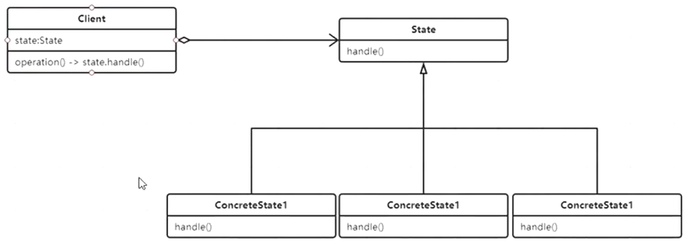
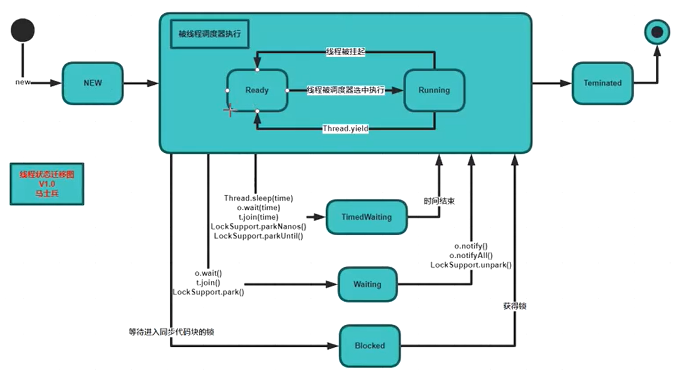

# State

根据状态决定行为



```java
/**
 * 当增加新的状态时非常不方便
 */
//一个类里的动作根据状态不同会有不同的反应
public class MM {
    String name;

    private enum MMState {HAPPY, SAD}

    MMState state;

    public void smile() {
        //switch case

    }

    public void cry() {
        //switch case
    }

    public void say() {
        //switch case
    }
}
```

```java
public class MM {
    String name;
    MMState state = new MMHappyState();

    public void smile() {
        state.smile();
    }

    public void cry() {
        state.cry();
    }

    public void say() {
        state.say();
    }

}
```

```java

public abstract class MMState {
    abstract void smile();

    abstract void cry();

    abstract void say();
}
```

```java
public class MMHappyState extends MMState {
    @Override
    void smile() {
        System.out.println("happy smile");
    }

    @Override
    void cry() {

    }

    @Override
    void say() {

    }
}
```

## 有限状态机FSM



```java
public class Thread_ {
    ThreadState_ state;

    void move(Action input) {
        state.move(input);//状态的迁移
    }

    void run() {
        state.run();
    }


}
```

```java
public class NewState extends ThreadState_ {
    private Thread_ t;

    public NewState(Thread_ t) {
        this.t = t;
    }

    @Override
    void move(Action input) {
        if (input.msg == "start") {
            t.state = new RunningState(t);
        }
    }

    @Override
    void run() {

    }
}
```

```java
public class RunningState extends ThreadState_ {
    private Thread_ t;

    public RunningState(Thread_ t) {
        this.t = t;
    }

    @Override
    void move(Action input) {

    }

    @Override
    void run() {

    }
}
```