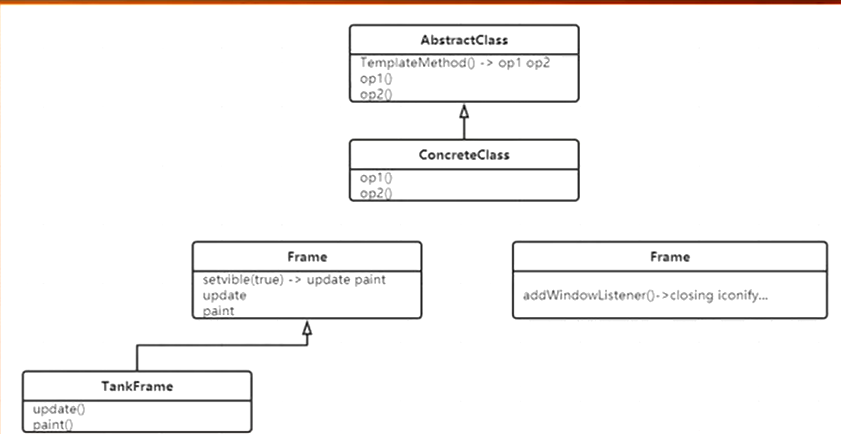

# TemplateMethod

钩子函数、回调函数



我们写一个方法，系统帮我们自动调用都可以称为模板方法，比如paint方法

```java
public class Main {
    public static void main(String[] args) {
        F f = new C1();
        f.m();
    }

}

abstract class F {
    public void m() {
        op1();
        op2();
    }

    abstract void op1();

    abstract void op2();
}

class C1 extends F {

    @Override
    void op1() {
        System.out.println("op1");
    }

    @Override
    void op2() {
        System.out.println("op2");
    }
}
```