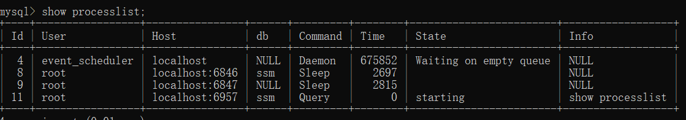
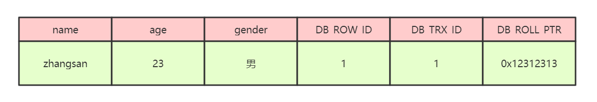

# optimizeMySQL


# Profile监控工具

https://dev.mysql.com/doc/refman/8.0/en/show-profile.html文档

```sql
SQL -> set profiling = 1;

SQL -> select 语句;

SQL -> show profiles;

SQL -> show profile; //默认最近一条执行时间 + for query 2（queryid在show profiles 中查看）

```


```sql
show profile cpu;

```


后面能跟的参数


查看连接



# MYSQL performance schema详解

### 0、performance_schema的介绍

​		**MySQL的performance schema 用于监控MySQL server在一个较低级别的运行过程中的资源消耗、资源等待等情况**。

​		特点如下：

​		1、提供了一种在数据库运行时实时检查server的内部执行情况的方法。performance_schema 数据库中的表使用performance_schema存储引擎。该数据库主要关注数据库运行过程中的性能相关的数据，与information_schema不同，information_schema主要关注server运行过程中的元数据信息

​		2、performance_schema通过监视server的事件来实现监视server内部运行情况， “事件”就是server内部活动中所做的任何事情以及对应的时间消耗，利用这些信息来判断server中的相关资源消耗在了哪里？一般来说，事件可以是函数调用、操作系统的等待、SQL语句执行的阶段（如sql语句执行过程中的parsing 或 sorting阶段）或者整个SQL语句与SQL语句集合。事件的采集可以方便的提供server中的相关存储引擎对磁盘文件、表I/O、表锁等资源的同步调用信息。
​		3、performance_schema中的事件与写入二进制日志中的事件（描述数据修改的events）、事件计划调度程序（这是一种存储程序）的事件不同。performance_schema中的事件记录的是server执行某些活动对某些资源的消耗、耗时、这些活动执行的次数等情况。
​		4、performance_schema中的事件只记录在本地server的performance_schema中，其下的这些表中数据发生变化时不会被写入binlog中，也不会通过复制机制被复制到其他server中。
​		5、 当前活跃事件、历史事件和事件摘要相关的表中记录的信息。能提供某个事件的执行次数、使用时长。进而可用于分析某个特定线程、特定对象（如mutex或file）相关联的活动。
​		6、PERFORMANCE_SCHEMA存储引擎使用server源代码中的“检测点”来实现事件数据的收集。对于performance_schema实现机制本身的代码没有相关的单独线程来检测，这与其他功能（如复制或事件计划程序）不同
​		7、收集的事件数据存储在performance_schema数据库的表中。这些表可以使用SELECT语句查询，也可以使用SQL语句更新performance_schema数据库中的表记录（如动态修改performance_schema的setup_*开头的几个配置表，但要注意：配置表的更改会立即生效，这会影响数据收集）
​		8、performance_schema的表中的数据不会持久化存储在磁盘中，而是保存在内存中，一旦服务器重启，这些数据会丢失（包括配置表在内的整个performance_schema下的所有数据）
​		9、MySQL支持的所有平台中事件监控功能都可用，但不同平台中用于统计事件时间开销的计时器类型可能会有所差异。

### 1、performance schema入门

​		在mysql的5.7版本中，性能模式是默认开启的，如果想要显式的关闭的话需要修改配置文件，不能直接进行修改，会报错Variable 'performance_schema' is a read only variable。

```sql
--查看performance_schema的属性
mysql> SHOW VARIABLES LIKE 'performance_schema';
+--------------------+-------+
| Variable_name      | Value |
+--------------------+-------+
| performance_schema | ON    |
+--------------------+-------+
1 row in set (0.01 sec)

--在配置文件中修改performance_schema的属性值，on表示开启，off表示关闭
[mysqld]
performance_schema=ON

--切换数据库
use performance_schema;

--查看当前数据库下的所有表,会看到有很多表存储着相关的信息
show tables;

--可以通过show create table tablename来查看创建表的时候的表结构
mysql> show create table setup_consumers;
+-----------------+---------------------------------
| Table           | Create Table                    
+-----------------+---------------------------------
| setup_consumers | CREATE TABLE `setup_consumers` (
  `NAME` varchar(64) NOT NULL,                      
  `ENABLED` enum('YES','NO') NOT NULL               
) ENGINE=PERFORMANCE_SCHEMA DEFAULT CHARSET=utf8 |  
+-----------------+---------------------------------
1 row in set (0.00 sec)                             
```

​		想要搞明白后续的内容，同学们需要理解两个基本概念：

​		instruments: 生产者，用于采集mysql中各种各样的操作产生的事件信息，对应配置表中的配置项我们可以称为监控采集配置项。

​		consumers:消费者，对应的消费者表用于存储来自instruments采集的数据，对应配置表中的配置项我们可以称为消费存储配置项。

### 2、performance_schema表的分类

​		performance_schema库下的表可以按照监视不同的纬度就行分组。

```sql
--语句事件记录表，这些表记录了语句事件信息，当前语句事件表events_statements_current、历史语句事件表events_statements_history和长语句历史事件表events_statements_history_long、以及聚合后的摘要表summary，其中，summary表还可以根据帐号(account)，主机(host)，程序(program)，线程(thread)，用户(user)和全局(global)再进行细分)
show tables like '%statement%';

--等待事件记录表，与语句事件类型的相关记录表类似：
show tables like '%wait%';

--阶段事件记录表，记录语句执行的阶段事件的表
show tables like '%stage%';

--事务事件记录表，记录事务相关的事件的表
show tables like '%transaction%';

--监控文件系统层调用的表
show tables like '%file%';

--监视内存使用的表
show tables like '%memory%';

--动态对performance_schema进行配置的配置表
show tables like '%setup%';
```

### 3、performance_schema的简单配置与使用

​		数据库刚刚初始化并启动时，并非所有instruments(事件采集项，在采集项的配置表中每一项都有一个开关字段，或为YES，或为NO)和consumers(与采集项类似，也有一个对应的事件类型保存表配置项，为YES就表示对应的表保存性能数据，为NO就表示对应的表不保存性能数据)都启用了，所以默认不会收集所有的事件，可能你需要检测的事件并没有打开，需要进行设置，可以使用如下两个语句打开对应的instruments和consumers（行计数可能会因MySQL版本而异)。

```sql
--打开等待事件的采集器配置项开关，需要修改setup_instruments配置表中对应的采集器配置项
UPDATE setup_instruments SET ENABLED = 'YES', TIMED = 'YES'where name like 'wait%';

--打开等待事件的保存表配置开关，修改setup_consumers配置表中对应的配置项
UPDATE setup_consumers SET ENABLED = 'YES'where name like '%wait%';

--当配置完成之后可以查看当前server正在做什么，可以通过查询events_waits_current表来得知，该表中每个线程只包含一行数据，用于显示每个线程的最新监视事件
select * from events_waits_current\G
*************************** 1. row ***************************
            THREAD_ID: 11
             EVENT_ID: 570
         END_EVENT_ID: 570
           EVENT_NAME: wait/synch/mutex/innodb/buf_dblwr_mutex
               SOURCE: 
          TIMER_START: 4508505105239280
            TIMER_END: 4508505105270160
           TIMER_WAIT: 30880
                SPINS: NULL
        OBJECT_SCHEMA: NULL
          OBJECT_NAME: NULL
           INDEX_NAME: NULL
          OBJECT_TYPE: NULL
OBJECT_INSTANCE_BEGIN: 67918392
     NESTING_EVENT_ID: NULL
   NESTING_EVENT_TYPE: NULL
            OPERATION: lock
      NUMBER_OF_BYTES: NULL
                FLAGS: NULL
/*该信息表示线程id为11的线程正在等待buf_dblwr_mutex锁，等待事件为30880
属性说明：
	id:事件来自哪个线程，事件编号是多少
	event_name:表示检测到的具体的内容
	source:表示这个检测代码在哪个源文件中以及行号
	timer_start:表示该事件的开始时间
	timer_end:表示该事件的结束时间
	timer_wait:表示该事件总的花费时间
注意：_current表中每个线程只保留一条记录，一旦线程完成工作，该表中不会再记录该线程的事件信息
*/

/*
_history表中记录每个线程应该执行完成的事件信息，但每个线程的事件信息只会记录10条，再多就会被覆盖，*_history_long表中记录所有线程的事件信息，但总记录数量是10000，超过就会被覆盖掉
*/
select thread_id,event_id,event_name,timer_wait from events_waits_history order by thread_id limit 21;

/*
summary表提供所有事件的汇总信息，该组中的表以不同的方式汇总事件数据（如：按用户，按主机，按线程等等）。例如：要查看哪些instruments占用最多的时间，可以通过对events_waits_summary_global_by_event_name表的COUNT_STAR或SUM_TIMER_WAIT列进行查询（这两列是对事件的记录数执行COUNT（*）、事件记录的TIMER_WAIT列执行SUM（TIMER_WAIT）统计而来）
*/
SELECT EVENT_NAME,COUNT_STAR FROM events_waits_summary_global_by_event_name  ORDER BY COUNT_STAR DESC LIMIT 10;

/*
instance表记录了哪些类型的对象会被检测。这些对象在被server使用时，在该表中将会产生一条事件记录，例如，file_instances表列出了文件I/O操作及其关联文件名
*/
select * from file_instances limit 20; 
```

### 4、常用配置项的参数说明

1、启动选项

```sql
performance_schema_consumer_events_statements_current=TRUE
是否在mysql server启动时就开启events_statements_current表的记录功能(该表记录当前的语句事件信息)，启动之后也可以在setup_consumers表中使用UPDATE语句进行动态更新setup_consumers配置表中的events_statements_current配置项，默认值为TRUE

performance_schema_consumer_events_statements_history=TRUE
与performance_schema_consumer_events_statements_current选项类似，但该选项是用于配置是否记录语句事件短历史信息，默认为TRUE

performance_schema_consumer_events_stages_history_long=FALSE
与performance_schema_consumer_events_statements_current选项类似，但该选项是用于配置是否记录语句事件长历史信息，默认为FALSE

除了statement(语句)事件之外，还支持：wait(等待)事件、state(阶段)事件、transaction(事务)事件，他们与statement事件一样都有三个启动项分别进行配置，但这些等待事件默认未启用，如果需要在MySQL Server启动时一同启动，则通常需要写进my.cnf配置文件中
performance_schema_consumer_global_instrumentation=TRUE
是否在MySQL Server启动时就开启全局表（如：mutex_instances、rwlock_instances、cond_instances、file_instances、users、hostsaccounts、socket_summary_by_event_name、file_summary_by_instance等大部分的全局对象计数统计和事件汇总统计信息表 ）的记录功能，启动之后也可以在setup_consumers表中使用UPDATE语句进行动态更新全局配置项
默认值为TRUE

performance_schema_consumer_statements_digest=TRUE
是否在MySQL Server启动时就开启events_statements_summary_by_digest 表的记录功能，启动之后也可以在setup_consumers表中使用UPDATE语句进行动态更新digest配置项
默认值为TRUE

performance_schema_consumer_thread_instrumentation=TRUE
是否在MySQL Server启动时就开启

events_xxx_summary_by_yyy_by_event_name表的记录功能，启动之后也可以在setup_consumers表中使用UPDATE语句进行动态更新线程配置项
默认值为TRUE

performance_schema_instrument[=name]
是否在MySQL Server启动时就启用某些采集器，由于instruments配置项多达数千个，所以该配置项支持key-value模式，还支持%号进行通配等，如下:

# [=name]可以指定为具体的Instruments名称（但是这样如果有多个需要指定的时候，就需要使用该选项多次），也可以使用通配符，可以指定instruments相同的前缀+通配符，也可以使用%代表所有的instruments

## 指定开启单个instruments

--performance-schema-instrument= 'instrument_name=value'

## 使用通配符指定开启多个instruments

--performance-schema-instrument= 'wait/synch/cond/%=COUNTED'

## 开关所有的instruments

--performance-schema-instrument= '%=ON'

--performance-schema-instrument= '%=OFF'

注意，这些启动选项要生效的前提是，需要设置performance_schema=ON。另外，这些启动选项虽然无法使用show variables语句查看，但我们可以通过setup_instruments和setup_consumers表查询这些选项指定的值。
```

2、系统变量

```sql
show variables like '%performance_schema%';
--重要的属性解释
performance_schema=ON
/*
控制performance_schema功能的开关，要使用MySQL的performance_schema，需要在mysqld启动时启用，以启用事件收集功能
该参数在5.7.x之前支持performance_schema的版本中默认关闭，5.7.x版本开始默认开启
注意：如果mysqld在初始化performance_schema时发现无法分配任何相关的内部缓冲区，则performance_schema将自动禁用，并将performance_schema设置为OFF
*/

performance_schema_digests_size=10000
/*
控制events_statements_summary_by_digest表中的最大行数。如果产生的语句摘要信息超过此最大值，便无法继续存入该表，此时performance_schema会增加状态变量
*/
performance_schema_events_statements_history_long_size=10000
/*
控制events_statements_history_long表中的最大行数，该参数控制所有会话在events_statements_history_long表中能够存放的总事件记录数，超过这个限制之后，最早的记录将被覆盖
全局变量，只读变量，整型值，5.6.3版本引入 * 5.6.x版本中，5.6.5及其之前的版本默认为10000，5.6.6及其之后的版本默认值为-1，通常情况下，自动计算的值都是10000 * 5.7.x版本中，默认值为-1，通常情况下，自动计算的值都是10000
*/
performance_schema_events_statements_history_size=10
/*
控制events_statements_history表中单个线程（会话）的最大行数，该参数控制单个会话在events_statements_history表中能够存放的事件记录数，超过这个限制之后，单个会话最早的记录将被覆盖
全局变量，只读变量，整型值，5.6.3版本引入 * 5.6.x版本中，5.6.5及其之前的版本默认为10，5.6.6及其之后的版本默认值为-1，通常情况下，自动计算的值都是10 * 5.7.x版本中，默认值为-1，通常情况下，自动计算的值都是10
除了statement(语句)事件之外，wait(等待)事件、state(阶段)事件、transaction(事务)事件，他们与statement事件一样都有三个参数分别进行存储限制配置，有兴趣的同学自行研究，这里不再赘述
*/
performance_schema_max_digest_length=1024
/*
用于控制标准化形式的SQL语句文本在存入performance_schema时的限制长度，该变量与max_digest_length变量相关(max_digest_length变量含义请自行查阅相关资料)
全局变量，只读变量，默认值1024字节，整型值，取值范围0~1048576
*/
performance_schema_max_sql_text_length=1024
/*
控制存入events_statements_current，events_statements_history和events_statements_history_long语句事件表中的SQL_TEXT列的最大SQL长度字节数。 超出系统变量performance_schema_max_sql_text_length的部分将被丢弃，不会记录，一般情况下不需要调整该参数，除非被截断的部分与其他SQL比起来有很大差异
全局变量，只读变量，整型值，默认值为1024字节，取值范围为0~1048576，5.7.6版本引入
降低系统变量performance_schema_max_sql_text_length值可以减少内存使用，但如果汇总的SQL中，被截断部分有较大差异，会导致没有办法再对这些有较大差异的SQL进行区分。 增加该系统变量值会增加内存使用，但对于汇总SQL来讲可以更精准地区分不同的部分。
*/
```

### 5、重要配置表的相关说明

​		配置表之间存在相互关联关系，按照配置影响的先后顺序，可添加为


```sql
/*
performance_timers表中记录了server中有哪些可用的事件计时器
字段解释：
	timer_name:表示可用计时器名称，CYCLE是基于CPU周期计数器的定时器
	timer_frequency:表示每秒钟对应的计时器单位的数量,CYCLE计时器的换算值与CPU的频率相关、
	timer_resolution:计时器精度值，表示在每个计时器被调用时额外增加的值
	timer_overhead:表示在使用定时器获取事件时开销的最小周期值
*/
select * from performance_timers;

/*
setup_timers表中记录当前使用的事件计时器信息
字段解释：
	name:计时器类型，对应某个事件类别
	timer_name:计时器类型名称
*/
select * from setup_timers;

/*
setup_consumers表中列出了consumers可配置列表项
字段解释：
	NAME：consumers配置名称
	ENABLED：consumers是否启用，有效值为YES或NO，此列可以使用UPDATE语句修改。
*/
select * from setup_consumers;

/*
setup_instruments 表列出了instruments 列表配置项，即代表了哪些事件支持被收集：
字段解释：
	NAME：instruments名称，instruments名称可能具有多个部分并形成层次结构
	ENABLED：instrumetns是否启用，有效值为YES或NO，此列可以使用UPDATE语句修改。如果设置为NO，则这个instruments不会被执行，不会产生任何的事件信息
	TIMED：instruments是否收集时间信息，有效值为YES或NO，此列可以使用UPDATE语句修改，如果设置为NO，则这个instruments不会收集时间信息
*/
SELECT * FROM setup_instruments;

/*
setup_actors表的初始内容是匹配任何用户和主机，因此对于所有前台线程，默认情况下启用监视和历史事件收集功能
字段解释：
	HOST：与grant语句类似的主机名，一个具体的字符串名字，或使用“％”表示“任何主机”
	USER：一个具体的字符串名称，或使用“％”表示“任何用户”
	ROLE：当前未使用，MySQL 8.0中才启用角色功能
	ENABLED：是否启用与HOST，USER，ROLE匹配的前台线程的监控功能，有效值为：YES或NO
	HISTORY：是否启用与HOST， USER，ROLE匹配的前台线程的历史事件记录功能，有效值为：YES或NO
*/
SELECT * FROM setup_actors;

/*
setup_objects表控制performance_schema是否监视特定对象。默认情况下，此表的最大行数为100行。
字段解释：
	OBJECT_TYPE：instruments类型，有效值为：“EVENT”（事件调度器事件）、“FUNCTION”（存储函数）、“PROCEDURE”（存储过程）、“TABLE”（基表）、“TRIGGER”（触发器），TABLE对象类型的配置会影响表I/O事件（wait/io/table/sql/handler instrument）和表锁事件（wait/lock/table/sql/handler instrument）的收集
	OBJECT_SCHEMA：某个监视类型对象涵盖的数据库名称，一个字符串名称，或“％”(表示“任何数据库”)
	OBJECT_NAME：某个监视类型对象涵盖的表名，一个字符串名称，或“％”(表示“任何数据库内的对象”)
	ENABLED：是否开启对某个类型对象的监视功能，有效值为：YES或NO。此列可以修改
	TIMED：是否开启对某个类型对象的时间收集功能，有效值为：YES或NO，此列可以修改
*/
SELECT * FROM setup_objects;

/*
threads表对于每个server线程生成一行包含线程相关的信息，
字段解释：
	THREAD_ID：线程的唯一标识符（ID）
	NAME：与server中的线程检测代码相关联的名称(注意，这里不是instruments名称)
	TYPE：线程类型，有效值为：FOREGROUND、BACKGROUND。分别表示前台线程和后台线程
	PROCESSLIST_ID：对应INFORMATION_SCHEMA.PROCESSLIST表中的ID列。
	PROCESSLIST_USER：与前台线程相关联的用户名，对于后台线程为NULL。
	PROCESSLIST_HOST：与前台线程关联的客户端的主机名，对于后台线程为NULL。
	PROCESSLIST_DB：线程的默认数据库，如果没有，则为NULL。
	PROCESSLIST_COMMAND：对于前台线程，该值代表着当前客户端正在执行的command类型，如果是sleep则表示当前会话处于空闲状态
	PROCESSLIST_TIME：当前线程已处于当前线程状态的持续时间（秒）
	PROCESSLIST_STATE：表示线程正在做什么事情。
	PROCESSLIST_INFO：线程正在执行的语句，如果没有执行任何语句，则为NULL。
	PARENT_THREAD_ID：如果这个线程是一个子线程（由另一个线程生成），那么该字段显示其父线程ID
	ROLE：暂未使用
	INSTRUMENTED：线程执行的事件是否被检测。有效值：YES、NO 
	HISTORY：是否记录线程的历史事件。有效值：YES、NO * 
	THREAD_OS_ID：由操作系统层定义的线程或任务标识符（ID）：
*/
select * from threads
```

注意：在performance_schema库中还包含了很多其他的库和表，能对数据库的性能做完整的监控，大家需要参考官网详细了解。

### 6、performance_schema实践操作

​		基本了解了表的相关信息之后，可以通过这些表进行实际的查询操作来进行实际的分析。

```sql
--1、哪类的SQL执行最多？
SELECT DIGEST_TEXT,COUNT_STAR,FIRST_SEEN,LAST_SEEN FROM events_statements_summary_by_digest ORDER BY COUNT_STAR DESC
--2、哪类SQL的平均响应时间最多？
SELECT DIGEST_TEXT,AVG_TIMER_WAIT FROM events_statements_summary_by_digest ORDER BY COUNT_STAR DESC
--3、哪类SQL排序记录数最多？
SELECT DIGEST_TEXT,SUM_SORT_ROWS FROM events_statements_summary_by_digest ORDER BY COUNT_STAR DESC
--4、哪类SQL扫描记录数最多？
SELECT DIGEST_TEXT,SUM_ROWS_EXAMINED FROM events_statements_summary_by_digest ORDER BY COUNT_STAR DESC
--5、哪类SQL使用临时表最多？
SELECT DIGEST_TEXT,SUM_CREATED_TMP_TABLES,SUM_CREATED_TMP_DISK_TABLES FROM events_statements_summary_by_digest ORDER BY COUNT_STAR DESC
--6、哪类SQL返回结果集最多？
SELECT DIGEST_TEXT,SUM_ROWS_SENT FROM events_statements_summary_by_digest ORDER BY COUNT_STAR DESC
--7、哪个表物理IO最多？
SELECT file_name,event_name,SUM_NUMBER_OF_BYTES_READ,SUM_NUMBER_OF_BYTES_WRITE FROM file_summary_by_instance ORDER BY SUM_NUMBER_OF_BYTES_READ + SUM_NUMBER_OF_BYTES_WRITE DESC
--8、哪个表逻辑IO最多？
SELECT object_name,COUNT_READ,COUNT_WRITE,COUNT_FETCH,SUM_TIMER_WAIT FROM table_io_waits_summary_by_table ORDER BY sum_timer_wait DESC
--9、哪个索引访问最多？
SELECT OBJECT_NAME,INDEX_NAME,COUNT_FETCH,COUNT_INSERT,COUNT_UPDATE,COUNT_DELETE FROM table_io_waits_summary_by_index_usage ORDER BY SUM_TIMER_WAIT DESC
--10、哪个索引从来没有用过？
SELECT OBJECT_SCHEMA,OBJECT_NAME,INDEX_NAME FROM table_io_waits_summary_by_index_usage WHERE INDEX_NAME IS NOT NULL AND COUNT_STAR = 0 AND OBJECT_SCHEMA <> 'mysql' ORDER BY OBJECT_SCHEMA,OBJECT_NAME;
--11、哪个等待事件消耗时间最多？
SELECT EVENT_NAME,COUNT_STAR,SUM_TIMER_WAIT,AVG_TIMER_WAIT FROM events_waits_summary_global_by_event_name WHERE event_name != 'idle' ORDER BY SUM_TIMER_WAIT DESC
--12-1、剖析某条SQL的执行情况，包括statement信息，stege信息，wait信息
SELECT EVENT_ID,sql_text FROM events_statements_history WHERE sql_text LIKE '%count(*)%';
--12-2、查看每个阶段的时间消耗
SELECT event_id,EVENT_NAME,SOURCE,TIMER_END - TIMER_START FROM events_stages_history_long WHERE NESTING_EVENT_ID = 1553;
--12-3、查看每个阶段的锁等待情况
SELECT event_id,event_name,source,timer_wait,object_name,index_name,operation,nesting_event_id FROM events_waits_history_longWHERE nesting_event_id = 1553;
```

# Schema与数据类型优化

## 数据类型优化

**更小的通常更好**

​		字段长度

**简单就好**

​		整型比字符串代价更低，因为字符串校验比较复杂

**尽量避免使用null**

​		null使得MySQL的索引统计和值的比较比较复杂

### 实际细则

### 整型类型

​		TINYINT、SMALLINT、MEDIUMINT、INT、BIGINT分别使用8、16、24、32、64位字节bit，尽量使用满足需求的最小数据类型。

### 字符和字符串类型

​		**varchar根据实际内容长度保存数据**

​				使用最小的符合需求的长度

​				varchar(n) n小于等于255时，需要使用一个额外的字节保存长度，当n>255时使用额外的两个字节保存长度

​				varchar(5)和varchar(255)保存同样的内容，硬盘存储空间相同（一个磁盘页），但内存空间占用不同，是指定的大小

​				varchar在mysql5.6之前变更长度，或者从255变更到255以上时会进行锁表

​				**应用场景**

​				存储长度波动比较大的数据，如文章，长短不一

​				字符串很少更新的场景，每次更新后都会从新计算并使用额外的存储空间保存长度

​				适合保存多字节字符，如汉字、特殊字符

​		**char固定长度字符串**

​				最大长度255

​				存储时不满足长度的填充空格，检索时会自动删除末尾的空格（区别于varchar）

​				检索效率、写速率会比varchar高，以空间换时间

​				**应用场景**

​				存储长度波动不大的数据，如MD5摘要（固定长度）

​				存储短字符串，经常更新的字符串

​		**BLOB、TEXT**

​				几乎没人用

### datetime和timestamp

​		**datetime**

​				占用8字节

​				与时区无关，数据库底层对时区配置时对datetime无效

​				可以保存到毫秒

​				可以保存的时间范围大 1000- 01-01 -9999-12-31

​				不要使用字符串存储日期类型，占用空间大，损失日期类型函数和便捷性

​		**timestamp**

​				占用4个字节

​				时间范围：1970-01-01 2038-01-19

​				精确到秒

​				采用整型存储

​				依赖数据库设置时区

​				自动更新timestamp列的值

​		**date**

​				占用的字节数比使用字符串、datetime、int存储要少，占3字节

​				可以进行日期计算

​				可以保存的时间范围大 1000- 01-01 -9999-12-31

### 使用枚举类型替代字符串

​		

## 合理使用范式和反范式

### 		范式

​				优点：1. 范式化的更新通常比反范式要快  2. 范式化能减少重复的数据 3 . 范式化的数据比较小，可以放到内存中去，操作比较快

​				缺点：需要进行表的关联

### 		反范式

​				优点： 1. 所有数据都在同一张表中，可以避免关联  2. 可以设计有效的索引

​				缺点： 表格内冗余较多，删除数据时会造成表有些有用的信息丢失

### 		注意

​				范式和反范式一般混合使用

​						存储一些冗余数据，牺牲空间换时间

​						避免表中数据全排序（需要全部load内存性能太低），通过索引的方式进行排序

​						衍生数据也是有用的，比如分页total做一个字段每次进行update（适情况而定，查询和更新的速度）

### 	案例

​				范式

​				


​				

​				反范式


## 主键的选择

### 		代理主键

​				与业务无关，无意义的数字序列

### 		自然主键

​				事物属性中的自然的唯一标识

### 		推荐使用代理主键

​				不与业务耦合，更容易维护

​				主键生成器

## 字符集的选择

​				纯拉丁文能表示的内容不要用其他字符集 latin1

​				如果不需要存放多种语言，没必要非要使用UTF-8或其他的UNICODE字符类型

​				

## 存储引擎的选择

 


## 适当的数据冗余

​		被频繁引用且只能通过join2张甚至更多的大表的方式，才能得到的独立字段

​		确保数据一致性


## 适当拆分

​					


# mysql执行计划

​       在企业的应用场景中，为了知道优化SQL语句的执行，需要查看SQL语句的具体执行过程，以加快SQL语句的执行效率。

​       可以使用explain+SQL语句来模拟优化器执行SQL查询语句，从而知道mysql是如何处理sql语句的。

​	   官网地址： https://dev.mysql.com/doc/refman/5.5/en/explain-output.html 

### 1、执行计划中包含的信息

|    Column     |                    Meaning                     |
| :-----------: | :--------------------------------------------: |
|      id       |            The `SELECT` identifier             |
|  select_type  |               The `SELECT` type                |
|     table     |          The table for the output row          |
|  partitions   |            The matching partitions             |
|     type      |                 The join type                  |
| possible_keys |         The possible indexes to choose         |
|      key      |           The index actually chosen            |
|    key_len    |          The length of the chosen key          |
|      ref      |       The columns compared to the index        |
|     rows      |        Estimate of rows to be examined         |
|   filtered    | Percentage of rows filtered by table condition |
|     extra     |             Additional information             |

**id**

select查询的序列号，包含一组数字，表示查询中执行select子句或者操作表的顺序

id号分为三种情况：

​		1、如果id相同，那么执行顺序从上到下

```sql
explain select * from emp e join dept d on e.deptno = d.deptno join salgrade sg on e.sal between sg.losal and sg.hisal;
```

​		2、如果id不同，如果是子查询，id的序号会递增，id值越大优先级越高，越先被执行

```sql
explain select * from emp e where e.deptno in (select d.deptno from dept d where d.dname = 'SALES');
```

​		3、id相同和不同的，同时存在：相同的可以认为是一组，从上往下顺序执行，在所有组中，id值越大，优先级越高，越先执行

```sql
explain select * from emp e join dept d on e.deptno = d.deptno join salgrade sg on e.sal between sg.losal and sg.hisal where e.deptno in (select d.deptno from dept d where d.dname = 'SALES');
```

**select_type**

主要用来分辨查询的类型，是普通查询还是联合查询还是子查询

| `select_type` Value  |                           Meaning                            |
| :------------------: | :----------------------------------------------------------: |
|        SIMPLE        |        Simple SELECT (not using UNION or subqueries)         |
|       PRIMARY        |                       Outermost SELECT                       |
|        UNION         |         Second or later SELECT statement in a UNION          |
|   DEPENDENT UNION    | Second or later SELECT statement in a UNION, dependent on outer query |
|     UNION RESULT     |                      Result of a UNION.                      |
|       SUBQUERY       |                   First SELECT in subquery                   |
|  DEPENDENT SUBQUERY  |      First SELECT in subquery, dependent on outer query      |
|       DERIVED        |                        Derived table                         |
| UNCACHEABLE SUBQUERY | A subquery for which the result cannot be cached and must be re-evaluated for each row of the outer query |
|  UNCACHEABLE UNION   | The second or later select in a UNION that belongs to an uncacheable subquery (see UNCACHEABLE SUBQUERY) |

```sql
--sample:简单的查询，不包含子查询和union
explain select * from emp;

--primary:查询中若包含任何复杂的子查询，最外层查询则被标记为Primary
explain select staname,ename supname from (select ename staname,mgr from emp) t join emp on t.mgr=emp.empno ;

--union:若第二个select出现在union之后，则被标记为union
explain select * from emp where deptno = 10 union select * from emp where sal >2000;

--dependent union:跟union类似，此处的depentent表示union或union all联合而成的结果会受外部表影响
explain select * from emp e where e.empno  in ( select empno from emp where deptno = 10 union select empno from emp where sal >2000)

--union result:从union表获取结果的select
explain select * from emp where deptno = 10 union select * from emp where sal >2000;

--subquery:在select或者where列表中包含子查询
explain select * from emp where sal > (select avg(sal) from emp) ;

--dependent subquery:subquery的子查询要受到外部表查询的影响
explain select * from emp e where e.deptno in (select distinct deptno from dept);

--DERIVED: from子句中出现的子查询，也叫做派生类，
explain select staname,ename supname from (select ename staname,mgr from emp) t join emp on t.mgr=emp.empno ;

--UNCACHEABLE SUBQUERY：表示使用子查询的结果不能被缓存
 explain select * from emp where empno = (select empno from emp where deptno=@@sort_buffer_size);
 
--uncacheable union:表示union的查询结果不能被缓存：sql语句未验证
```

**table**

对应行正在访问哪一个表，表名或者别名，可能是临时表或者union合并结果集
		1、如果是具体的表名，则表明从实际的物理表中获取数据，当然也可以是表的别名

​		2、表名是derivedN的形式，表示使用了id为N的查询产生的衍生表

​		3、当有union result的时候，表名是union n1,n2等的形式，n1,n2表示参与union的id

**type**

type显示的是访问类型，访问类型表示我是以何种方式去访问我们的数据，最容易想的是全表扫描，直接暴力的遍历一张表去寻找需要的数据，效率非常低下，访问的类型有很多，效率从最好到最坏依次是：

system > const > eq_ref > ref > fulltext > ref_or_null > index_merge > unique_subquery > index_subquery > range > index > ALL 

一般情况下，得保证查询至少达到range级别，最好能达到ref

```sql
--all:全表扫描，一般情况下出现这样的sql语句而且数据量比较大的话那么就需要进行优化。
explain select * from emp;

--index：全索引扫描这个比all的效率要好，主要有两种情况，一种是当前的查询时覆盖索引，即我们需要的数据在索引中就可以索取，或者是使用了索引进行排序，这样就避免数据的重排序
explain  select empno from emp;

--range：表示利用索引查询的时候限制了范围，在指定范围内进行查询，这样避免了index的全索引扫描，适用的操作符： =, <>, >, >=, <, <=, IS NULL, BETWEEN, LIKE, or IN() 
explain select * from emp where empno between 7000 and 7500;

--index_subquery：利用索引来关联子查询，不再扫描全表
explain select * from emp where emp.job in (select job from t_job);

--unique_subquery:该连接类型类似与index_subquery,使用的是唯一索引
 explain select * from emp e where e.deptno in (select distinct deptno from dept);
 
--index_merge：在查询过程中需要多个索引组合使用，没有模拟出来

--ref_or_null：对于某个字段即需要关联条件，也需要null值的情况下，查询优化器会选择这种访问方式
explain select * from emp e where  e.mgr is null or e.mgr=7369;

--ref：使用了非唯一性索引进行数据的查找
 create index idx_3 on emp(deptno);
 explain select * from emp e,dept d where e.deptno =d.deptno;

--eq_ref ：使用唯一性索引进行数据查找
explain select * from emp,emp2 where emp.empno = emp2.empno;

--const：这个表至多有一个匹配行，
explain select * from emp where empno = 7369;
 
--system：表只有一行记录（等于系统表），这是const类型的特例，平时不会出现
```

 **possible_keys** 

​        显示可能应用在这张表中的索引，一个或多个，查询涉及到的字段上若存在索引，则该索引将被列出，但不一定被查询实际使用

```sql
explain select * from emp,dept where emp.deptno = dept.deptno and emp.deptno = 10;
```

**key**

​		实际使用的索引，如果为null，则没有使用索引，查询中若使用了覆盖索引，则该索引和查询的select字段重叠。

```sql
explain select * from emp,dept where emp.deptno = dept.deptno and emp.deptno = 10;
```

**key_len**

表示索引中使用的字节数，可以通过key_len计算查询中使用的索引长度，在不损失精度的情况下长度越短越好。

```sql
explain select * from emp,dept where emp.deptno = dept.deptno and emp.deptno = 10;
```

**ref**

显示索引的哪一列被使用了，如果可能的话，是一个常数

```sql
explain select * from emp,dept where emp.deptno = dept.deptno and emp.deptno = 10;
```

**rows**

根据表的统计信息及索引使用情况，大致估算出找出所需记录需要读取的行数，此参数很重要，直接反应的sql找了多少数据，在完成目的的情况下越少越好

```sql
explain select * from emp;
```

**extra**

包含额外的信息。

```sql
--using filesort:说明mysql无法利用索引进行排序，只能利用排序算法进行排序，会消耗额外的位置
explain select * from emp order by sal;

--using temporary:建立临时表来保存中间结果，查询完成之后把临时表删除
explain select ename,count(*) from emp where deptno = 10 group by ename;

--using index:这个表示当前的查询时覆盖索引的，直接从索引中读取数据，而不用访问数据表。如果同时出现using where 表名索引被用来执行索引键值的查找，如果没有，表面索引被用来读取数据，而不是真的查找
explain select deptno,count(*) from emp group by deptno limit 10;

--using where:使用where进行条件过滤
explain select * from t_user where id = 1;

--using join buffer:使用连接缓存，情况没有模拟出来

--impossible where：where语句的结果总是false
explain select * from emp where empno = 7469;
```

# 索引

## 		索引数据结构

### 					哈希表

​					需要将hash表所有数据文件都加载到内存，消耗内存空间

​					如果都是等值查询，hash表很快，但实际工作中都是范围查找

​					存储引擎如果是memory，索引就是哈希表

### 					二叉树

​					二叉树会导致一边很多，一边很少不平衡，所以用平衡二叉树，插入删除效率很低（左旋右旋），查询效率高

### 					红黑树

​					最长子树不超过最短子树的两倍，平衡二叉树的变种，

1、红黑树放弃了追求完全平衡，追求大致平衡，在与平衡二叉树的时间复杂度相差不大的情况下，保证每次插入最多只需要三次旋转就能达到平衡，实现起来也更为简单。 
2、平衡二叉树追求绝对平衡，条件比较苛刻，实现起来比较麻烦，每次插入新节点之后需要旋转的次数不能预知。

### 					B树	

**上边都是内存中，下边基于磁盘**					

mysql基于磁盘，大数据量，索引也会很大，不能都放内存里呀	


### 		B+树

​			在B树的基础上，非叶子节点不再存储数据，只存储指针，这样上层就能存更多的指针（key），减少树的高度，减少IO次数，空间没变化省的是时间 

​			从根节点查是随机查找，从叶子节点查是范围查找，先随机到叶子结点，再范围查找

比如分页，先从根结点找到第2页的叶子几点，此时就可以通过链表找到第5页的数据


​	


聚簇：索引文件和数据文件是否放在一起

使用InnoDB引擎时，叶子节点存储的就是实际的数据

主键索引叶子节点存储的是一行数据，普通索引存储的是主键的值和索引列

使用MyISAM时，叶子节点存储的是实际数据的地址

缺点：更新数据索引会更新


主键建议自增，实现是自增锁，如果不自增，插入中间值id时会导致页分裂（等分），分裂后的页如果没有使用会被浪费掉

## 索引的优点

​		大大减少了服务器扫描的数据量

​		帮助服务器避免排序和临时表

​		将随机io变成顺序io

## 索引的用处

​		快速查找匹配的where子句的行

​		多个索引时会找使用最少行的索引

​		多个表进行关联

​		查找max和min

​		对表进行排序和分组

​		优化查询数据以检索值 而无需查询数据行

## 索引分类

​		主键索引 值不能为空，是一种唯一性索引

​		唯一索引 数据库自动建立，可以为空，空值查询速度慢

​		普通索引 普通列索引

​		全文索引 MyISAM支持，Innodb在5.6后支持

​		组合索引 组合列索引

### 面试技术名词

​		回表 普通索引中叶子节点存储的是主键和索引列，先获得索引列的值，去主键B+树中找到整行的数据叫回表

​		索引覆盖 不需要根据主键去回表 

​		最左匹配 组合索引中如果只有右边的列没有左边的列则不能匹配，如果只有左边可以匹配

​		索引下推 5.6后的innodb中 组合索引中(name,age)，在**存储引擎层**，(先匹配name，name是范围匹配)回表（主键B+树）之前 把age过滤了（age=xxoo ）

```sql
　　SELECT * from user where  name like '陈%' and age=20
```

​	在回表之前在二级索引中就过滤了age= 20的条件	

不是写了索引 SQL一定会用到

## 索引匹配方式

索引（name,age,pos）

全值匹配：和索引中的所有列都进行匹配

匹配最做前缀：组合索引中可以只匹配左面几列

匹配列前缀：可以匹配某一列的开头部分 select * from staff where name like 'J%',如果是'%J%'就不会用索引

匹配范围值：可以查找某一个范围的值 select * from staff where name > 'Marry'

精确哦匹配某一列，并范围匹配另外一列 select * from staff where name = 'July' and age > '25'

> 如果 select * from staff where name = 'July' and age > '25' pos='xxoo'pos将不会匹配
>
> 如果 select * from staff where name > 'July' and age = '25' pos='xxoo'age、pos将不会匹配
>
> 如果写成select * from staff where name = 'July' and pos > '25' 中间跳过age 相当于pos的索引不生效
>
> 如果写成select * from staff where name = 'July' and pos = '25' age='23'  pos和age顺序无关都能匹配，mysql会调顺序
>
> 只访问索引的查询 如果 select name ,pos ,age from staff where name = 'July' and pos = '25' age='23'如果写*还要获取其他列的值

​	

## 哈希索引

基于哈希表的实现，只有精确匹配所有列才有效，不能使用范围查找

mysql中只有memory存储引擎才支持哈希表

只需要存储哈希值，索引查找十分快

### 哈希索引使用限制

哈希索引只包含哈希值和行指针，而不存储字段值，哈希值->行指针->实际数据

哈希无法排序

不支持部分列的匹配查找

支持等值查找，不支持范围查询

哈希冲突遍历行指针

哈希冲突，维护代价高

​	

## 聚簇索引的优缺点

优点：

1、可以把相关数据保存在一起

2、数据访问更快，因为索引和数据保存在同一个树中

3、使用覆盖索引扫描的查询可以直接使用页节点中的主键值，查询列要被所使用的索引覆盖。

缺点：

1、聚簇数据最大限度地提高了IO密集型应用的性能，如果数据全部在内存，那么聚簇索引就没有什么优势

2、插入速度严重依赖于插入顺序，按照主键的顺序插入是最快的方式（不在中间插入避免页分裂）

3、更新聚簇索引列的代价很高，因为会强制将每个被更新的行移动到新的位置

4、基于聚簇索引的表在插入新行，或者主键被更新导致需要移动行的时候，可能面临页分裂的问题

5、聚簇索引可能导致全表扫描变慢，尤其是行比较稀疏，或者由于页分裂导致数据存储不连续的时候

## 覆盖索引

1、如果一个索引包含所有需要查询的字段的值（只能正好都有，不能多），我们称之为覆盖索引

2、不是所有类型的索引都可以称为覆盖索引，覆盖索引必须要存储索引列的值

3、不同的存储实现覆盖索引的方式不同，不是所有的引擎都支持覆盖索引，memory不支持覆盖索引

### 优势

1、索引条目通常远小于数据行大小，如果只需要读取索引，那么mysql就会极大的较少数据访问量

2、因为索引是按照列值顺序存储的，所以对于IO密集型的范围查询会比随机从磁盘读取每一行数据的IO要少的多

3、一些存储引擎如MYISAM在内存中只缓存索引（只存数据的地址），数据则依赖于操作系统来缓存，因此要访问数据需要一次系统调用，这可能会导致严重的性能问题

4、由于INNODB的聚簇索引，覆盖索引对INNODB表特别有用

## 优化小细节

1、当使用索引列进行查询的时候尽量不要使用表达式，把计算放到业务层而不是数据库层,尽量给准确值不要给表达式

select actor_id from actor where actor_id=4 > select actor_id from actor where actor_id+1=5;

执行计划的type从好到坏 System>Const>ref>range>index>all

2、尽量使用主键查询，不会进行回表操作

3、使用前缀索引

### 前缀索引实例说明

​		有时候需要索引很长的字符串，这会让索引变的大且慢，通常情况下可以使用某个列开始的部分字符串，这样大大的节约索引空间，从而提高索引效率，但这会降低索引的选择性，索引的选择性是指不重复的索引值和数据表记录总数的比值，范围从1/#T到1之间。索引的选择性越高则查询效率越高，因为选择性更高的索引可以让mysql在查找的时候过滤掉更多的行。

​		一般情况下某个列前缀的选择性也是足够高的，足以满足查询的性能，但是对应BLOB,TEXT,VARCHAR类型的列，必须要使用前缀索引，因为mysql不允许索引这些列的完整长度，使用该方法的诀窍在于要选择足够长的前缀以保证较高的选择性，通过又不能太长。

案例演示：

```sql
--创建数据表
create table citydemo(city varchar(50) not null);
insert into citydemo(city) select city from city;

--重复执行5次下面的sql语句
insert into citydemo(city) select city from citydemo;

--更新城市表的名称
update citydemo set city=(select city from city order by rand() limit 1);

--查找最常见的城市列表，发现每个值都出现45-65次，
select count(*) as cnt,city from citydemo group by city order by cnt desc limit 10;

--查找最频繁出现的城市前缀，先从3个前缀字母开始，发现比原来出现的次数更多，可以分别截取多个字符查看城市出现的次数
select count(*) as cnt,left(city,3) as pref from citydemo group by pref order by cnt desc limit 10;
select count(*) as cnt,left(city,7) as pref from citydemo group by pref order by cnt desc limit 10;
--此时前缀的选择性接近于完整列的选择性

--还可以通过另外一种方式来计算完整列的选择性，可以看到当前缀长度到达7之后，再增加前缀长度，选择性提升的幅度已经很小了
select count(distinct left(city,3))/count(*) as sel3,
count(distinct left(city,4))/count(*) as sel4,
count(distinct left(city,5))/count(*) as sel5,
count(distinct left(city,6))/count(*) as sel6,
count(distinct left(city,7))/count(*) as sel7,
count(distinct left(city,8))/count(*) as sel8 
from citydemo;

--计算完成之后可以创建前缀索引
alter table citydemo add key(city(7));

--注意：前缀索引是一种能使索引更小更快的有效方法，但是也包含缺点：mysql无法使用前缀索引做order by 和 group by。 
```

4、使用索引扫描来排序

### 使用索引扫描来做排序

​		mysql有两种方式可以生成有序的结果：通过排序操作或者按索引顺序扫描，如果explain出来的type列的值为index,则说明mysql使用了索引扫描来做排序

​		扫描索引本身是很快的，因为只需要从一条索引记录移动到紧接着的下一条记录。但如果索引不能覆盖查询所需的全部列，那么就不得不每扫描一条索引记录就得回表查询一次对应的行，这基本都是随机IO，因此按索引顺序读取数据的速度通常要比顺序地全表扫描慢

​		mysql可以使用同一个索引即满足排序，又用于查找行，如果可能的话，设计索引时应该尽可能地同时满足这两种任务。

​		只有当索引的列顺序和order by子句的顺序完全一致，并且所有列的排序方式都一样时，mysql才能够使用索引来对结果进行排序，如果查询需要关联多张表，则只有当orderby子句引用的字段全部为第一张表时，才能使用索引做排序。order by子句和查找型查询的限制是一样的，需要满足索引的最左前缀的要求，否则，mysql都需要执行顺序操作，而无法利用索引排序

```sql
--sakila数据库中rental表在rental_date,inventory_id,customer_id上有rental_date的索引
--使用rental_date索引为下面的查询做排序
explain select rental_id,staff_id from rental where rental_date='2005-05-25' order by inventory_id,customer_id\G
*************************** 1. row ***************************
           id: 1
  select_type: SIMPLE
        table: rental
   partitions: NULL
         type: ref
possible_keys: rental_date
          key: rental_date
      key_len: 5
          ref: const
         rows: 1
     filtered: 100.00
        Extra: Using index condition
1 row in set, 1 warning (0.00 sec)
--order by子句不满足索引的最左前缀的要求，也可以用于查询排序，这是因为所以你的第一列被指定为一个常数

--该查询为索引的第一列提供了常量条件，而使用第二列进行排序，将两个列组合在一起，就形成了索引的最左前缀
explain select rental_id,staff_id from rental where rental_date='2005-05-25' order by inventory_id desc\G
*************************** 1. row ***************************
           id: 1
  select_type: SIMPLE
        table: rental
   partitions: NULL
         type: ref
possible_keys: rental_date
          key: rental_date
      key_len: 5
          ref: const
         rows: 1
     filtered: 100.00
        Extra: Using where
1 row in set, 1 warning (0.00 sec)

--下面的查询不会利用索引
explain select rental_id,staff_id from rental where rental_date>'2005-05-25' order by rental_date,inventory_id\G
*************************** 1. row ***************************
           id: 1
  select_type: SIMPLE
        table: rental
   partitions: NULL
         type: ALL
possible_keys: rental_date
          key: NULL
      key_len: NULL
          ref: NULL
         rows: 16005
     filtered: 50.00
        Extra: Using where; Using filesort

--该查询使用了两中不同的排序方向，但是索引列都是正序排序的
explain select rental_id,staff_id from rental where rental_date>'2005-05-25' order by inventory_id desc,customer_id asc\G
*************************** 1. row ***************************
           id: 1
  select_type: SIMPLE
        table: rental
   partitions: NULL
         type: ALL
possible_keys: rental_date
          key: NULL
      key_len: NULL
          ref: NULL
         rows: 16005
     filtered: 50.00
        Extra: Using where; Using filesort
1 row in set, 1 warning (0.00 sec)

--该查询中引用了一个不再索引中的列
explain select rental_id,staff_id from rental where rental_date>'2005-05-25' order by inventory_id,staff_id\G
*************************** 1. row ***************************
           id: 1
  select_type: SIMPLE
        table: rental
   partitions: NULL
         type: ALL
possible_keys: rental_date
          key: NULL
      key_len: NULL
          ref: NULL
         rows: 16005
     filtered: 50.00
        Extra: Using where; Using filesort
1 row in set, 1 warning (0.00 sec)

```

5、union all,in,or都能够使用索引，但是推荐使用in

6、范围列可以用到索引

范围列可以用到索引，但是范围列后面的列无法用到索引，索引最多用于一个范围列

7、强制类型转换会全表扫描

varchar类型 

explain select * from user where phone=13800001234;不会触发索引

explain select * from user where phone='13800001234';触发索引

8、更新十分频繁，数据区分度不高的字段（男、女）上不宜建立索引

更新会变更B+树，更新频繁的字段建议索引会大大降低数据库性能

类似于性别这类区分不大的属性，建立索引是没有意义的，不能有效的过滤数据，

一般区分度在80%以上的时候就可以建立索引，区分度可以使用 count(distinct(列名))/count(*) 来计算

9、创建索引的列，不允许为null，可能会得到不符合预期的结果

10、当需要进行表连接的时候，最好不要超过三张表，因为需要join的字段，数据类型必须一致

11、能使用limit的时候尽量使用limit

12、单表索引建议控制在5个以内

13、单索引字段数不允许超过5个（组合索引）

14、创建索引的时候应该避免以下错误概念

索引越多越好

过早优化，在不了解系统的情况下进行优化

15、小表join大表

## 索引监控

show status like 'Handler_read%';

Handler_read_first：读取索引第一个条目的次数

Handler_read_key：通过index获取数据的次数 越大越好

Handler_read_last：读取索引最后一个条目的次数

Handler_read_next：通过索引读取下一条数据的次数

Handler_read_prev：通过索引读取上一条数据的次数

Handler_read_rnd：从固定位置读取数据的次数

Handler_read_rnd_next：从数据节点读取下一条数据的次数 越大越好

## 索引优化分析案例

预先准备好数据

```sql
SET FOREIGN_KEY_CHECKS=0;
DROP TABLE IF EXISTS `itdragon_order_list`;
CREATE TABLE `itdragon_order_list` (
  `id` bigint(11) NOT NULL AUTO_INCREMENT COMMENT '主键id，默认自增长',
  `transaction_id` varchar(150) DEFAULT NULL COMMENT '交易号',
  `gross` double DEFAULT NULL COMMENT '毛收入(RMB)',
  `net` double DEFAULT NULL COMMENT '净收入(RMB)',
  `stock_id` int(11) DEFAULT NULL COMMENT '发货仓库',
  `order_status` int(11) DEFAULT NULL COMMENT '订单状态',
  `descript` varchar(255) DEFAULT NULL COMMENT '客服备注',
  `finance_descript` varchar(255) DEFAULT NULL COMMENT '财务备注',
  `create_type` varchar(100) DEFAULT NULL COMMENT '创建类型',
  `order_level` int(11) DEFAULT NULL COMMENT '订单级别',
  `input_user` varchar(20) DEFAULT NULL COMMENT '录入人',
  `input_date` varchar(20) DEFAULT NULL COMMENT '录入时间',
  PRIMARY KEY (`id`)
) ENGINE=InnoDB AUTO_INCREMENT=10003 DEFAULT CHARSET=utf8;

INSERT INTO itdragon_order_list VALUES ('10000', '81X97310V32236260E', '6.6', '6.13', '1', '10', 'ok', 'ok', 'auto', '1', 'itdragon', '2017-08-28 17:01:49');
INSERT INTO itdragon_order_list VALUES ('10001', '61525478BB371361Q', '18.88', '18.79', '1', '10', 'ok', 'ok', 'auto', '1', 'itdragon', '2017-08-18 17:01:50');
INSERT INTO itdragon_order_list VALUES ('10002', '5RT64180WE555861V', '20.18', '20.17', '1', '10', 'ok', 'ok', 'auto', '1', 'itdragon', '2017-09-08 17:01:49');

```

逐步开始进行优化：

第一个案例：

```sql
select * from itdragon_order_list where transaction_id = "81X97310V32236260E";
--通过查看执行计划发现type=all,需要进行全表扫描
explain select * from itdragon_order_list where transaction_id = "81X97310V32236260E";

--优化一、为transaction_id创建唯一索引
 create unique index idx_order_transaID on itdragon_order_list (transaction_id);
--当创建索引之后，唯一索引对应的type是const，通过索引一次就可以找到结果，普通索引对应的type是ref，表示非唯一性索引赛秒，找到值还要进行扫描，直到将索引文件扫描完为止，显而易见，const的性能要高于ref
 explain select * from itdragon_order_list where transaction_id = "81X97310V32236260E";
 
 --优化二、使用覆盖索引，查询的结果变成 transaction_id,当extra出现using index,表示使用了覆盖索引
 explain select transaction_id from itdragon_order_list where transaction_id = "81X97310V32236260E";
```

第二个案例

```sql
--创建复合索引
create index idx_order_levelDate on itdragon_order_list (order_level,input_date);

--创建索引之后发现跟没有创建索引一样，都是全表扫描，都是文件排序
explain select * from itdragon_order_list order by order_level,input_date;

--可以使用force index强制指定索引
explain select * from itdragon_order_list force index(idx_order_levelDate) order by order_level,input_date;
--其实给订单排序意义不大，给订单级别添加索引意义也不大，因此可以先确定order_level的值，然后再给input_date排序
explain select * from itdragon_order_list where order_level=3 order by input_date;
```

# 查询优化

## 查询慢的原因

网络、CPU、IO、上下文切换、系统调用、生成统计信息、锁等待时间

## 优化数据访问

### 优化IO量

​		查询性能低下的主要原因是访问的数据太多，某些查询不可避免的需要筛选大量的数据，我们可以通过减少访问数据量的方式进行优化，看下执行计划扫描了多少行。

确认应用程序是否在检索大量超过需要的数据，这样就不会用到索引，高性能MySQL说30%。

> selet * from rental limit 10000,5; 第一个值不宜过大，否则将会进行全表扫描

确认mysql服务器层是否在分析大量超过需要的数据行，并发SQL查询太多，是否能筛选更少的数据。


**是否向数据库请求了不需要的数据**

1、查询不需要的记录

我们常常会误以为mysql会只返回需要的数据，实际上mysql却是先返回全部结果再进行计算。

错误做法：先用select语句查询大量的结果，然后获取前面的N行后关闭结果集。

正确做法：是在查询后面添加limit。

2、多表关联时返回全部列

select ***** from actor inner join film_actor using(actor_id) inner join film using(film_id) where film.title='Academy Dinosaur';

select **actor.*** from actor...; 只查询需要的列，时间更少，建议使用别名

3、总是取出全部列

在公司的企业需求中，禁止使用select *,虽然这种方式能够简化开发，但是会影响查询的性能，所以尽量不要使用

4、重复查询相同的数据

如果需要不断的重复执行相同的查询，且每次返回完全相同的数据，因此，基于这样的应用场景，我们可以将这部分数据缓存起来，这样的话能够提高查询效率

## 执行过程的优化

1、查询缓存

在解析一个查询语句之前，如果查询缓存是打开的，那么mysql会优先检查这个查询是否命中查询缓存中的数据，如果查询恰好命中了查询缓存，那么会在返回结果之前会检查用户权限，如果权限没有问题，那么mysql会跳过所有的阶段，就直接从缓存中拿到结果并返回给客户端

2、查询优化处理

mysql查询完缓存之后会经过以下几个步骤：解析SQL、预处理、优化SQL执行计划，这几个步骤出现任何的错误，都可能会终止查询

语法解析器和预处理

mysql通过关键字将SQL语句进行解析，并生成一颗解析树，mysql解析器将使用mysql语法规则验证和解析查询，例如验证使用使用了错误的关键字或者顺序是否正确等等，预处理器会进一步检查解析树是否合法，例如表名和列名是否存在，是否有歧义，还会验证权限等等

**查询优化器**

当语法树没有问题之后，相应的要由优化器将其转成执行计划，一条查询语句可以使用非常多的执行方式，最后都可以得到对应的结果，但是不同的执行方式带来的效率是不同的，优化器的最主要目的就是要选择最有效的执行计划。mysql使用的是基于成本的优化器，在优化的时候会尝试预测一个查询使用某种查询计划时候的成本，并选择其中成本最小的一个

在很多情况下mysql会选择错误的执行计划，原因如下：

**统计信息不准确**

InnoDB因为其mvcc的架构，并不能维护一个数据表的行数的精确统计信息

**执行计划的成本估算不等同于实际执行的成本**

有时候某个执行计划虽然需要读取更多的页面，但是他的成本却更小，因为如果这些页面都是顺序读或者这些页面都已经在内存中的话，那么它的访问成本将很小，mysql层面并不知道哪些页面在内存中，哪些在磁盘，所以查询之际执行过程中到底需要多少次IO是无法得知的

**mysql的最优可能跟你想的不一样**

**mysql不考虑其他并发执行的查询**

**mysql不会考虑不受其控制的操作成本**

**优化器的优化策略**

静态优化

直接对解析树进行分析，并完成优化

动态优化

动态优化与查询的上下文有关，也可能跟取值、索引对应的行数有关

mysql对查询的静态优化只需要一次，但对动态优化在每次执行时都需要重新评估


**优化器的优化类型**

重新定义关联表的顺序，数据表的关联并不总是按照在查询中指定的顺序进行，决定关联顺序时优化器很重要的功能

将外连接转化成内连接，内连接的效率要高于外连接

使用等价变换规则，mysql可以使用一些等价变化来简化并规划表达式

优化count(),min(),max()，如果可以使用分组排序，要找到某一列的最小值，只需要查询  函数（索引的最左前端的记录）即可，不需要使用  函数(*)

预估并转化为常数表达式，当mysql检测到一个表达式可以转化为常数的时候，就会一直把该表达式作为常数进行处理，

> explain select film.film_id,film_actor.actor_id from film inner join film_actor using(film_id) where film.film_id = 1尽量不要使用范围查询

索引覆盖扫描，当索引中的列包含所有查询中需要使用的列的时候，可以使用覆盖索引

子查询优化，mysql在某些情况下可以将子查询转换一种效率更高的形式，从而减少多个查询多次对数据进行访问，例如将经常查询的数据放入到缓存中

等值传播，如果两个列的值通过等式关联，那么mysql能够把其中一个列的where条件传递到另一个上：

explain select film.film_id from film inner join film_actor using(film_id

) where film.film_id > 500;

这里使用film_id字段进行等值关联，film_id这个列不仅适用于film表而且适用于film_actor表

explain select film.film_id from film inner join film_actor using(film_id

) where film.film_id > 500 and film_actor.film_id > 500;


### 关联查询

join的实现方式原理


不使用索引

---


使用索引

---


使用joinBuffer

（1）Join Buffer会缓存所有参与查询的列而不是只有Join的列。
（2）可以通过调整join_buffer_size缓存大小
（3）join_buffer_size的默认值是256K，join_buffer_size的最大值在MySQL 5.1.22版本前是4G-1，而之后的版本才能在64位操作系统下申请大于4G的Join Buffer空间。
（4）使用Block Nested-Loop Join算法需要开启优化器管理配置的optimizer_switch的设置block_nested_loop为on，默认为开启。

show variables like '%optimizer_switch%'

查看不同的顺序执行方式对查询性能的影响：

**explain select film.film_id,film.title,film.release_year,actor.actor_id,actor.first_name,actor.last_name from film inner join film_actor using(film_id) inner join actor using(actor_id);**

查看执行的成本：

show status like 'last_query_cost'; 

按照自己预想的规定顺序执行：

**explain select straight_join film.film_id,film.title,film.release_year,actor.actor_id,actor.first_name,actor.last_name from fil**//强制执行

**m inner join film_actor using(film_id) inner join actor using(actor_id);**//优化过

查看执行的成本：

show status like 'last_query_cost'; 


**排序优化**

排序算法

​	两次传输排序

第一次数据读取是将需要排序的字段读取出来，然后进行排序，第二次是将排好序的结果按照需要去读取数据行。

这种方式效率比较低，原因是第二次读取数据的时候因为已经排好序，需要去读取所有记录而此时更多的是随机IO，读取数据成本会比较高

两次传输的优势，在排序的时候存储尽可能少的数据，让排序缓冲区可以尽可能多的容纳行数来进行排序操作

​	单次传输排序

先读取查询所需要的所有列，然后再根据给定列进行排序，最后直接返回排序结果，此方式只需要一次顺序IO读取所有的数据，而无须任何的随机IO，问题在于查询的列特别多的时候，会占用大量的存储空间，无法存储大量的数据

当需要排序的列的总大小超过max_length_for_sort_data定义的字节，mysql会选择双次排序，反之使用单次排序，当然，用户可以设置此参数的值来选择排序的方式

## 优化特定类型的查询

### 优化count()查询

MyIsam的count函数比较快，这是有前提条件的，只有没有任何where条件的count(*)才是比较快的

使用近似值

在某些应用场景中，不需要完全精确的值，可以参考使用近似值来代替，比如可以使用explain来获取近似的值

其实在很多OLAP的应用中，需要计算某一个列值的基数，有一个计算近似值的算法叫hyperloglog。

更复杂的优化

一般情况下，count()需要扫描大量的行才能获取精确的数据，其实很难优化，在实际操作的时候可以考虑使用索引覆盖扫描，或者增加汇总表，或者增加外部缓存系统。

### 优化关联查询

确保on或者using子句中的列上有索引，在创建索引的时候就要考虑到关联的顺序

确保任何的groupby和order by中的表达式只涉及到一个表中的列，这样mysql才有可能使用索引来优化这个过程

### 优化子查询

子查询会有临时表消耗IO资源

子查询尽可能使用关联查询代替

### 优化limit分页

优化此类查询的最简单的办法就是尽可能地使用覆盖索引，而不是查询所有的列

>select film_id,description from film order by title limit 50,5
>
>explain select film.film_id,film.description from film inner join (select film_id from film order by title limit 50,5) as lim using(film_id);

### 优化union查询

除非确实需要服务器消除重复的行，否则一定要使用union all，因此没有all关键字，mysql会在查询的时候给临时表加上distinct的关键字，这个操作的代价很高

### 推荐使用用户自定义变量

**自定义变量使用**

set @one :=1

set @min_actor :=(select min(actor_id) from actor)

set @last_week :=current_date-interval 1 week;

**自定义变量限制**

1、无法使用查询缓存

2、不能在使用常量或者标识符的地方使用自定义变量，例如表名、列名或者limit子句

3、用户自定义变量的生命周期是在一个连接中有效，所以不能用它们来做连接间的通信

4、不能显式地声明自定义变量地类型

5、mysql优化器在某些场景下可能会将这些变量优化掉，这可能导致代码不按预想地方式运行

6、赋值符号：=的优先级非常低，所以在使用赋值表达式的时候应该明确的使用括号

7、使用未定义变量不会产生任何语法错误

**自定义变量的使用案例**

优化排名语句

1、在给一个变量赋值的同时使用这个变量

set @rownum:=100

select actor_id,@rownum:=@rownum+1 as rownum from actor limit 10;

2、查询获取演过最多电影的前10名演员，然后根据出演电影次数做一个排名

select actor_id,count(*) as cnt from film_actor group by actor_id order by cnt desc limit 10;


避免重新查询刚刚更新的数据

当需要高效的更新一条记录的时间戳，同时希望查询当前记录中存放的时间戳是什么

>update t1 set  lastUpdated=now() where id =1;
>select lastUpdated from t1 where id =1;
>
>update t1 set lastupdated = now() where id = 1 and @now:=now();
>select @now;


确定取值的顺序

在赋值和读取变量的时候可能是在查询的不同阶段

>set @rownum:=0;
>select actor_id,@rownum:=@rownum+1 as cnt from actor where @rownum<=1;
>因为where和select在查询的不同阶段执行，所以看到查询到两条记录，这不符合预期
>
>set @rownum:=0;
>select actor_id,@rownum:=@rownum+1 as cnt from actor where @rownum<=1 order by first_name
>当引入了orde;r by之后，发现打印出了全部结果，这是因为order by引入了文件排序，而where条件是在文件排序操作之前取值的  
>
>解决这个问题的关键在于让变量的赋值和取值发生在执行查询的同一阶段：
>set @rownum:=0;
>select actor_id,@rownum as cnt from actor where (@rownum:=@rownum+1)<=1;

# 分区表

## 分区表的应用场景

表非常大以至于无法全部都放在内存中，或者只在表的最后部分有热点数据，其他均是历史数据

分区表的数据更容易维护

> 批量删除大量数据可以使用清除整个分区的方式

> 对一个独立分区进行优化、检查、修复等操作

分区表的数据可以分布在不同的物理设备上，从而高效地利用多个硬件设备

可以使用分区表来避免某些特殊的瓶颈

> innodb的单个索引的互斥访问,索引加锁

> ext3文件系统的inode锁竞争

可以备份和恢复独立的分区

## 分区表的限制

一个表最多只能有1024个分区，在5.7版本的时候可以支持8196个分区

在早期的mysql中，分区表达式必须是整数或者是返回整数的表达式，在mysql5.5中，某些场景可以直接使用列来进行分区

如果分区字段中有主键或者唯一索引的列，那么所有主键列和唯一索引列都必须包含进来

分区表无法使用外键约束

## 分区表的原理

​	分区表由多个相关的底层表实现，这个底层表也是由句柄对象标识，我们可以直接访问各个分区。存储引擎管理分区的各个底层表和管理普通表一样（所有的底层表都必须使用相同的存储引擎），分区表的索引知识在各个底层表上各自加上一个完全相同的索引。从存储引擎的角度来看，底层表和普通表没有任何不同，存储引擎也无须知道这是一个普通表还是一个分区表的一部分。

​		分区表的操作按照以下的操作逻辑进行：

​		**select查询**

​		当查询一个分区表的时候，分区层先打开并锁住所有的底层表，优化器先判断是否可以过滤部分分区，然后再调用对应的存储引擎接口访问各个分区的数据

​		**insert操作**

​		当写入一条记录的时候，分区层先打开并锁住所有的底层表，然后确定哪个分区接受这条记录，再将记录写入对应底层表

​		**delete操作**

​		当删除一条记录时，分区层先打开并锁住所有的底层表，然后确定数据对应的分区，最后对相应底层表进行删除操作

​		**update操作**

​		当更新一条记录时，分区层先打开并锁住所有的底层表，mysql先确定需要更新的记录再哪个分区，然后取出数据并更新，再判断更新后的数据应该再哪个分区，最后对底层表进行写入操作，并对源数据所在的底层表进行删除操作

​		有些操作时支持过滤的，例如，当删除一条记录时，MySQL需要先找到这条记录，如果where条件恰好和分区表达式匹配，就可以将所有不包含这条记录的分区都过滤掉，这对update同样有效。如果是insert操作，则本身就是只命中一个分区，其他分区都会被过滤掉。mysql先确定这条记录属于哪个分区，再将记录写入对应得曾分区表，无须对任何其他分区进行操作

​		虽然每个操作都会“先打开并锁住所有的底层表”，但这并不是说分区表在处理过程中是锁住全表的，如果存储引擎能够自己实现行级锁，例如innodb，则会在分区层释放对应表锁。

## 分区表的类型

### 范围分区

根据列值在给定范围内将行分配给分区

​	范围分区表的分区方式是：每个分区都包含行数据且分区的表达式在给定的范围内，分区的范围应该是连续的且不能重叠，可以使用values less than运算符来定义。

​		1、创建普通的表

```sql
CREATE TABLE employees (
    id INT NOT NULL,
    fname VARCHAR(30),
    lname VARCHAR(30),
    hired DATE NOT NULL DEFAULT '1970-01-01',
    separated DATE NOT NULL DEFAULT '9999-12-31',
    job_code INT NOT NULL,
    store_id INT NOT NULL
);
```

​		2、创建带分区的表，下面建表的语句是按照store_id来进行分区的，指定了4个分区

```sql
CREATE TABLE employees (
    id INT NOT NULL,
    fname VARCHAR(30),
    lname VARCHAR(30),
    hired DATE NOT NULL DEFAULT '1970-01-01',
    separated DATE NOT NULL DEFAULT '9999-12-31',
    job_code INT NOT NULL,
    store_id INT NOT NULL
)
PARTITION BY RANGE (store_id) (
    PARTITION p0 VALUES LESS THAN (6),
    PARTITION p1 VALUES LESS THAN (11),
    PARTITION p2 VALUES LESS THAN (16),
    PARTITION p3 VALUES LESS THAN (21)
);
--在当前的建表语句中可以看到，store_id的值在1-5的在p0分区，6-10的在p1分区，11-15的在p3分区，16-20的在p4分区，但是如果插入超过20的值就会报错，因为mysql不知道将数据放在哪个分区
```

​		3、可以使用less than maxvalue来避免此种情况

```sql
CREATE TABLE employees (
    id INT NOT NULL,
    fname VARCHAR(30),
    lname VARCHAR(30),
    hired DATE NOT NULL DEFAULT '1970-01-01',
    separated DATE NOT NULL DEFAULT '9999-12-31',
    job_code INT NOT NULL,
    store_id INT NOT NULL
)
PARTITION BY RANGE (store_id) (
    PARTITION p0 VALUES LESS THAN (6),
    PARTITION p1 VALUES LESS THAN (11),
    PARTITION p2 VALUES LESS THAN (16),
    PARTITION p3 VALUES LESS THAN MAXVALUE
);
--maxvalue表示始终大于等于最大可能整数值的整数值
```

​		4、可以使用相同的方式根据员工的职务代码对表进行分区

```sql
CREATE TABLE employees (
    id INT NOT NULL,
    fname VARCHAR(30),
    lname VARCHAR(30),
    hired DATE NOT NULL DEFAULT '1970-01-01',
    separated DATE NOT NULL DEFAULT '9999-12-31',
    job_code INT NOT NULL,
    store_id INT NOT NULL
)
PARTITION BY RANGE (job_code) (
    PARTITION p0 VALUES LESS THAN (100),
    PARTITION p1 VALUES LESS THAN (1000),
    PARTITION p2 VALUES LESS THAN (10000)
);
```

​		5、可以使用date类型进行分区：如虚妄根据每个员工离开公司的年份进行划分，如year(separated)

```sql
CREATE TABLE employees (
    id INT NOT NULL,
    fname VARCHAR(30),
    lname VARCHAR(30),
    hired DATE NOT NULL DEFAULT '1970-01-01',
    separated DATE NOT NULL DEFAULT '9999-12-31',
    job_code INT,
    store_id INT
)
PARTITION BY RANGE ( YEAR(separated) ) (
    PARTITION p0 VALUES LESS THAN (1991),
    PARTITION p1 VALUES LESS THAN (1996),
    PARTITION p2 VALUES LESS THAN (2001),
    PARTITION p3 VALUES LESS THAN MAXVALUE
);
```

​		6、可以使用函数根据range的值来对表进行分区，如timestampunix_timestamp()

```sql
CREATE TABLE quarterly_report_status (
    report_id INT NOT NULL,
    report_status VARCHAR(20) NOT NULL,
    report_updated TIMESTAMP NOT NULL DEFAULT CURRENT_TIMESTAMP ON UPDATE CURRENT_TIMESTAMP
)
PARTITION BY RANGE ( UNIX_TIMESTAMP(report_updated) ) (
    PARTITION p0 VALUES LESS THAN ( UNIX_TIMESTAMP('2008-01-01 00:00:00') ),
    PARTITION p1 VALUES LESS THAN ( UNIX_TIMESTAMP('2008-04-01 00:00:00') ),
    PARTITION p2 VALUES LESS THAN ( UNIX_TIMESTAMP('2008-07-01 00:00:00') ),
    PARTITION p3 VALUES LESS THAN ( UNIX_TIMESTAMP('2008-10-01 00:00:00') ),
    PARTITION p4 VALUES LESS THAN ( UNIX_TIMESTAMP('2009-01-01 00:00:00') ),
    PARTITION p5 VALUES LESS THAN ( UNIX_TIMESTAMP('2009-04-01 00:00:00') ),
    PARTITION p6 VALUES LESS THAN ( UNIX_TIMESTAMP('2009-07-01 00:00:00') ),
    PARTITION p7 VALUES LESS THAN ( UNIX_TIMESTAMP('2009-10-01 00:00:00') ),
    PARTITION p8 VALUES LESS THAN ( UNIX_TIMESTAMP('2010-01-01 00:00:00') ),
    PARTITION p9 VALUES LESS THAN (MAXVALUE)
);
--timestamp不允许使用任何其他涉及值的表达式
```

基于时间间隔的分区方案，在mysql5.7中，可以基于范围或事件间隔实现分区方案，有两种选择

1、基于范围的分区，对于分区表达式，可以使用操作函数基于date、time、或者datatime列来返回一个整数值

```sql
CREATE TABLE members (
    firstname VARCHAR(25) NOT NULL,
    lastname VARCHAR(25) NOT NULL,
    username VARCHAR(16) NOT NULL,
    email VARCHAR(35),
    joined DATE NOT NULL
)
PARTITION BY RANGE( YEAR(joined) ) (
    PARTITION p0 VALUES LESS THAN (1960),
    PARTITION p1 VALUES LESS THAN (1970),
    PARTITION p2 VALUES LESS THAN (1980),
    PARTITION p3 VALUES LESS THAN (1990),
    PARTITION p4 VALUES LESS THAN MAXVALUE
);

CREATE TABLE quarterly_report_status (
    report_id INT NOT NULL,
    report_status VARCHAR(20) NOT NULL,
    report_updated TIMESTAMP NOT NULL DEFAULT CURRENT_TIMESTAMP ON UPDATE CURRENT_TIMESTAMP
)
PARTITION BY RANGE ( UNIX_TIMESTAMP(report_updated) ) (
    PARTITION p0 VALUES LESS THAN ( UNIX_TIMESTAMP('2008-01-01 00:00:00') ),
    PARTITION p1 VALUES LESS THAN ( UNIX_TIMESTAMP('2008-04-01 00:00:00') ),
    PARTITION p2 VALUES LESS THAN ( UNIX_TIMESTAMP('2008-07-01 00:00:00') ),
    PARTITION p3 VALUES LESS THAN ( UNIX_TIMESTAMP('2008-10-01 00:00:00') ),
    PARTITION p4 VALUES LESS THAN ( UNIX_TIMESTAMP('2009-01-01 00:00:00') ),
    PARTITION p5 VALUES LESS THAN ( UNIX_TIMESTAMP('2009-04-01 00:00:00') ),
    PARTITION p6 VALUES LESS THAN ( UNIX_TIMESTAMP('2009-07-01 00:00:00') ),
    PARTITION p7 VALUES LESS THAN ( UNIX_TIMESTAMP('2009-10-01 00:00:00') ),
    PARTITION p8 VALUES LESS THAN ( UNIX_TIMESTAMP('2010-01-01 00:00:00') ),
    PARTITION p9 VALUES LESS THAN (MAXVALUE)
);
```

2、基于范围列的分区，使用date或者datatime列作为分区列

```sql
CREATE TABLE members (
    firstname VARCHAR(25) NOT NULL,
    lastname VARCHAR(25) NOT NULL,
    username VARCHAR(16) NOT NULL,
    email VARCHAR(35),
    joined DATE NOT NULL
)
PARTITION BY RANGE COLUMNS(joined) (
    PARTITION p0 VALUES LESS THAN ('1960-01-01'),
    PARTITION p1 VALUES LESS THAN ('1970-01-01'),
    PARTITION p2 VALUES LESS THAN ('1980-01-01'),
    PARTITION p3 VALUES LESS THAN ('1990-01-01'),
    PARTITION p4 VALUES LESS THAN MAXVALUE
);
```


### 列表分区

类似于按range分区，区别在于list分区是基于列值匹配一个离散值集合中的某个值来进行选择

### 列分区

mysql从5.5开始支持column分区，可以认为i是range和list的升级版，在5.5之后，可以使用column分区替代range和list，但是column分区只接受普通列不接受表达式

### hash分区

基于用户定义的表达式的返回值来进行选择的分区，该表达式使用将要插入到表中的这些行的列值进行计算。这个函数可以包含myql中有效的、产生非负整数值的任何表达式

### key分区

类似于hash分区，区别在于key分区只支持一列或多列，且mysql服务器提供其自身的哈希函数，必须有一列或多列包含整数值

### 子分区

在分区的基础之上，再进行分区后存储

## 如何使用分区表

如果需要从非常大的表中查询出某一段时间的记录，而这张表中包含很多年的历史数据，数据是按照时间排序的，此时应该如何查询数据呢？

因为数据量巨大，肯定不能在每次查询的时候都扫描全表。考虑到索引在空间和维护上的消耗，也不希望使用索引，即使使用索引，会发现会产生大量的碎片，还会产生大量的随机IO，但是当数据量超大的时候，索引也就无法起作用了，此时可以考虑使用分区来进行解决

**全量扫描数据，不要任何索引**

使用简单的分区方式存放表，不要任何索引，根据分区规则大致定位需要的数据为止，通过使用where条件将需要的数据限制在少数分区中，这种策略适用于以正常的方式访问大量数据

**索引数据，并分离热点**

如果数据有明显的热点，而且除了这部分数据，其他数据很少被访问到，那么可以将这部分热点数据单独放在一个分区中，让这个分区的数据能够有机会都缓存在内存中，这样查询就可以只访问一个很小的分区表，能够使用索引，也能够有效的使用缓存

## 在使用分区表的时候需要注意的问题

null值会使分区过滤无效

分区列和索引列不匹配，会导致查询无法进行分区过滤

选择分区的成本可能很高

打开并锁住所有底层表的成本可能很高

维护分区的成本可能很高

# 服务器参数的设置

## general

datadir=/var/lib/mysql  数据文件存放的目录

socket=/var/lib/mysql/mysql.sock  mysql.socket表示server和client在同一台服务器，并且使用localhost进行连接，就会使用socket进行连接

pid_file=/var/lib/mysql/mysql.pid  存储mysql的pid 当前 mysqld 进程的 pid

port=3306 mysql服务的端口号

default_storage_engine=InnoDB  mysql存储引擎

skip-grant-tables 当忘记mysql的用户名密码的时候，可以在mysql配置文件中配置该参数，跳过权限表验证，不需要密码即可登录mysql

## character

character_set_client 客户端数据的字符集

character_set_connection mysql处理客户端发来的信息时，会把这些数据转换成连接的字符集格式

character_set_results mysql发送给客户端的结果集所用的字符集

character_set_database 数据库默认的字符集

character_set_server mysql server的默认字符集

## connection

max_connections  mysql的最大连接数，如果数据库的并发连接请求比较大，应该调高该值

max_user_connections  限制每个用户的连接个数

back_log  mysql能够暂存的连接数量，当mysql的线程在一个很短时间内得到非常多的连接请求时，就会起作用，如果mysql的连接数量达到max_connections时，新的请求会被存储在堆栈中，以等待某一个连接释放资源，如果等待连接的数量超过back_log,则不再接受连接资源

wait_timeout  mysql在关闭一个非交互的连接之前需要等待的时长

interactive_timeout  关闭一个交互连接之前需要等待的秒数

## log

log_error  指定错误日志文件名称，用于记录当mysqld启动和停止时，以及服务器在运行中发生任何严重错误时的相关信息

log_bin  指定二进制日志文件名称，用于记录对数据造成更改的所有查询语句

**binlog（二进制日志）的三种模式**

https://www.cnblogs.com/barrywxx/p/11544473.html

**Row Level 行模式**

master中日志记录每一行被修改的的信息，slave对相同的数据进行更改。

优点：日志清晰记录每一行细节

缺点：产生大量日志内容

**Statement Level 默认**

修改数据的sql记录到master的bin-log中，slave同步时执行相同的sql

优点：不用记录每一行数据变化

缺点：只记录sql复制可能会出现问题

**Mixed 混合模式**

根据sql动态切换上述两种模式

**企业场景如何选择binlog的模式**

1、 如果生产中使用MySQL的特殊功能相对少（存储过程、触发器、函数）。选择默认的语句模式，Statement Level。

2、 如果生产中使用MySQL的特殊功能较多的，可以选择Mixed模式。

3、 如果生产中使用MySQL的特殊功能较多，又希望数据最大化一致，此时最好Row level模式；但是要注意，该模式的binlog非常“沉重”。


**redo log（从做日志）**

确保事务的持久性。防止在发生故障的时间点，尚有脏页未写入磁盘，在重启mysql服务的时候，根据redo log进行重做，从而达到事务的持久性这一特性。


第二种方式最安全，效率最低

**undo log（回滚日志）**

innodb存储引擎


### 数据更新流程


数据和日志分离


binlog_do_db  指定将更新记录到二进制日志的数据库，其他所有没有显式指定的数据库更新将忽略，不记录在日志中

binlog_ignore_db  指定不将更新记录到二进制日志的数据库

sync_binlog  指定多少次写日志后同步磁盘

general_log  是否开启查询日志记录

general_log_file  指定查询日志文件名，用于记录所有的查询语句

slow_query_log  是否开启慢查询日志记录

slow_query_log_file  指定慢查询日志文件名称，用于记录耗时比较长的查询语句

long_query_time  设置慢查询的时间，超过这个时间的查询语句才会记录日志

log_slow_admin_statements  是否将管理语句写入慢查询日志

## cache

### key_buffer_size

索引缓存区的大小（只对myisam表起作用）

### query cache

query_cache_size 查询缓存的大小，未来版本被删除

>show status like '%Qcache%';查看缓存的相关属性
>
>Qcache_free_blocks：缓存中相邻内存块的个数，如果值比较大，那么查询缓存中碎片比较多
>
>Qcache_free_memory：查询缓存中剩余的内存大小
>
>Qcache_hits：表示有多少此命中缓存
>
>Qcache_inserts：表示多少次未命中而插入
>
>Qcache_lowmen_prunes：多少条query因为内存不足而被移除cache
>
>Qcache_queries_in_cache：当前cache中缓存的query数量
>
>Qcache_total_blocks：当前cache中block的数量

query_cache_limit 超出此大小的查询将不被缓存

query_cache_min_res_unit 缓存块最小大小

query_cache_type 缓存类型，决定缓存什么样的查询，0表示禁用，1表示将缓存所有结果，除非sql语句中使用sql_no_cache禁用查询缓存，2表示只缓存select语句中通过sql_cache指定需要缓存的查询

### sort_buffer_size

每个需要排序的线程分派该大小的缓冲区

### max_allowed_packet=32M

限制server接受的数据包大小

### join_buffer_size=2M

表示关联缓存的大小

### thread_cache_size

Threads_cached：代表当前此时此刻线程缓存中有多少空闲线程

Threads_connected：代表当前已建立连接的数量

Threads_created：代表最近一次服务启动，已创建现成的数量，如果该值比较大，那么服务器会一直再创建线程

Threads_running：代表当前激活的线程数

## INNODB

innodb_buffer_pool_size= 该参数指定大小的内存来缓冲数据和索引，最大可以设置为物理内存的80%

innodb_flush_log_at_trx_commit  主要控制innodb将log buffer中的数据写入日志文件并flush磁盘的时间点，值分别为0，1，2

innodb_thread_concurrency  设置innodb线程的并发数，默认为0表示不受限制，如果要设置建议跟服务器的cpu核心数一致或者是cpu核心数的两倍

innodb_log_buffer_size 此参数确定日志文件所用的内存大小，以M为单位

innodb_log_file_size  此参数确定数据日志文件的大小，以M为单位

innodb_log_files_in_group  以循环方式将日志文件写到多个文件中

read_buffer_size mysql读入缓冲区大小，对表进行顺序扫描的请求将分配到一个读入缓冲区

read_rnd_buffer_size mysql随机读的缓冲区大小 

innodb_file_per_table 此参数确定为每张表分配一个新的文件

# mysql的锁机制

### 1、MySQL锁的基本介绍

​		**锁是计算机协调多个进程或线程并发访问某一资源的机制。**在数据库中，除传统的 计算资源（如CPU、RAM、I/O等）的争用以外，数据也是一种供许多用户共享的资源。如何保证数据并发访问的一致性、有效性是所有数据库必须解决的一 个问题，锁冲突也是影响数据库并发访问性能的一个重要因素。从这个角度来说，锁对数据库而言显得尤其重要，也更加复杂。

​		相对其他数据库而言，MySQL的锁机制比较简单，其最 显著的特点是不同的**存储引擎**支持不同的锁机制。比如，MyISAM和MEMORY存储引擎采用的是表级锁（table-level locking）；InnoDB存储引擎既支持行级锁（row-level locking），也支持表级锁，但默认情况下是采用行级锁。 

​		**表级锁：**开销小，加锁快；不会出现死锁；锁定粒度大，发生锁冲突的概率最高，并发度最低。 
​		**行级锁：**开销大，加锁慢；会出现死锁；锁定粒度最小，发生锁冲突的概率最低，并发度也最高。  

​		从上述特点可见，很难笼统地说哪种锁更好，只能就具体应用的特点来说哪种锁更合适！仅从锁的角度 来说：表级锁更适合于以查询为主，只有少量按索引条件更新数据的应用，如Web应用；而行级锁则更适合于有大量按索引条件并发更新少量不同数据，同时又有 并发查询的应用，如一些在线事务处理（OLTP）系统。 

### 2、MyISAM表锁

MySQL的表级锁有两种模式：**表共享读锁（Table Read Lock）**和**表独占写锁（Table Write Lock）**。  

对MyISAM表的读操作，不会阻塞其他用户对同一表的读请求，但会阻塞对同一表的写请求；对 MyISAM表的写操作，则会阻塞其他用户对同一表的读和写操作；MyISAM表的读操作与写操作之间，以及写操作之间是串行的！ 

建表语句：

```sql
CREATE TABLE `mylock` (
  `id` int(11) NOT NULL AUTO_INCREMENT,
  `NAME` varchar(20) DEFAULT NULL,
  PRIMARY KEY (`id`)
) ENGINE=MyISAM DEFAULT CHARSET=utf8;

INSERT INTO `mylock` (`id`, `NAME`) VALUES ('1', 'a');
INSERT INTO `mylock` (`id`, `NAME`) VALUES ('2', 'b');
INSERT INTO `mylock` (`id`, `NAME`) VALUES ('3', 'c');
INSERT INTO `mylock` (`id`, `NAME`) VALUES ('4', 'd');
```

**MyISAM写锁阻塞读的案例：**

​		当一个线程获得对一个表的写锁之后，只有持有锁的线程可以对表进行更新操作。其他线程的读写操作都会等待，直到锁释放为止。

|                           session1                           |                         session2                          |
| :----------------------------------------------------------: | :-------------------------------------------------------: |
|       获取表的write锁定<br />lock table mylock write;        |                                                           |
| 当前session对表的查询，插入，更新操作都可以执行<br />select * from mylock;<br />insert into mylock values(5,'e'); | 当前session对表的查询会被阻塞<br />select * from mylock； |
|                释放锁：<br />unlock tables；                 |          当前session能够立刻执行，并返回对应结果          |

**MyISAM读阻塞写的案例：**

​		一个session使用lock table给表加读锁，这个session可以锁定表中的记录，但更新和访问其他表都会提示错误，同时，另一个session可以查询表中的记录，但更新就会出现锁等待。

|                           session1                           |                           session2                           |
| :----------------------------------------------------------: | :----------------------------------------------------------: |
|        获得表的read锁定<br />lock table mylock read;         |                                                              |
|   当前session可以查询该表记录：<br />select * from mylock;   |   当前session可以查询该表记录：<br />select * from mylock;   |
| 当前session不能查询没有锁定的表<br />select * from person<br />Table 'person' was not locked with LOCK TABLES | 当前session可以查询或者更新未锁定的表<br />select * from mylock<br />insert into person values(1,'zhangsan'); |
| 当前session插入或者更新表会提示错误<br />insert into mylock values(6,'f')<br />Table 'mylock' was locked with a READ lock and can't be updated<br />update mylock set name='aa' where id = 1;<br />Table 'mylock' was locked with a READ lock and can't be updated | 当前session插入数据会等待获得锁<br />insert into mylock values(6,'f'); |
|                  释放锁<br />unlock tables;                  |                       获得锁，更新成功                       |

### 注意:

**MyISAM在执行查询语句之前，会自动给涉及的所有表加读锁，在执行更新操作前，会自动给涉及的表加写锁，这个过程并不需要用户干预，因此用户一般不需要使用命令来显式加锁，上例中的加锁时为了演示效果。**

**MyISAM的并发插入问题**

MyISAM表的读和写是串行的，这是就总体而言的，在一定条件下，MyISAM也支持查询和插入操作的并发执行

|                           session1                           |                           session2                           |
| :----------------------------------------------------------: | :----------------------------------------------------------: |
| 获取表的read local锁定<br />lock table mylock read **local** |                                                              |
| 当前session不能对表进行更新或者插入操作<br />insert into mylock values(6,'f')<br />Table 'mylock' was locked with a READ lock and can't be updated<br />update mylock set name='aa' where id = 1;<br />Table 'mylock' was locked with a READ lock and can't be updated |    其他session可以查询该表的记录<br />select* from mylock    |
| 当前session不能查询没有锁定的表<br />select * from person<br />Table 'person' was not locked with LOCK TABLES | 其他session可以进行插入操作，但是更新会阻塞<br />update mylock set name = 'aa' where id = 1; |
|          当前session不能访问其他session插入的记录；          |                                                              |
|                  释放锁资源：unlock tables                   |               当前session获取锁，更新操作完成                |
|           当前session可以查看其他session插入的记录           |                                                              |

 可以通过检查table_locks_waited和table_locks_immediate状态变量来分析系统上的表锁定争夺： 

```sql
mysql> show status like 'table%';
+-----------------------+-------+
| Variable_name         | Value |
+-----------------------+-------+
| Table_locks_immediate | 352   |
| Table_locks_waited    | 2     |
+-----------------------+-------+
--如果Table_locks_waited的值比较高，则说明存在着较严重的表级锁争用情况。
```

**InnoDB锁**

**1、事务及其ACID属性**

事务是由一组SQL语句组成的逻辑处理单元，事务具有4属性，通常称为事务的ACID属性。

原子性（Actomicity）：事务是一个原子操作单元，其对数据的修改，要么全都执行，要么全都不执行。

MySQL中通过Undo log、和MVCC来实现，Undo log中是原来的数据，可以回滚

一致性（Consistent）：在事务开始和完成时，数据都必须保持一致状态。
隔离性（Isolation）：数据库系统提供一定的隔离机制，保证事务在不受外部并发操作影响的“独立”环境执行。//锁机制，mvcc

持久性（Durable）：事务完成之后，它对于数据的修改是永久性的，即使出现系统故障也能够保持。//redo log	

相对于串行处理来说，并发事务处理能大大增加数据库资源的利用率，提高数据库系统的事务吞吐量，从而可以支持更多用户的并发操作，但与此同时，会带来一下问题：

**脏读**： 一个事务正在对一条记录做修改，在这个事务并提交前，这条记录的数据就处于不一致状态；这时，另一个事务也来读取同一条记录，如果不加控制，第二个事务读取了这些“脏”的数据，并据此做进一步的处理，就会产生未提交的数据依赖关系。这种现象被形象地叫做“脏读” 

**不可重复读**：一个事务在读取某些数据已经发生了改变、或某些记录已经被删除了！这种现象叫做“不可重复读”。 

**幻读**： 一个事务按相同的查询条件重新读取以前检索过的数据，却发现其他事务插入了满足其查询条件的新数据，这种现象就称为“幻读” 

上述出现的问题都是数据库读一致性的问题，可以通过事务的隔离机制来进行保证。

数据库的事务隔离越严格，并发副作用就越小，但付出的代价也就越大，因为事务隔离本质上就是使事务在一定程度上串行化，需要根据具体的业务需求来决定使用哪种隔离级别

|                  | 脏读 | 不可重复读 | 幻读 |
| :--------------: | :--: | :--------: | :--: |
| read uncommitted |  √   |     √      |  √   |
|  read committed  |      |     √      |  √   |
| repeatable read  |      |            |  √   |
|   serializable   |      |            |      |

 

可以通过检查InnoDB_row_lock状态变量来分析系统上的行锁的争夺情况： 

```sql
mysql> show status like 'innodb_row_lock%';
+-------------------------------+-------+
| Variable_name                 | Value |
+-------------------------------+-------+
| Innodb_row_lock_current_waits | 0     |
| Innodb_row_lock_time          | 18702 |
| Innodb_row_lock_time_avg      | 18702 |
| Innodb_row_lock_time_max      | 18702 |
| Innodb_row_lock_waits         | 1     |
+-------------------------------+-------+
--如果发现锁争用比较严重，如InnoDB_row_lock_waits和InnoDB_row_lock_time_avg的值比较高
```

**3、InnoDB的行锁模式及加锁方法**

​		**共享锁（s）**：又称读锁。允许一个事务去读一行，阻止其他事务获得相同数据集的排他锁。若事务T对数据对象A加上S锁，则事务T可以读A但不能修改A，其他事务只能再对A加S锁，而不能加X锁，直到T释放A上的S锁。这保证了其他事务可以读A，但在T释放A上的S锁之前不能对A做任何修改。
​		**排他锁（x）**：又称写锁。允许获取排他锁的事务更新数据，阻止其他事务取得相同的数据集共享读锁和排他写锁。若事务T对数据对象A加上X锁，事务T可以读A也可以修改A，其他事务不能再对A加任何锁，直到T释放A上的锁。

​		mysql InnoDB引擎默认的修改数据语句：**update,delete,insert都会自动给涉及到的数据加上排他锁，select语句默认不会加任何锁类型**，如果加排他锁可以使用select …for update语句，加共享锁可以使用select … lock in share mode语句。**所以加过排他锁的数据行在其他事务种是不能修改数据的，也不能通过for update和lock in share mode锁的方式查询数据，但可以直接通过select …from…查询数据，因为普通查询没有任何锁机制。** 

**InnoDB行锁实现方式**

​		InnoDB行锁是通过给**索引**上的索引项加锁来实现的，这一点MySQL与Oracle不同，后者是通过在数据块中对相应数据行加锁来实现的。InnoDB这种行锁实现特点意味着：只有通过索引条件检索数据，InnoDB才使用行级锁，**否则，InnoDB将使用表锁！**  

1、在不通过索引条件查询的时候，innodb使用的是表锁而不是行锁

```sql
create table tab_no_index(id int,name varchar(10)) engine=innodb;
insert into tab_no_index values(1,'1'),(2,'2'),(3,'3'),(4,'4');
```

|                           session1                           |                           session2                           |
| :----------------------------------------------------------: | :----------------------------------------------------------: |
| set autocommit=0<br />select * from tab_no_index where id = 1; | set autocommit=0<br />select * from tab_no_index where id =2 |
|      select * from tab_no_index where id = 1 for update      |                                                              |
|                                                              |     select * from tab_no_index where id = 2 for update;      |

session1只给一行加了排他锁，但是session2在请求其他行的排他锁的时候，会出现锁等待。原因是在没有索引的情况下，innodb只能使用表锁。

2、创建带索引的表进行条件查询，innodb使用的是行锁

```sql
create table tab_with_index(id int,name varchar(10)) engine=innodb;
alter table tab_with_index add index id(id);
insert into tab_with_index values(1,'1'),(2,'2'),(3,'3'),(4,'4');
```

|                           session1                           |                           session2                           |
| :----------------------------------------------------------: | :----------------------------------------------------------: |
| set autocommit=0<br />select * from tab_with_indexwhere id = 1; | set autocommit=0<br />select * from tab_with_indexwhere id =2 |
|     select * from tab_with_indexwhere id = 1 for update      |                                                              |
|                                                              |     select * from tab_with_indexwhere id = 2 for update;     |

3、由于mysql的行锁是针对索引加的锁，不是针对记录加的锁，所以虽然是访问不同行的记录，但是依然无法访问到具体的数据

```sql
insert into tab_with_index  values(1,'4');
```

|                           session1                           |                           session2                           |
| :----------------------------------------------------------: | :----------------------------------------------------------: |
|                       set autocommit=0                       |                       set autocommit=0                       |
| select * from tab_with_index where id = 1 and name='1' for update |                                                              |
|                                                              | select * from tab_with_index where id = 1 and name='4' for update<br />虽然session2访问的是和session1不同的记录，但是因为使用了相同的索引，所以需要等待锁 |

### 总结

**对于MyISAM的表锁，主要讨论了以下几点：** 
（1）共享读锁（S）之间是兼容的，但共享读锁（S）与排他写锁（X）之间，以及排他写锁（X）之间是互斥的，也就是说读和写是串行的。  
（2）在一定条件下，MyISAM允许查询和插入并发执行，我们可以利用这一点来解决应用中对同一表查询和插入的锁争用问题。 
（3）MyISAM默认的锁调度机制是写优先，这并不一定适合所有应用，用户可以通过设置LOW_PRIORITY_UPDATES参数，或在INSERT、UPDATE、DELETE语句中指定LOW_PRIORITY选项来调节读写锁的争用。 
（4）由于表锁的锁定粒度大，读写之间又是串行的，因此，如果更新操作较多，MyISAM表可能会出现严重的锁等待，可以考虑采用InnoDB表来减少锁冲突。

**对于InnoDB表，本文主要讨论了以下几项内容：** 
（1）InnoDB的行锁是基于索引实现的，如果不通过索引访问数据，InnoDB会使用表锁。 
（2）在不同的隔离级别下，InnoDB的锁机制和一致性读策略不同。

在了解InnoDB锁特性后，用户可以通过设计和SQL调整等措施减少锁冲突和死锁，包括：

- 尽量使用较低的隔离级别； 精心设计索引，并尽量使用索引访问数据，使加锁更精确，从而减少锁冲突的机会；
- 选择合理的事务大小，小事务发生锁冲突的几率也更小；
- 给记录集显式加锁时，最好一次性请求足够级别的锁。比如要修改数据的话，最好直接申请排他锁，而不是先申请共享锁，修改时再请求排他锁，这样容易产生死锁；
- 不同的程序访问一组表时，应尽量约定以相同的顺序访问各表，对一个表而言，尽可能以固定的顺序存取表中的行。这样可以大大减少死锁的机会；
- 尽量用相等条件访问数据，这样可以避免间隙锁对并发插入的影响； 不要申请超过实际需要的锁级别；除非必须，查询时不要显示加锁；
- 对于一些特定的事务，可以使用表锁来提高处理速度或减少死锁的可能。

# MVCC多版本并发控制

### 1、MVCC

​		MVCC，全称Multi-Version Concurrency Control，即多版本并发控制。MVCC是一种并发控制的方法，一般在数据库管理系统中，实现对数据库的并发访问，在编程语言中实现事务内存。

 		MVCC在MySQL InnoDB中的实现主要是为了提高数据库并发性能，用更好的方式去处理读写冲突，做到即使有读写冲突时，也能做到不加锁，非阻塞并发读。

### 2、当前读

​		像select lock in share mode(共享锁), select for update ; update, insert ,delete(排他锁)这些操作都是一种当前读，为什么叫当前读？就是它读取的是记录的最新版本，读取时还要保证其他并发事务不能修改当前记录，会对读取的记录进行加锁。

### 3、快照读（提高数据库的并发查询能力）

​		像不加锁的select操作就是快照读，即不加锁的非阻塞读；快照读的前提是隔离级别不是串行级别，串行级别下的快照读会退化成当前读；之所以出现快照读的情况，是基于提高并发性能的考虑，快照读的实现是基于多版本并发控制，即MVCC,可以认为MVCC是行锁的一个变种，但它在很多情况下，避免了加锁操作，降低了开销；既然是基于多版本，即快照读可能读到的并不一定是数据的最新版本，而有可能是之前的历史版本

### 4、当前读、快照读、MVCC关系

​		MVCC多版本并发控制指的是维持一个数据的多个版本，使得读写操作没有冲突，快照读是MySQL为实现MVCC的一个非阻塞读功能。MVCC模块在MySQL中的具体实现是由三个隐式字段，undo日志、read view三个组件来实现的。

SQL 标准定义了四个隔离级别：

- READ-UNCOMMITTED(读取未提交)： 事务的修改，即使没有提交，对其他事务也都是可见的。事务能够读取未提交的数据，这种情况称为脏读。
- READ-COMMITTED(读取已提交)： 事务读取已提交的数据，大多数数据库的默认隔离级别。当一个事务在执行过程中，数据被另外一个事务修改，造成本次事务前后读取的信息不一样，这种情况称为不可重复读。
- REPEATABLE-READ(可重复读)： 这个级别是MySQL的默认隔离级别，它解决了脏读的问题，同时也保证了同一个事务多次读取同样的记录是一致的，但这个级别还是会出现幻读的情况。**幻读是指当一个事务A读取某一个范围的数据时，另一个事务B在这个范围插入行，A事务再次读取这个范围的数据时，会产生幻读(快照读和当前读混合使用)**
- SERIALIZABLE(可串行化)： 最高的隔离级别，完全服从ACID的隔离级别。所有的事务依次逐个执行，这样事务之间就完全不可能产生干扰，也就是说，该级别可以防止脏读、不可重复读以及幻读。

### 5、MVCC解决的问题

​		数据库并发场景有三种，分别为：

​		1、读读：不存在任何问题，也不需要并发控制

​		2、读写：有线程安全问题，可能会造成事务隔离性问题，可能遇到脏读、幻读、不可重复读

​		3、写写：有线程安全问题，可能存在更新丢失问题

​		MVCC是一种用来解决读写冲突的无锁并发控制，也就是为事务分配单项增长的时间戳，为每个修改保存一个版本，版本与事务时间戳关联，读操作只读该事务开始前的数据库的快照，所以MVCC可以为数据库解决一下问题：

​		1、在并发读写数据库时，可以做到在读操作时不用阻塞写操作，写操作也不用阻塞读操作，提高了数据库并发读写的性能

​		2、解决脏读、幻读、不可重复读等事务隔离问题，但是不能解决更新丢失问题

### 6、MVCC实现原理

​		mvcc的实现原理主要依赖于记录中的三个隐藏字段，undolog，read view来实现的。

​		**隐藏字段**

​		每行记录除了我们自定义的字段外，还有数据库隐式定义的DB_TRX_ID,DB_ROLL_PTR,DB_ROW_ID等字段

​		DB_TRX_ID

​		6字节，最近修改事务id，记录创建这条记录或者最后一次修改该记录的事务id

​		DB_ROLL_PTR

​		7字节，回滚指针，指向这条记录的上一个版本,用于配合undolog，指向上一个旧版本

​		DB_ROW_JD

​		6字节，隐藏的主键，如果数据表没有主键，那么innodb会自动生成一个6字节的row_id

​		记录如图所示：



​		在上图中，DB_ROW_ID是数据库默认为该行记录生成的唯一隐式主键，DB_TRX_ID是当前操作该记录的事务ID，DB_ROLL_PTR是一个回滚指针，用于配合undo日志，指向上一个旧版本

​		**undo log**

​		undolog被称之为回滚日志，表示在进行insert，delete，update操作的时候产生的方便回滚的日志

​		当进行insert操作的时候，产生的undolog只在事务回滚的时候需要，并且在事务提交之后可以被立刻丢弃

​		当进行update和delete操作的时候，产生的undolog不仅仅在事务回滚的时候需要，在快照读的时候也需要，所以不能随便删除，只有在快照读或事务回滚不涉及该日志时，对应的日志才会被purge线程统一清除（当数据发生更新和删除操作的时候都只是设置一下老记录的deleted_bit，并不是真正的将过时的记录删除，因为为了节省磁盘空间，innodb有专门的purge线程来清除deleted_bit为true的记录，如果某个记录的deleted_id为true，并且DB_TRX_ID相对于purge线程的read view 可见，那么这条记录一定时可以被清除的）

​		**下面我们来看一下undolog生成的记录链**

​		1、假设有一个事务编号为1的事务向表中插入一条记录，那么此时行数据的状态为：


​		2、假设有第二个事务编号为2对该记录的name做出修改，改为lisi

​		在事务2修改该行记录数据时，数据库会对该行加排他锁

​		然后把该行数据拷贝到undolog中，作为 旧记录，即在undolog中有当前行的拷贝副本

​		拷贝完毕后，修改该行name为lisi，并且修改隐藏字段的事务id为当前事务2的id，回滚指针指向拷贝到undolog的副本记录中

​		事务提交后，释放锁


​		3、假设有第三个事务编号为3对该记录的age做了修改，改为32

​		在事务3修改该行数据的时，数据库会对该行加排他锁

​		然后把该行数据拷贝到undolog中，作为旧纪录，发现该行记录已经有undolog了，那么最新的旧数据作为链表的表头，插在该行记录的undolog最前面

​		修改该行age为32岁，并且修改隐藏字段的事务id为当前事务3的id，回滚指针指向刚刚拷贝的undolog的副本记录

​		事务提交，释放锁


​		从上述的一系列图中，大家可以发现，不同事务或者相同事务的对同一记录的修改，会导致该记录的undolog生成一条记录版本线性表，即链表，undolog的链首就是最新的旧记录，链尾就是最早的旧记录。

​		**Read View**

​		上面的流程如果看明白了，那么大家需要再深入理解下read view的概念了。

​		Read View是事务进行快照读操作的时候生产的读视图，在该事务执行快照读的那一刻，会生成一个数据系统当前的快照，记录并维护系统当前活跃事务的id，事务的id值是递增的。

​		其实Read View的最大作用是用来做可见性判断的，也就是说当某个事务在执行快照读的时候，对该记录创建一个Read View的视图，把它当作条件去判断当前事务能够看到哪个版本的数据，有可能读取到的是最新的数据，也有可能读取的是当前行记录的undolog中某个版本的数据

​		Read View遵循的可见性算法主要是将要被修改的数据的最新记录中的DB_TRX_ID（当前事务id）取出来，与系统当前其他活跃事务的id去对比，如果DB_TRX_ID跟Read View的属性做了比较，不符合可见性，那么就通过DB_ROLL_PTR回滚指针去取出undolog中的DB_TRX_ID做比较，即遍历链表中的DB_TRX_ID，直到找到满足条件的DB_TRX_ID,这个DB_TRX_ID所在的旧记录就是当前事务能看到的最新老版本数据。

​		Read View的可见性规则如下所示：

​		首先要知道Read View中的三个全局属性：

​		trx_list:一个数值列表，用来维护Read View生成时刻系统正活跃的事务ID（1,2,3）

​		up_limit_id:记录trx_list列表中事务ID最小的ID（1）

​		low_limit_id:Read View生成时刻系统尚未分配的下一个事务ID，（4）

​		具体的比较规则如下：

最新提交的事务id DB_TRX_ID  


​		1、首先比较DB_TRX_ID < up_limit_id,如果小于，则当前事务能看到DB_TRX_ID所在的记录，如果大于等于进入下一个判断

​		2、接下来判断DB_TRX_ID >= low_limit_id,如果大于等于则代表DB_TRX_ID所在的记录在Read View生成后才出现的，那么对于当前事务肯定不可见，如果小于，则进入下一步判断

​		3、判断DB_TRX_ID是否在活跃事务中，如果在，则代表在Read View生成时刻，这个事务还是活跃状态，还没有commit，修改的数据，当前事务也是看不到，如果不在，则说明这个事务在Read View生成之前就已经开始commit，那么修改的结果是能够看见的。

### 7、MVCC的整体处理流程

假设有四个事务同时在执行，如下图所示：

|  事务1   |  事务2   |  事务3   |    事务4     |
| :------: | :------: | :------: | :----------: |
| 事务开始 | 事务开始 | 事务开始 |   事务开始   |
|  ......  |  ......  |  ......  | 修改且已提交 |
|  进行中  |  快照读  |  进行中  |              |
|  ......  |  ......  |  ......  |              |

从上述表格中，我们可以看到，当事务2对某行数据执行了快照读，数据库为该行数据生成一个Read View视图，可以看到事务1和事务3还在活跃状态，事务4在事务2快照读的前一刻提交了更新，所以，在Read View中记录了系统当前活跃事务1，3，维护在一个列表中。同时可以看到up_limit_id的值为1，而low_limit_id为5，如下图所示：


在上述的例子中，只有事务4修改过该行记录，并在事务2进行快照读前，就提交了事务，所以该行当前数据的undolog如下所示：


​		当事务2在快照读该行记录的是，会拿着该行记录的DB_TRX_ID去跟up_limit_id,lower_limit_id和活跃事务列表进行比较，判读事务2能看到该行记录的版本是哪个。

​		具体流程如下：先拿该行记录的事务ID（4）去跟Read View中的up_limit_id相比较，判断是否小于，通过对比发现不小于，所以不符合条件，继续判断4是否大于等于low_limit_id,通过比较发现也不大于，所以不符合条件，判断事务4是否处理trx_list列表中，发现不再次列表中，那么符合可见性条件，所以事务4修改后提交的最新结果对事务2 的快照是可见的，因此，事务2读取到的最新数据记录是事务4所提交的版本，而事务4提交的版本也是全局角度的最新版本。如下图所示：


当上述的内容都看明白了的话，那么大家就应该能够搞清楚这几个核心概念之间的关系了，下面我们讲一个不同的隔离级别下的快照读的不同。

### 8、RC、RR级别下的InnoDB快照读有什么不同

​		因为Read View生成时机的不同，从而造成RC、RR级别下快照读的结果的不同

​		1、**在RR级别下的某个事务的对某条记录的第一次快照读会创建一个快照即Read View**,将当前系统活跃的其他事务记录起来，此后在调用快照读的时候，还是使用的是同一个Read View,所以只要当前事务在其他事务提交更新之前使用过快照读，那么之后的快照读使用的都是同一个Read View,所以对之后的修改不可见

​		2、在RR级别下，快照读生成Read View时，Read View会记录此时所有其他活动和事务的快照，这些事务的修改对于当前事务都是不可见的，而早于Read View创建的事务所做的修改均是可见

​		3、**在RC级别下，事务中，每次快照读都会新生成一个快照和Read View**,这就是我们在RC级别下的事务中可以看到别的事务提交的更新的原因。

​		**总结：在RC隔离级别下，是每个快照读都会生成并获取最新的Read View,而在RR隔离级别下，则是同一个事务中的第一个快照读才会创建Read View，之后的快照读获取的都是同一个Read View.**

## mysql幻读怎么解决的

​		事务A按照一定条件进行数据读取，期间事务B插入了相同搜索条件的新数据，事务A再次按照原先条件进行读取时，发现了事务B新插入的数据称之为幻读。

```sql
CREATE TABLE `user` (
  `id` int(11) NOT NULL AUTO_INCREMENT,
  `name` varchar(255) DEFAULT NULL,
  `age` int(11) DEFAULT NULL,
  PRIMARY KEY (`id`)
) ENGINE=InnoDB ;

INSERT into user VALUES (1,'1',20),(5,'5',20),(15,'15',30),(20,'20',30);
```

假设有如下业务场景：

| 时间 | 事务1                                                        | 事务2                                       |
| ---- | ------------------------------------------------------------ | ------------------------------------------- |
|      | begin；                                                      |                                             |
| T1   | select * from user where age = 20;2个结果                    |                                             |
| T2   |                                                              | insert into user values(25,'25',20);commit; |
| T3   | select * from user where age =20;2个结果                     |                                             |
| T4   | update user set name='00' where age =20;此时看到影响的行数为3 |                                             |
| T5   | select * from user where age =20;三个结果                    |                                             |

执行流程如下：

1、T1时刻读取年龄为20 的数据，事务1拿到了2条记录

2、T2时刻另一个事务插入一条新的记录，年龄也是20 

3、T3时刻，事务1再次读取年龄为20的数据，发现还是2条记录，事务2插入的数据并没有影响到事务1的事务读取

4、T4时刻，事务1修改年龄为20的数据，发现结果变成了三条，修改了三条数据

5、T5时刻，事务1再次读取年龄为20的数据，发现结果有三条，第三条数据就是事务2插入的数据，此时就产生了幻读情况

此时大家需要思考一个问题，在当下场景里，为什么没有解决幻读问题？

其实通过前面的分析，大家应该知道了快照读和当前读，一般情况下select * from ....where ...是快照读，不会加锁，而 for update,lock in share mode,update,delete都属于当前读，**如果事务中都是用快照读，那么不会产生幻读的问题，但是快照读和当前读一起使用的时候就会产生幻读**。

如果都是当前读的话，如何解决幻读问题呢？

```sql
truncate table user;
INSERT into user VALUES (1,'1',20),(5,'5',20),(15,'15',30),(20,'20',30);
```

| 时间 | 事务1                                        | 事务2                                                |
| ---- | -------------------------------------------- | ---------------------------------------------------- |
|      | begin;                                       |                                                      |
| T1   | select * from user where age =20 for update; |                                                      |
| T2   |                                              | insert into user values(25,'25',20);此时会阻塞等待锁 |
| T3   | select * from user where age =20 for update; |                                                      |

此时，可以看到事务2被阻塞了，需要等待事务1提交事务之后才能完成，其实本质上来说采用的是间隙锁的机制解决幻读问题。