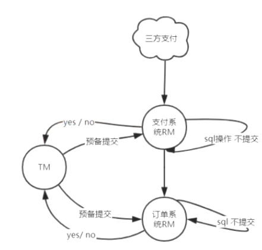
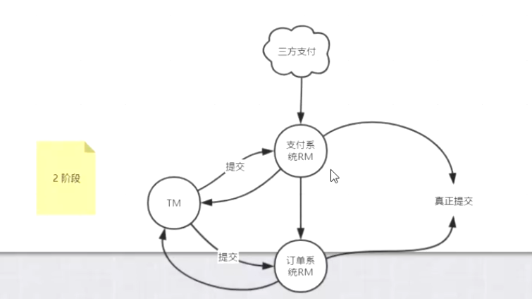
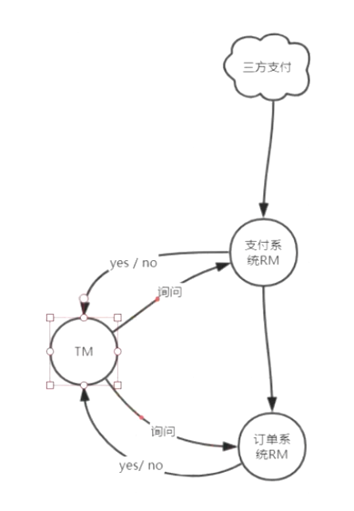

# 分布式事务

## 面试题

单机事务如何保证？

通过锁、redo、undo来保证，写库之前先写日志，然后再写数据文件，如果事务提交数据库中没有就执行redo操作，如果事务没有提交就执行undo操作，把事务进行回滚（反向操作insert<>delete,update<>update）

ACID  （AD日志文件）（CI锁）

A原子性：要么都做要么都不做

C一致性：做完之后保证结果数据是一致的

I隔离性：四种隔离级别

D持久性：落库永久存储

## 刚性事务

ACID，我打你一下，你马上就疼（实时一致性）

## 柔性事务

base理论，我打你一下，你过一会再疼（最终一致性）

xa接口：事务管理器TM、资源管理器RM，如果两个人要一起干一件事就需要一个协调者，TM协调RM

## 两阶段提交

### 预提交

TM（有超时机制）分别向两个RM发出预备提交命令，两个RM分别执行sql操作（锁定资源）不提交，并通知TM结果，如果有一个no所有事务都回滚

### 第二阶段

TM（有超时机制）分别向两个RM发出提交命令，两个RM提交后返回结果，释放资源，如果失败，所有事务都回滚

缺点：

- TM单点故障，TM不能挂

- 提交指令网络故障导致资源阻塞

- 数据不一致，第一个提交了，第二个RM挂掉了

  

## 三阶段提交

在两阶段提交之前加上询问的过程，增大成功的概率

对于阻塞资源的问题加入了RM超时机制，TM等待返回结果超时也回滚

3pc不能解决2pc的问题，只能降低灾难发生的概率