# 分布式事务

## 面试题

单机事务如何保证？

通过锁、redo、undo来保证，写库之前先写日志，然后再写数据文件，如果事务提交数据库中没有就执行redo操作，如果事务没有提交就执行undo操作，把事务进行回滚（反向操作insert<>delete,update<>update）

ACID  （AD日志文件）（CI锁）

A原子性：要么都做要么都不做

C一致性：做完之后保证结果数据是一致的

I隔离性：四种隔离级别

D持久性：落库永久存储

## 刚性事务

ACID，我打你一下，你马上就疼（实时一致性）

## 柔性事务

base理论，我打你一下，你过一会再疼（最终一致性）

xa接口：事务管理器TM、资源管理器RM，如果两个人要一起干一件事就需要一个协调者，TM协调RM


## 两阶段提交

### 预提交


TM（Transaction Manager有超时机制）分别向两个RM发出预备提交命令，两个RM分别执行sql操作（锁定资源）不提交，并通知TM结果，如果有一个no所有事务都回滚

### 第二阶段


TM（有超时机制）分别向两个RM发出提交命令，两个RM提交后返回结果，释放资源，如果失败，所有事务都回滚

缺点：

- TM单点故障，TM不能挂

- 提交指令网络故障导致资源阻塞

- 数据不一致，第一个提交了，第二个RM挂掉了

  

## 三阶段提交

在两阶段提交之前加上询问的过程，增大成功的概率


对于阻塞资源的问题加入了RM超时机制，TM等待返回结果超时也回滚

3pc不能解决2pc的问题，只能降低灾难发生的概率

## 消息队列+事件表

**不适用于数据两特别大的情况**

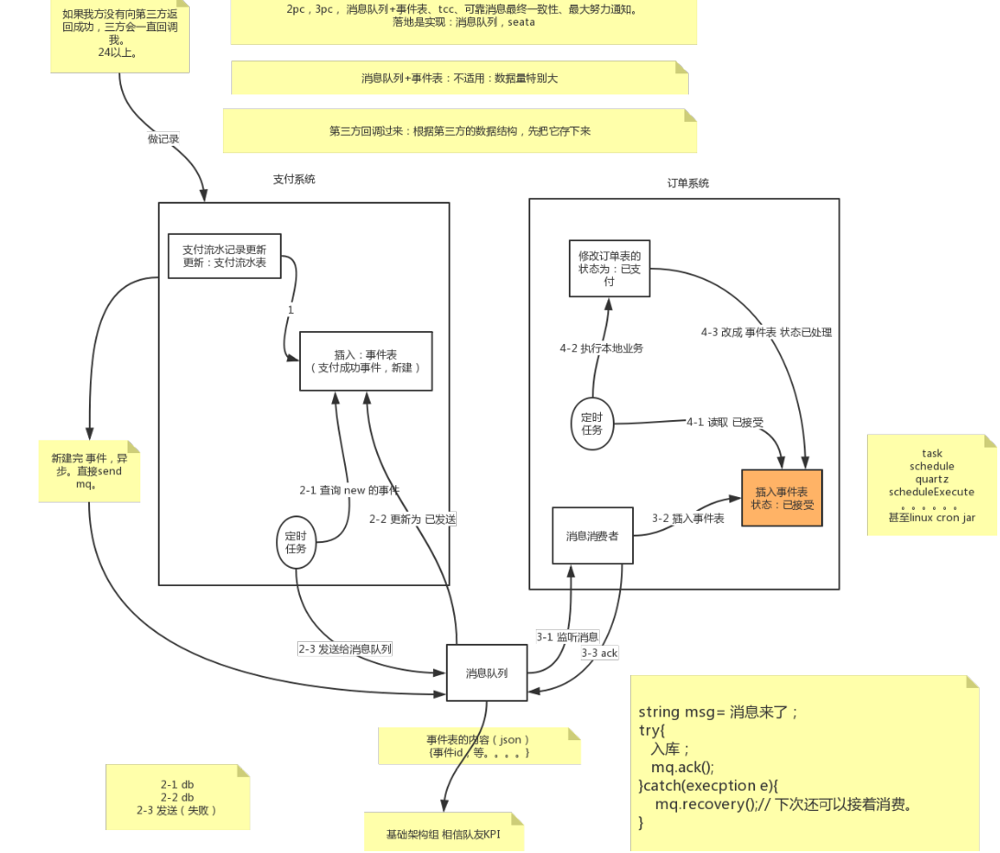

**支付系统**

第三方支付（微信、支付宝）回调支付系统，更新流水记录表，插入事件表，创建状态为new的事件，这两步骤在一个本地事务中，成功直接成功，失败无所谓不会导致数据的不一致，失败回滚相当于三方没有回调，还是未支付，如果没有向三方返回支付成功，三方会一直回调我（支付宝24小时），还有就是每天晚上主去第三方查询 对账（定时任务）

第三方回调每次都要存下来，分析失败率

定时任务去事件表读状态为new的事件，然后发送给消息队列，2.x为另一个本地事务

**疑问**：为什么不和1在同一个事务中，新建完之后直接发送到消息队列？

如果发消息队列失败了怎么办？第一步也回滚？与第三方交互的地方回滚不合适，而且增加了排查错误的复杂度

**细节**：2-2和2-3的顺序，扔队列在最后一步失败回滚没影响

总结：先本地再调用三方


**订单系统**

消费者监听消息队列，消息来了后插入事件表，消息状态已接受，ack给mq

保证了幂等性，通过消息的id主键约束（支付系统的主键id到订单系统的主键id，两个库同一个id），来保证重复消费的问题

消息队列挂了？

1. 还没发送给消息队列，消息队列挂了，无影响
2. 消息发送给消息队列，还未消费，消息队列挂了，消息队列做持久化，再次启动消息还在
3. 消费后消息队列挂了，没有收到ack，下次重复消费插表主键重复，最终控制在数据库主键

定时任务，读取已接受的事件，处理订单，修改订单状态为已支付，时间表状态改成已处理


优化，已发送的事件放到历史表中，防止数据量过大（冷热数据）

#### 实战代码

左边：

```java
@Configuration
public class ActiveMQConfig {

    @Value("${spring.activemq.broker-url}")
    private String brokerUrl;

    @Bean
    public Queue queue() {
        return new ActiveMQQueue("ActiveMQQueue");
    }

    @Bean
    public ActiveMQConnectionFactory connectionFactory(){
        return new ActiveMQConnectionFactory(brokerUrl);
    }
}
```

```java
@Component
public class ProduceTask {

    @Autowired
    private TblOrderEventDao tblOrderEventDao;

    @Autowired
    private Queue queue;

    @Autowired
    JmsMessagingTemplate jmsMessagingTemplate;

    @Scheduled(cron="0/5 * * * * ?")
    @Transactional(rollbackFor = Exception.class) //失败回滚不会把1变成2
    public void task(){
        System.out.println("定时任务");

        List<TblOrderEvent> tblOrderEventList = tblOrderEventDao.selectByOrderType("1");
        for (int i = 0; i < tblOrderEventList.size(); i++) {
            TblOrderEvent event = tblOrderEventList.get(i);

            // 更改这条数据的orderType为2
            tblOrderEventDao.updateEvent(event.getOrderType());
            System.out.println("修改数据库完成");

            jmsMessagingTemplate.convertAndSend(queue,JSONObject.fromObject(event).toString());

        }


    }

}
```

右边：

```java
@Configuration
public class ActiveMQConfig {

    @Value("${spring.activemq.broker-url}")
    private String brokerUrl;

    /**
     * 连接工厂
     * @param redeliveryPolicy
     * @return
     */
    @Bean
    public ActiveMQConnectionFactory connectionFactory(RedeliveryPolicy redeliveryPolicy){
        ActiveMQConnectionFactory activeMQConnectionFactory = new ActiveMQConnectionFactory("admin","admin",brokerUrl);
        activeMQConnectionFactory.setRedeliveryPolicy(redeliveryPolicy);
        return activeMQConnectionFactory;
    }

    /**
     * 重发配置 s
     * @return
     */
    @Bean
    public RedeliveryPolicy redeliveryPolicy(){
        RedeliveryPolicy redeliveryPolicy = new RedeliveryPolicy();
        return redeliveryPolicy;
    }

    /**
     * 设置消息队列 确认机制
     * @param activeMQConnectionFactory
     * @return
     */
    @Bean
    public JmsListenerContainerFactory jmsListenerContainerFactory(ActiveMQConnectionFactory activeMQConnectionFactory){
        DefaultJmsListenerContainerFactory bean = new DefaultJmsListenerContainerFactory();
        bean.setConnectionFactory(activeMQConnectionFactory);
        // 1: 自动确认，2： 客户端手动确认，3：自动批量确认，4 事务提交并确认。
        bean.setSessionAcknowledgeMode(2);
        return bean;
    }

}
```

```java
@Component
public class ConsumerQueue {

    @Autowired
    private TblOrderEventDao tblOrderEventDao;

    @JmsListener(destination = "ActiveMQQueue",containerFactory = "jmsListenerContainerFactory")
    public void receive(TextMessage textMessage, Session session) throws JMSException {
        try {
            System.out.println("收到的消息："+textMessage.getText());
            String content = textMessage.getText();

            TblOrderEvent tblOrderEvent = (TblOrderEvent) JSONObject.toBean(JSONObject.fromObject(content),TblOrderEvent.class);
            tblOrderEventDao.insert(tblOrderEvent);
            // 业务完成，确认消息 消费成功
            textMessage.acknowledge();
        }catch (Exception e){
            // 回滚消息
            e.printStackTrace();
//            e.getMessage(); // 放到log中。
            System.out.println("异常了");
            session.recover();
        }

    }

    /**
     * 补偿 处理（人工，脚本）。自己根据自己情况。
     * @param text
     */
    @JmsListener(destination = "DLQ.ActiveMQQueue")
    public void receive2(String text){
        System.out.println("死信队列:"+text);
    }
}
```

## LCN

Lock Confirm Notify

锁定事务单元、确认实物、通知事务

使用场景：全是sql

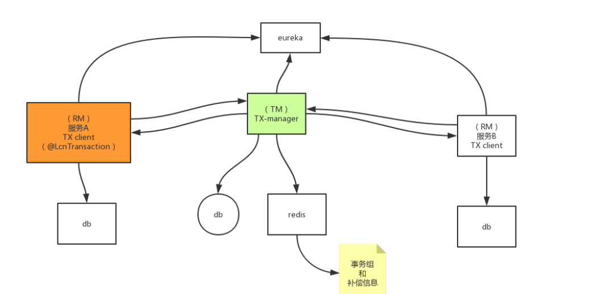

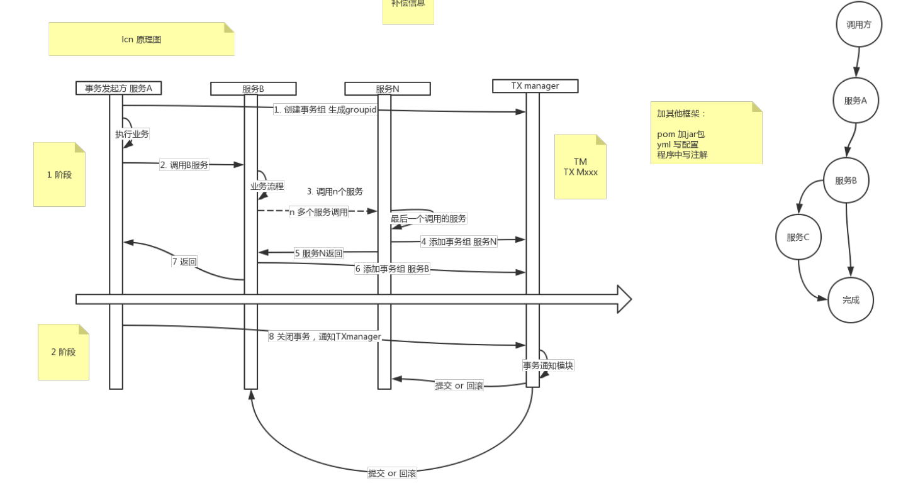

1.创建事务组


最后通知提交或回滚是异步的

箭头上面是一阶段，下面是二阶段，是两次http连接

### 协调机制

提交和回滚如何实现？如何保证第一阶段的事务，在第二阶段提交或回滚？

**保留第一阶段的连接池**，重写close方法假释放连接

缺点阻塞资源


最新版本

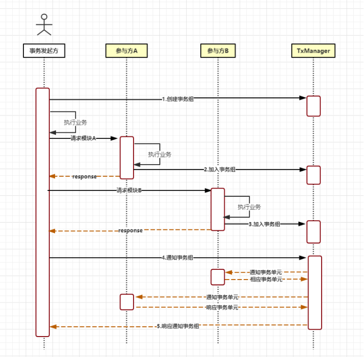


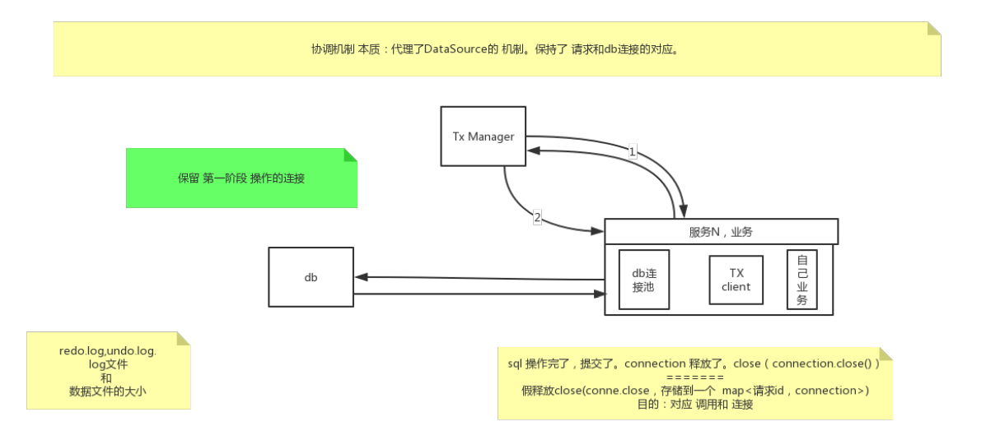


### 补偿机制

等不到2阶段的通知怎么办？

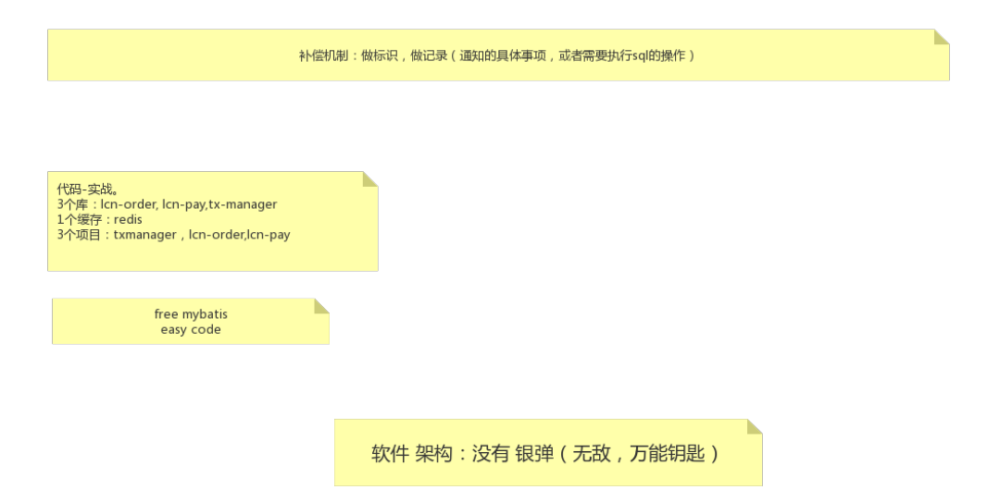

做标识、做记录记录sql，存redis中事务组和补偿信息，有可能服务挂了

### 实战

**tx-manager**

```java
@SpringBootApplication
@EnableTransactionManagerServer
public class LcnTmApplication {

    public static void main(String[] args) {
        SpringApplication.run(LcnTmApplication.class, args);
    }

}
```

```xml
<dependencies>
    <!--tm-->
    <!-- tm  manager -->
    <dependency>
        <groupId>com.codingapi.txlcn</groupId>
        <artifactId>txlcn-tm</artifactId>
        <version>5.0.2.RELEASE</version>
    </dependency>

    <dependency>
        <groupId>com.codingapi.txlcn</groupId>
        <artifactId>txlcn-tc</artifactId>
        <version>5.0.2.RELEASE</version>
    </dependency>
    <dependency>
        <groupId>com.codingapi.txlcn</groupId>
        <artifactId>txlcn-txmsg-netty</artifactId>
        <version>5.0.2.RELEASE</version>
    </dependency>

    <!--tm-->
    <dependency>
        <groupId>org.springframework.boot</groupId>
        <artifactId>spring-boot-starter</artifactId>
    </dependency>

    <dependency>
        <groupId>org.springframework.boot</groupId>
        <artifactId>spring-boot-starter-test</artifactId>
        <scope>test</scope>
        <exclusions>
            <exclusion>
                <groupId>org.junit.vintage</groupId>
                <artifactId>junit-vintage-engine</artifactId>
            </exclusion>
        </exclusions>
    </dependency>
</dependencies>
```

```properties
# TM事务管理器的服务端WEB访问端口。提供一个可视化的界面。端口自定义。
server.port=7970

# TM事务管理器，需要访问数据库，实现分布式事务状态记录。
spring.datasource.driver-class-name=com.mysql.cj.jdbc.Driver
spring.datasource.url=jdbc:mysql://localhost:3306/tx-manager?characterEncoding=UTF-8&serverTimezone=Asia/Shanghai
spring.datasource.username=root
spring.datasource.password=root

# TM事务管理器，是依赖Redis使用分布式事务协调的。尤其是TCC和TXC两种事务模型。
spring.redis.host=127.0.0.1
spring.redis.port=6379
spring.redis.database=0

# 为spring应用起名。
spring.application.name=tx-lcn-transaction-manager

# TM事务管理器，提供的WEB管理平台的登录密码。无用户名。 默认是codingapi
tx-lcn.manager.admin-key=msb
# 日志。如果需要TM记录日志。则开启，赋值为true，并提供后续的配置。
tx-lcn.logger.enabled=true

# 为日志功能，提供数据库连接。和之前配置的分布式事务管理依赖使用的数据源不同。
tx-lcn.logger.driver-class-name=com.mysql.cj.jdbc.Driver
tx-lcn.logger.jdbc-url=jdbc:mysql://localhost:3306/tx-manager?characterEncoding=UTF-8&serverTimezone=Asia/Shanghai
tx-lcn.logger.username=root
tx-lcn.logger.password=root
```

```yml

```


**lcn-pay**

```java
@SpringBootApplication
@EnableDistributedTransaction
public class LcnPayApplication {

    public static void main(String[] args) {
        SpringApplication.run(LcnPayApplication.class, args);
    }

}
```

```yml
server:
  port: 1002

#应用名称及验证账号
spring:
  application:
    name: lcn-pay


  datasource:
    type: com.alibaba.druid.pool.DruidDataSource
    driver-class-name: com.mysql.cj.jdbc.Driver
    url: jdbc:mysql://localhost:3306/lcn-pay?characterEncoding=UTF-8&serverTimezone=Asia/Shanghai
    username: root
    password: root
    dbcp2:
      initial-size: 5
      min-idle: 5
      max-total: 5
      max-wait-millis: 200
      validation-query: SELECT 1
      test-while-idle: true
      test-on-borrow: false
      test-on-return: false

mybatis:
  mapper-locations:
  - classpath:mapper/*.xml

eureka:
  client:
    service-url:
      defaultZone: http://localhost:7900/eureka/

tx-lcn:
  client:
    manager-address: 127.0.0.1:8070
```

```java
@RestController
public class PayController {


    @Autowired
    private TblPayDao tblPayDao;

    @PostMapping("/add-pay")
    @Transactional(rollbackFor = Exception.class)
    @LcnTransaction
    public String addPay(@RequestBody TblPay bean){
        tblPayDao.insert(bean);
        return "新增支付成功";

    }
}
```

**tcl-order**

```java
@SpringBootApplication
@EnableDistributedTransaction
public class LcnOrderApplication {

    public static void main(String[] args) {
        SpringApplication.run(LcnOrderApplication.class, args);
    }

    @Bean
    @LoadBalanced
    public RestTemplate restTemplate(){
        return new RestTemplate();
    }
}
```

```yml
server:
  port: 1001

#应用名称及验证账号
spring:
  application:
    name: lcn-order


  datasource:
    type: com.alibaba.druid.pool.DruidDataSource
    driver-class-name: com.mysql.cj.jdbc.Driver
    url: jdbc:mysql://localhost:3306/lcn-order?characterEncoding=UTF-8&serverTimezone=Asia/Shanghai
    username: root
    password: root
    dbcp2:
      initial-size: 5
      min-idle: 5
      max-total: 5
      max-wait-millis: 200
      validation-query: SELECT 1
      test-while-idle: true
      test-on-borrow: false
      test-on-return: false

mybatis:
  mapper-locations:
  - classpath:mapper/*.xml

eureka:
  client:
    service-url:
      defaultZone: http://localhost:7900/eureka/

# tm配置
tx-lcn:
  client:
    manager-address: 127.0.0.1:8070
```

```java
@RestController
public class OrderController {

    @Autowired
    private TblOrderDao tblOrderDao;

    @Autowired
    private RestTemplate restTemplate;

    @PostMapping("/add-order")
    @Transactional(rollbackFor = Exception.class)
    @LcnTransaction // 加上以后下面的异常pay也会回滚
    public String add(@RequestBody TblOrder bean){

        JSONObject date = new JSONObject();
        date.put("payName",bean.getOrderName()+"pay");

        restTemplate.postForEntity("http://lcn-pay/add-pay",date,String.class);
        int i = 1/0;
        tblOrderDao.insert(bean);
        return "新增订单成功";
    }
}
```

### 源码

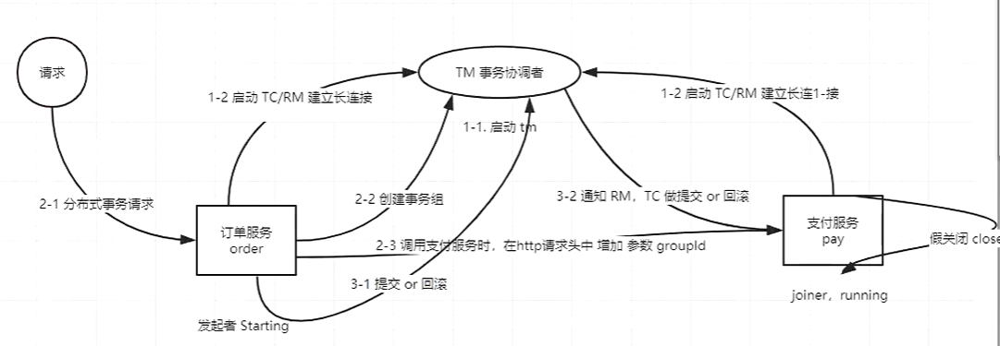


lcn关键点：代理数据源连接

```java
@Aspect
@Component
public class DataSourceAspect implements Ordered {
    private static final Logger log = LoggerFactory.getLogger(DataSourceAspect.class);
    private final TxClientConfig txClientConfig;
    private final DTXResourceWeaver dtxResourceWeaver;

    public DataSourceAspect(TxClientConfig txClientConfig, DTXResourceWeaver dtxResourceWeaver) {
        this.txClientConfig = txClientConfig;
        this.dtxResourceWeaver = dtxResourceWeaver;
    }

    @Around("execution(* javax.sql.DataSource.getConnection(..))")
    public Object around(ProceedingJoinPoint point) throws Throwable {
        return this.dtxResourceWeaver.getConnection(() -> { // -> lcn接管了连接
            return (Connection)point.proceed();
        });
    }

    public int getOrder() {
        return this.txClientConfig.getResourceOrder();
    }
}
```

```java
@Component
public class DTXResourceWeaver {
    private static final Logger log = LoggerFactory.getLogger(DTXResourceWeaver.class);
    private final TxLcnBeanHelper txLcnBeanHelper;

    public DTXResourceWeaver(TxLcnBeanHelper txLcnBeanHelper) {
        this.txLcnBeanHelper = txLcnBeanHelper;
    }

    public Object getConnection(ConnectionCallback connectionCallback) throws Throwable {
        DTXLocalContext dtxLocalContext = DTXLocalContext.cur();
        if (Objects.nonNull(dtxLocalContext) && dtxLocalContext.isProxy()) {
            String transactionType = dtxLocalContext.getTransactionType();
            TransactionResourceProxy resourceProxy = this.txLcnBeanHelper.loadTransactionResourceProxy(transactionType);
            Connection connection = resourceProxy.proxyConnection(connectionCallback);
            log.debug("proxy a sql connection: {}.", connection);
            return connection;
        } else {
            return connectionCallback.call();
        }
    }
}
```

```java
public class LcnConnectionProxy implements Connection {
    private static final Logger log = LoggerFactory.getLogger(LcnConnectionProxy.class);
    private Connection connection;

    public LcnConnectionProxy(Connection connection) {
        this.connection = connection;
    }

    public RpcResponseState notify(int state) {
        try {
            if (state == 1) {
                log.debug("commit transaction type[lcn] proxy connection:{}.", this);
                this.connection.commit();
            } else {
                log.debug("rollback transaction type[lcn] proxy connection:{}.", this);
                this.connection.rollback();
            }

            this.connection.close();
            log.debug("transaction type[lcn] proxy connection:{} closed.", this);
            return RpcResponseState.success;
        } catch (Exception var3) {
            log.error(var3.getLocalizedMessage(), var3);
            return RpcResponseState.fail;
        }
    }

    public void setAutoCommit(boolean autoCommit) throws SQLException {
        this.connection.setAutoCommit(false);
    }

    public void commit() throws SQLException {
    }

    public void rollback() throws SQLException {
    }

    public void close() throws SQLException {
        // 假关闭
    }

    public boolean getAutoCommit() throws SQLException {
        return this.connection.getAutoCommit();
    }
```


## TCC

Try Confirm Cancel

使用场景没有事务的中间件，比如redis

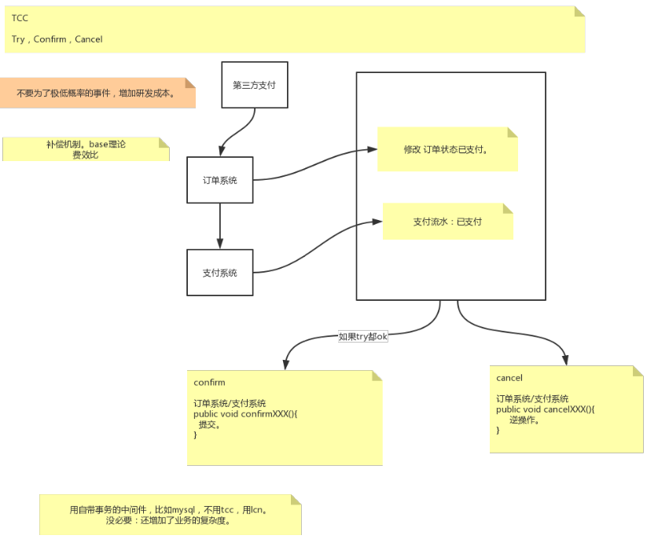

### 实战

```java
@RestController
public class TccOrderController {

    private ThreadLocal<Integer> threadLocal = new ThreadLocal();


    @Autowired
    private TblOrderDao tblOrderDao;

    @Autowired
    private RestTemplate restTemplate;

    @PostMapping("/add-order-tcc")
    @Transactional(rollbackFor = Exception.class)
    @TccTransaction
    public String add(@RequestBody TblOrder bean){

        JSONObject date = new JSONObject();
        date.put("payName",bean.getOrderName()+"pay");

        restTemplate.postForEntity("http://lcn-pay/add-pay-tcc",date,String.class);
        int i = 1/0;
        tblOrderDao.insert(bean);
        Integer id = bean.getId();
        threadLocal.set(id);
        return "新增订单成功";
    }


    public String confirmAdd( TblOrder bean){

        System.out.println("order confirm");
        return "订单确认成功";
    }

    public String cancelAdd( TblOrder bean){

        // deleteDao.deleteById(threadLoacl.get(id));
        System.out.println("order cancel"); // 回滚时执行逆sql
        return "取消订单成功";
    }
}

```

```java
@RestController
public class TccPayController {

    private ThreadLocal<Integer> threadLocal = new ThreadLocal(); // 也可用HashMap

    @Autowired
    private TblPayDao tblPayDao;

    @PostMapping("/add-pay-tcc")
    @Transactional(rollbackFor = Exception.class)
    @TccTransaction
    public String addPay(@RequestBody TblPay bean){
        tblPayDao.insert(bean);
        Integer id = bean.getId();
        threadLocal.set(id);
        return "新增支付成功";

    }

    public String confirmAddPay( TblPay bean){

        System.out.println("order confirm");
        return "支付确认成功";
    }

    public String cancelAddPay( TblPay bean){

        // deleteDao.deleteById(threadLoacl.get(id));
        System.out.println("order cancel"); // 回滚时执行逆sql
        return "取消支付成功";
    }
}
```

## LCN+TCC

```java
@RestController
public class OrderTccRedisController {

    @Autowired
    private TblOrderDao tblOrderDao;

    @Autowired
    private RestTemplate restTemplate;

    @Autowired
    private RedisTemplate<String,String> redisTemplate;

    @PostMapping("/add-order-tcc-redis")
    @Transactional(rollbackFor = Exception.class)
    @LcnTransaction
    public String add(@RequestBody TblOrder bean){

        JSONObject date = new JSONObject();
        date.put("payName",bean.getOrderName()+"pay");
        restTemplate.postForEntity("http://lcn-pay/add-pay-tcc-redis",date,String.class);

        TblOrder tblOrder = new TblOrder();
        tblOrder.setId(1);
        tblOrder.setOrderName("新");

//        BoundValueOperations<String, String> order = redisTemplate.boundValueOps("order");
//        order.set("order-value");

        tblOrderDao.updateByPrimaryKey(tblOrder);
//        int i = 1/0;
        return "新增订单成功";
    }
```


```java
@RestController
public class PayTccRedisController {


    @Autowired
    private TblPayDao tblPayDao;

    @Autowired
    private RedisService redisService;

    @PostMapping("/add-pay-tcc-redis")
    @Transactional(rollbackFor = Exception.class)
    public String addPay(@RequestBody TblPay bean){
        redisService.addPay(null);
        int i = 1/0;
        return "新增支付成功";

    }

}
```

```java
@Service
public class RedisService {

    @Autowired
    private RedisTemplate<String,String> redisTemplate;

    @TccTransaction
    public String addPay(@RequestBody TblPay bean){
        BoundValueOperations<String, String> pay = redisTemplate.boundValueOps("pay");
        pay.set("pay-value");
//        int i = 1/0;
        return "新增支付成功";

    }
    public String confirmAddPay(TblPay bean){
        System.out.println("pay confirm");
        return "新增支付成功";

    }
    private static Map<String,Integer> maps = new HashMap<>();

    /**
     * 逆sql
     * @param bean
     * @return
     */
    public String cancelAddPay(TblPay bean){

        redisTemplate.delete("pay");
        System.out.println("pay cancel");
        return "取消支付成功";

    }
}
```

## Seata

Simple Extensible Autonomous Transaction Architecture 简单的可扩展自治事务体系结构

TC (Transaction Coordinator)事务协调者，协调事务

RM (Resource Manager)资源管理者，每个微服务

TM (Transaction Manager)事务发起者（管理者），特殊的RM，发起事务的微服务

**seata支持的事务模式**

AT、TCC、SAGA、XA

### AT

atomic transation

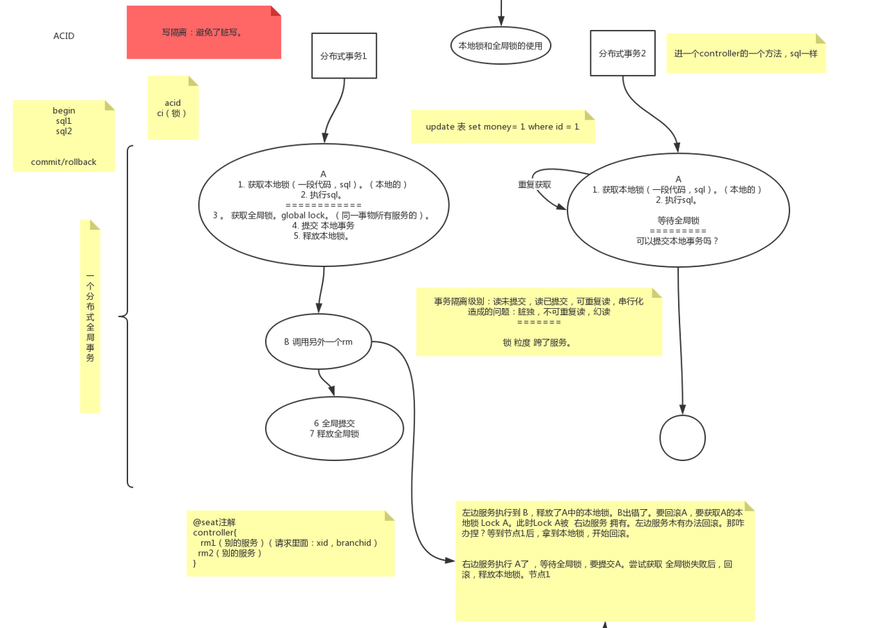

关键步骤：在提交本地事务之前先获取全局锁


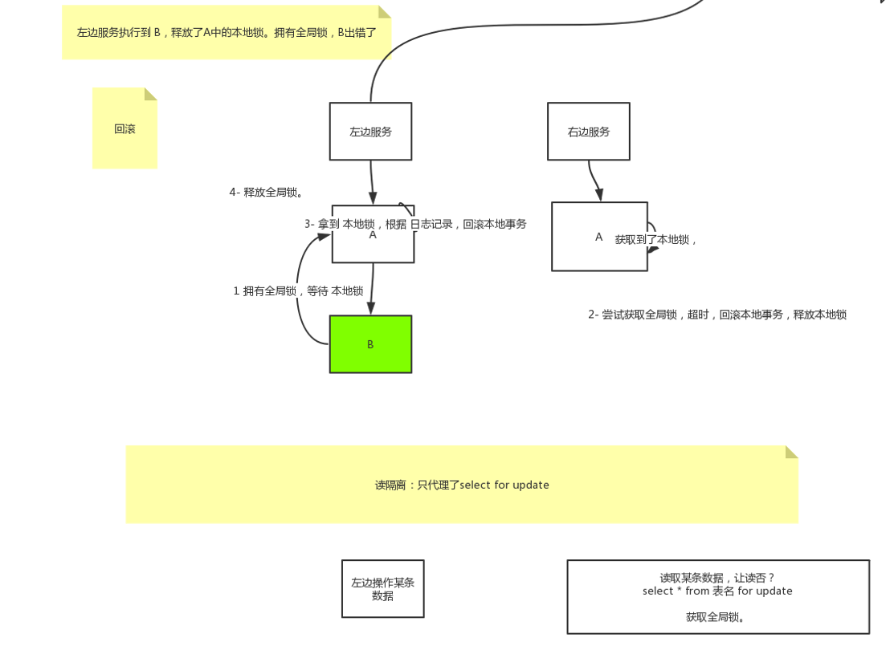

如果获取不到全局锁会不断重试直到超时，此时左边服务回滚时能够获取到本地锁

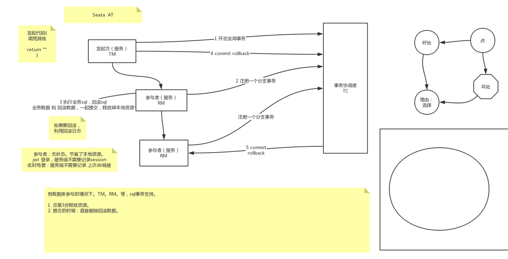

### TCC

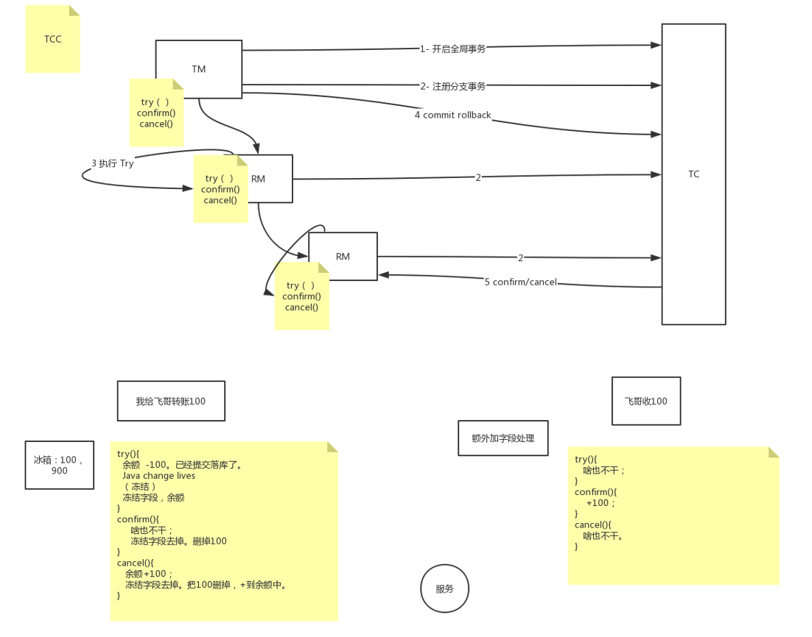

右边confirm和try交换位置就不会出现，账户多一百又少一百的体验

左边增加一个冻结字段，1000余额，减100，冻结字段+100，confirm时删除冻结字段100，cancel时将冻结字段值-100加到余额里又变成了1000


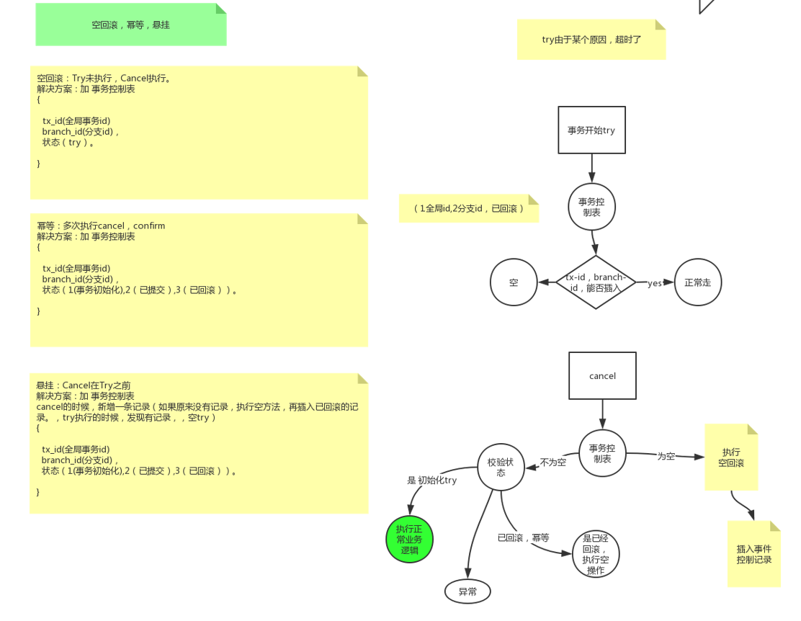

**空回滚**

Try未执行，Cancel执行

Try执行时间太长超时了，需要进行回滚

解决方案：加事务控制表

**幂等**

多次执行cancel，confirm，第一次confirm成功了返回结果丢失，第二次又confirm一次

解决方案：查事务控制表，是否能正常插入

**悬挂**

Cancel在Try之前，try时间过长在执行过程中cancel已经执行完了这时又继续执行try

解决方案：cancel时新增一条记录（如果原来没有记录（没有try，防止空回滚），执行空方法，再插入已回滚的记录，try执行的时候，发现有记录执行空try）

### 实战

1. 下载 seata-server

http://seata.io/zh-cn/blog/download.html

2. 修改配置

   registry.conf

   ```shell
   registry {
     # file 、nacos 、eureka、redis、zk、consul、etcd3、sofa
     #修改
     type = "eureka"
   
     nacos {
       serverAddr = "localhost"
       namespace = ""
       cluster = "default"
     }
     #修改
     eureka {
       serviceUrl = "http://localhost:7900/eureka/"
       #application = "default"
   	application = "seata-server"
       weight = "1"
     }
     redis {
       serverAddr = "localhost:6379"
       db = "0"
     }
     zk {
       cluster = "default"
       serverAddr = "127.0.0.1:2181"
       session.timeout = 6000
       connect.timeout = 2000
     }
     consul {
       cluster = "default"
       serverAddr = "127.0.0.1:8500"
     }
     etcd3 {
       cluster = "default"
       serverAddr = "http://localhost:2379"
     }
     sofa {
       serverAddr = "127.0.0.1:9603"
       application = "default"
       region = "DEFAULT_ZONE"
       datacenter = "DefaultDataCenter"
       cluster = "default"
       group = "SEATA_GROUP"
       addressWaitTime = "3000"
     }
     file {
       name = "file.conf"
     }
   }
   
   config {
     # file、nacos 、apollo、zk、consul、etcd3
     type = "file"
   
     nacos {
       serverAddr = "localhost"
       namespace = ""
     }
     consul {
       serverAddr = "127.0.0.1:8500"
     }
     apollo {
       app.id = "seata-server"
       apollo.meta = "http://192.168.1.204:8801"
     }
     zk {
       serverAddr = "127.0.0.1:2181"
       session.timeout = 6000
       connect.timeout = 2000
     }
     etcd3 {
       serverAddr = "http://localhost:2379"
     }
     file {
       name = "file.conf"
     }
   }
   
   ```

   配置注册中心和配置中心

file.conf

```shell
service {
  #transaction service group mapping
  #修改点1
  #vgroup_mapping.fbs_tx_group = "default"
  # seata-server是注册到Eureka的名字
  vgroup_mapping.my_tx_group = "seata-server" 
  #only support when registry.type=file, please don't set multiple addresses
  
  #修改点2
  #default.grouplist = "127.0.0.1:8091"
  seata-server.grouplist = "127.0.0.1:8091"
  #disable seata
  disableGlobalTransaction = false
}

## transaction log store, only used in seata-server
store {
  ## store mode: file、db
  # 修改
  mode = "db"

  ## file store property
  file {
    ## store location dir
    dir = "sessionStore"
  }

  ## database store property
  #修改
  db {
    ## the implement of javax.sql.DataSource, such as DruidDataSource(druid)/BasicDataSource(dbcp) etc.
	
    datasource = "druid"
    ## mysql/oracle/h2/oceanbase etc.
    db-type = "mysql"
    driver-class-name = "com.mysql.cj.jdbc.Driver"
    url = "jdbc:mysql://127.0.0.1:3306/seata-server?useUnicode=true&useSSL=false&characterEncoding=utf8&serverTimezone=Asia/Shanghai"
    user = "root"
    password = "root"
  }
}
```

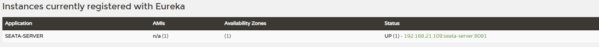

启动Eureka

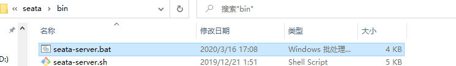

启动seata

#### setat-server-db

自己建库，自己建表。

数据库名和 file.conf中一致。

```sql
分支事务表
CREATE TABLE `branch_table` (
  `branch_id` bigint(20) NOT NULL,
  `xid` varchar(128) NOT NULL,
  `transaction_id` bigint(20) DEFAULT NULL,
  `resource_group_id` varchar(32) DEFAULT NULL,
  `resource_id` varchar(256) DEFAULT NULL,
  `branch_type` varchar(8) DEFAULT NULL,
  `status` tinyint(4) DEFAULT NULL,
  `client_id` varchar(64) DEFAULT NULL,
  `application_data` varchar(2000) DEFAULT NULL,
  `gmt_create` datetime(6) DEFAULT NULL,
  `gmt_modified` datetime(6) DEFAULT NULL,
  PRIMARY KEY (`branch_id`),
  KEY `idx_xid` (`xid`)
) ENGINE=InnoDB DEFAULT CHARSET=utf8;

全局事务表
CREATE TABLE `global_table` (
  `xid` varchar(128) NOT NULL,
  `transaction_id` bigint(20) DEFAULT NULL,
  `status` tinyint(4) NOT NULL,
  `application_id` varchar(32) DEFAULT NULL,
  `transaction_service_group` varchar(32) DEFAULT NULL,
  `transaction_name` varchar(128) DEFAULT NULL,
  `timeout` int(11) DEFAULT NULL,
  `begin_time` bigint(20) DEFAULT NULL,
  `application_data` varchar(2000) DEFAULT NULL,
  `gmt_create` datetime DEFAULT NULL,
  `gmt_modified` datetime DEFAULT NULL,
  PRIMARY KEY (`xid`),
  KEY `idx_gmt_modified_status` (`gmt_modified`,`status`),
  KEY `idx_transaction_id` (`transaction_id`)
) ENGINE=InnoDB DEFAULT CHARSET=utf8;


全局锁
CREATE TABLE `lock_table` (
  `row_key` varchar(128) NOT NULL,
  `xid` varchar(96) DEFAULT NULL,
  `transaction_id` bigint(20) DEFAULT NULL,
  `branch_id` bigint(20) NOT NULL,
  `resource_id` varchar(256) DEFAULT NULL,
  `table_name` varchar(32) DEFAULT NULL,
  `pk` varchar(36) DEFAULT NULL,
  `gmt_create` datetime DEFAULT NULL,
  `gmt_modified` datetime DEFAULT NULL,
  PRIMARY KEY (`row_key`),
  KEY `idx_branch_id` (`branch_id`)
) ENGINE=InnoDB DEFAULT CHARSET=utf8;


```


---

业务 one -> two    one  -> three

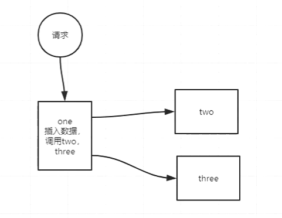

#### TM

one

db：seata-rm-one

业务：插入tbl_one

下面两个配置，不配置也行，走默认8091。

registry.conf

file.conf


pom

```xml
<dependency>
            <groupId>com.alibaba.cloud</groupId>
            <artifactId>spring-cloud-alibaba-seata</artifactId>
            <version>2.2.0.RELEASE</version>
        </dependency>
```


```java
@RestController
public class OneController {

    @Autowired
    RmOneService rmOneService;

    @GetMapping("/one")
    // AT模式
    // seata注解 开启全局事务
    // 只在one这里加就可以了
    @GlobalTransactional(rollbackFor = Exception.class)
    public String one() throws InterruptedException {
        rmOneService.rm1();
//        TimeUnit.MINUTES.sleep(1);
//        System.out.println(1/0);
        return "success";
    }

    @Autowired
    private RmOneInterface rmOneInterface;

    @GetMapping("/one-tcc")
    // TTC模式
    @GlobalTransactional(rollbackFor = Exception.class)
    public String oneTcc() throws InterruptedException {
        rmOneInterface.rm1(null);
        return "success";
    }

}
```

AT实现类

```java
@Service
public class RmOneService {
   
   @Autowired
   TblOneDao mapper;


   public String rm1() {
      
      

      
      TblOne o = new TblOne();
      o.setId(1);
      o.setName("rm1");
      mapper.insertSelective(o);

      rm2();
      rm3();
      
      return "";
   }
   
   
   public String rm2Update() {
      rm2UpdateRemote();

      TblOne o = new TblOne();
      o.setId(2);
      o.setName("rm2");
      mapper.insertSelective(o);
//    int i = 1/0;
      return "";
   }
   
   
   @Autowired
   private RestTemplate restTemplate;
   
   private void rm2() {
      restTemplate.getForEntity("http://two/rm2", null);
   }
   
   private void rm2UpdateRemote() {
      restTemplate.getForEntity("http://two/rm2-update", null);
   }
   
   private void rm3() {
      restTemplate.getForEntity("http://three/rm3", null);
   }
}
```

TCC接口、实现类

```java
@LocalTCC
public interface RmOneInterface {

    @TwoPhaseBusinessAction(name = "rm1TccAction" , commitMethod = "rm1Commit" ,rollbackMethod = "rm1Rollback")
    public String rm1(BusinessActionContext businessActionContext);

    public boolean rm1Commit(BusinessActionContext businessActionContext);

    public boolean rm1Rollback(BusinessActionContext businessActionContext);
}
```

```java
@Component
public class RmOneInterfaceImpl implements RmOneInterface {

    @Override
    @Transactional
    public String rm1(BusinessActionContext businessActionContext) {
        // 查询是事务记录表，xxxx
        System.out.println("rm1 try");

        rm2();
        rm3();
//        System.out.println(1/0);
        return null;
    }

    @Override
    @Transactional
    public boolean rm1Commit(BusinessActionContext businessActionContext) {
        System.out.println("rm1 confirm");
        return true;
    }

    @Override
    @Transactional
    public boolean rm1Rollback(BusinessActionContext businessActionContext) {
        System.out.println("rm1 rollback");
        return true;
    }


    @Autowired
    private RestTemplate restTemplate;

    private void rm2() {
        restTemplate.getForEntity("http://two/rm2-tcc", null);
    }

    private void rm3() {
        restTemplate.getForEntity("http://three/rm3-tcc", null);
    }
}
```

undo log

规定好的

```sql
CREATE TABLE `undo_log` (
  `id` bigint(20) NOT NULL AUTO_INCREMENT,
  `branch_id` bigint(20) NOT NULL,
  `xid` varchar(100) NOT NULL,
  `context` varchar(128) NOT NULL,
  `rollback_info` longblob NOT NULL,
  `log_status` int(11) NOT NULL,
  `log_created` datetime NOT NULL,
  `log_modified` datetime NOT NULL,
  `ext` varchar(100) DEFAULT NULL,
  PRIMARY KEY (`id`),
  UNIQUE KEY `ux_undo_log` (`xid`,`branch_id`)
) ENGINE=InnoDB AUTO_INCREMENT=45 DEFAULT CHARSET=utf8;


```


#### RM

two

db：seata-rm-two

业务：插入tbl_two

下面两个配置，不配置也行，走默认8091。

registry.conf

file.conf

pom

```xml
<dependency>
            <groupId>com.alibaba.cloud</groupId>
            <artifactId>spring-cloud-alibaba-seata</artifactId>
            <version>2.2.0.RELEASE</version>
        </dependency>
```


three

db：seata-rm-three

业务：插入tbl_three

下面两个配置，不配置也行，走默认8091。

registry.conf

file.conf

pom

```xml
<dependency>
            <groupId>com.alibaba.cloud</groupId>
            <artifactId>spring-cloud-alibaba-seata</artifactId>
            <version>2.2.0.RELEASE</version>
        </dependency>
```


undo log

规定好的

```sql
CREATE TABLE `undo_log` (
  `id` bigint(20) NOT NULL AUTO_INCREMENT,
  `branch_id` bigint(20) NOT NULL,
  `xid` varchar(100) NOT NULL,
  `context` varchar(128) NOT NULL,
  `rollback_info` longblob NOT NULL,
  `log_status` int(11) NOT NULL,
  `log_created` datetime NOT NULL,
  `log_modified` datetime NOT NULL,
  `ext` varchar(100) DEFAULT NULL,
  PRIMARY KEY (`id`),
  UNIQUE KEY `ux_undo_log` (`xid`,`branch_id`)
) ENGINE=InnoDB AUTO_INCREMENT=45 DEFAULT CHARSET=utf8;


```

---

**AT模式测试**

开始测试正常情况

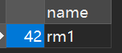

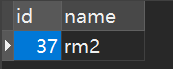

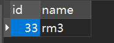

三张表都有数据

---

测试3出现异常

debug启动1

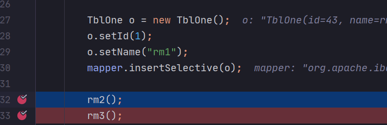

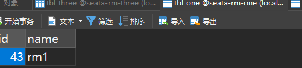

1如库

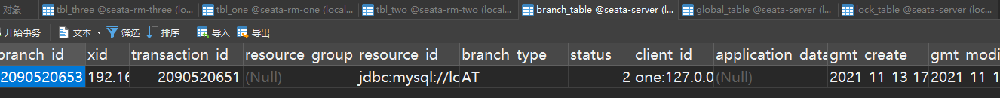

分支事务有一个

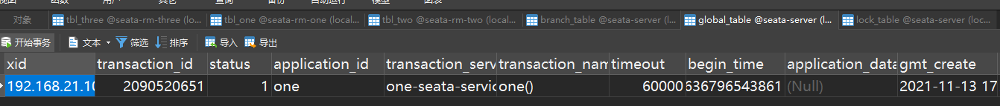

全局事务有一个

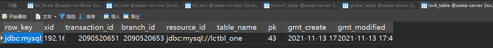

分布式锁

执行RM2

同1，分支事务+1

执行3时失败，全部回滚，表中都无数据

---

TCC模式测试

这次没有分布式锁，有全局事务和分支事务，undolog也没有了，需要自己实现提交、回滚的业务逻辑

try，confirm，cancel 中独立事务。通过业务回滚。

此时不用undo.log表了。

---


**tcc场景：不支持acid事务的关系型数据库**


1.混合场景。2。独立场景。


---

|        | 2pc  | tcc  | 消息队列 |      |
| ------ | ---- | ---- | -------- | ---- |
| 一致性 | 强   | 最终 | 最终     |      |
| 吞吐量 | 低   | 中等 | 高       |      |
| 复杂度 | 简单 | 复杂 | 中等     |      |


2pc和tcc需要经过全部的服务，所以吞吐量不高，直接扔给消息队列吞吐量高

## 事务消息

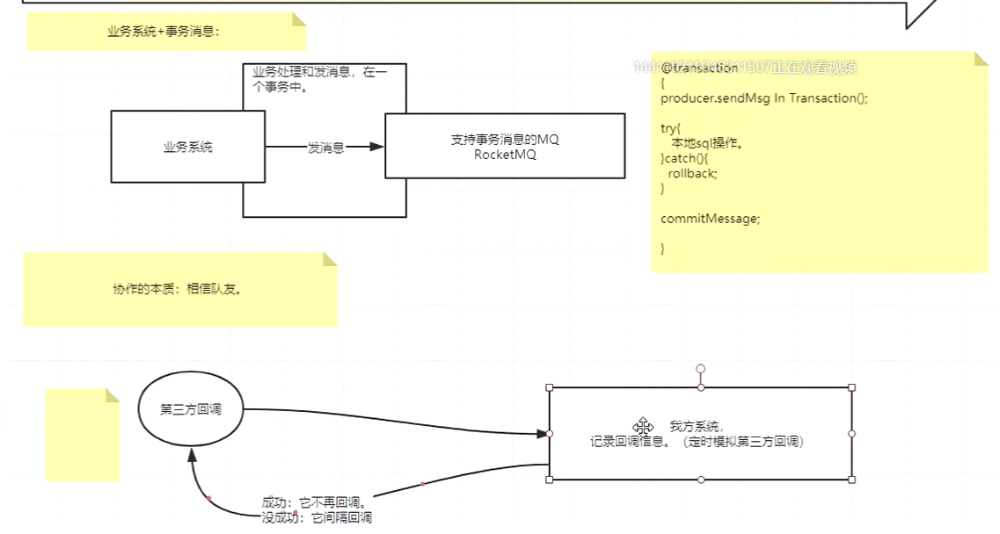

