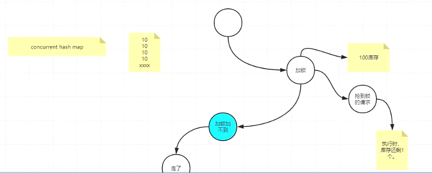

# 分布式锁

**注意的点**

互斥性：在一个时间只有一个服务能够拿到锁

防死锁：不要因为加完锁后程序挂了，释放不了锁，其他客户端获取不了锁

自己解自己的锁：

容错性：n个redis

## 需求


数据库

```sql
DROP TABLE IF EXISTS `tbl_order`;
CREATE TABLE `tbl_order` (
  `order_id` int(8) NOT NULL,
  `order_status` int(8) DEFAULT NULL,
  PRIMARY KEY (`order_id`)
) ENGINE=InnoDB DEFAULT CHARSET=utf8;
```

controller调用服务方

```java
@RestController
@RequestMapping("/grab")
public class GrabOrderController {
    @Autowired
    private RestTemplate restTemplate;
    
    @GetMapping("/do/{orderId}")
    public String grab(@PathVariable("orderId") int orderId, int driverId){
        String url = "http://service-order" + "/grab/do/"+orderId+"?driverId="+driverId;

        restTemplate.getForEntity(url, String.class).getBody();
        return "成功";
    }
}
```

controller被调用的服务方

```java
/**
 * @author yueyi2019
 */
@RestController
@RequestMapping("/grab")
public class GrabOrderController {

    @Autowired
    // 无锁
//    @Qualifier("grabNoLockService")
    // jvm锁
//    @Qualifier("grabJvmLockService")
    // mysql锁
//    @Qualifier("grabMysqlLockService")
    // 手写redis
//    @Qualifier("grabRedisLockService")
    //单个redisson
//    @Qualifier("grabRedisRedissonService")
    // 红锁
    @Qualifier("grabRedisRedissonRedLockLockService")
    private GrabService grabService;
    
    
    @GetMapping("/do/{orderId}")
    public String grab(@PathVariable("orderId") int orderId, int driverId){
        System.out.println("order:"+orderId+",driverId:"+driverId);
        grabService.grabOrder(orderId,driverId);
        return "";
    }
```

jmeter


无锁

```java
@Service("grabNoLockService")
public class GrabNoLockServiceImpl implements GrabService {
   
   @Autowired
   OrderService orderService;
   
   @Override
   public String grabOrder(int orderId, int driverId) {
      
      try {
         System.out.println("司机:"+driverId+" 执行抢单逻辑");
         
            boolean b = orderService.grab(orderId, driverId);
            if(b) {
               System.out.println("司机:"+driverId+" 抢单成功");
            }else {
               System.out.println("司机:"+driverId+" 抢单失败");
            }
            
        } finally {
           
            
        }
      
      return null;
   }

}
```

```java
@Service
public class OrderServiceImpl implements OrderService {

   @Autowired
   private TblOrderDao mapper;

   public boolean grab(int orderId, int driverId) {
      TblOrder order = mapper.selectByPrimaryKey(orderId);
      try {
         // 休息2秒
         Thread.sleep(2000);
      } catch (InterruptedException e) {
         e.printStackTrace();
      }

      // 。。。还有填写其他很多业务信息。
     
			// 数据库中如果是0设置为1
      if (order.getOrderStatus().intValue() == 0) {
         order.setOrderStatus(1);
         mapper.updateByPrimaryKeySelective(order);

         return true;
      }
      return false;

   }
}
```


无锁状态下，同时读到库中=0，10个并发都抢单成功


**jvm锁**

```java
@Service("grabJvmLockService")
public class GrabJvmLockServiceImpl implements GrabService {
   
   @Autowired
   OrderService orderService;
   
   @Override
   public String grabOrder(int orderId, int driverId) {
      String lock = (orderId+"");
      // 锁常量池中的字符串，保证对象唯一
      synchronized (lock.intern()) {
         try {
            System.out.println("司机:"+driverId+" 执行抢单逻辑");
            
               boolean b = orderService.grab(orderId, driverId);
               if(b) {
                  System.out.println("司机:"+driverId+" 抢单成功");
               }else {
                  System.out.println("司机:"+driverId+" 抢单失败");
               }
               
           } finally {
              
               
           }
      }
      
      
      return null;
   }

}
```


单个服务时，jvm锁生效了

两个服务时，同时打到两个服务就会有两个成功


## mysql实现


并发量小的时候可以用，mysql和redis比性能差10W倍，怕数据库卡死


```sql
DROP TABLE IF EXISTS `tbl_order`;
CREATE TABLE `tbl_order` (
  `order_id` int(8) NOT NULL,
  `order_status` int(8) DEFAULT NULL,
  PRIMARY KEY (`order_id`)
) ENGINE=InnoDB DEFAULT CHARSET=utf8;

-- ----------------------------
-- Records of tbl_order
-- ----------------------------
INSERT INTO `tbl_order` VALUES ('1', '1');

-- ----------------------------
-- Table structure for tbl_order_lock
-- ----------------------------
DROP TABLE IF EXISTS `tbl_order_lock`;
CREATE TABLE `tbl_order_lock` (
  `order_id` int(8) NOT NULL,
  `driver_id` int(8) DEFAULT NULL,
  PRIMARY KEY (`order_id`)
) ENGINE=InnoDB DEFAULT CHARSET=utf8;
```

```java
@Service("grabMysqlLockService")
public class GrabMysqlLockServiceImpl implements GrabService {

    @Autowired
    private MysqlLock lock;


    @Autowired
    OrderService orderService;

  	// 使用threadLocal保证线程安全，防止还没执行业务，值又被下一个线程更新了，TblOrderLock的值被更新成别的了
    ThreadLocal<TblOrderLock> orderLock = new ThreadLocal<>();

    @Override
    public String grabOrder(int orderId, int driverId) {
        // 生成 锁
        //生成key
        TblOrderLock ol = new TblOrderLock();
        ol.setOrderId(orderId);
        ol.setDriverId(driverId);

        orderLock.set(ol);
        lock.setOrderLockThreadLocal(orderLock);

        // lock
        lock.lock();

        // 执行业务
        try {
            System.out.println("司机:"+driverId+" 执行抢单逻辑");
						// 插入表中，利用主键冲突来做
            boolean b = orderService.grab(orderId, driverId);
            if(b) {
                System.out.println("司机:"+driverId+" 抢单成功");
            }else {
                System.out.println("司机:"+driverId+" 抢单失败");
            }
        }finally {
            // 释放锁
            lock.unlock();
        }
        // 执行业务

        return null;
    }
}
```

```java
@Service
@Data
public class MysqlLock implements Lock {

   @Autowired
   private TblOrderLockDao mapper;
   
   private ThreadLocal<TblOrderLock> orderLockThreadLocal ;

   @Override
   public void lock() {
      // 1、尝试加锁
      // 仅在调用时锁未被另一个线程保持的情况下，才获取该锁。 
      if(tryLock()) {
         System.out.println("尝试加锁");
         return;
      }
      // 2.休眠
      try {
         Thread.sleep(10);
      } catch (InterruptedException e) {
         e.printStackTrace();
      }
      // 3.递归再次调用
      lock();
   }
   
   /**
    *     非阻塞式加锁，成功，就成功，失败就失败。直接返回
    */
   @Override
   public boolean tryLock() {
      try {
         TblOrderLock tblOrderLock = orderLockThreadLocal.get();
         mapper.insertSelective(tblOrderLock);
         System.out.println("加锁对象："+orderLockThreadLocal.get());
         return true;
      }catch (Exception e) {
         return false;
      }
      
      
   }
   
   @Override
   public void unlock() {
      // 删除主键
      mapper.deleteByPrimaryKey(orderLockThreadLocal.get().getOrderId());
      System.out.println("解锁对象："+orderLockThreadLocal.get());
      orderLockThreadLocal.remove();
   }

  
}
```

```java
@Service
public class OrderServiceImpl implements OrderService {

   @Autowired
   private TblOrderDao mapper;

   public boolean grab(int orderId, int driverId) {
      TblOrder order = mapper.selectByPrimaryKey(orderId);
      try {
         Thread.sleep(2000);
      } catch (InterruptedException e) {
         e.printStackTrace();
      }

      // 还有填写其他很多业务信息。包括哪个司机啥的。起点，终点。

      if (order.getOrderStatus().intValue() == 0) {
         order.setOrderStatus(1);
         mapper.updateByPrimaryKeySelective(order);

         return true;
      }
      return false;

   }
}
```

## redis实现

### 手写实现

```java
@Service("grabRedisLockService")
public class GrabRedisLockServiceImpl implements GrabService {

   @Autowired
   StringRedisTemplate stringRedisTemplate;
   
   @Autowired
   OrderService orderService;
   
    @Override
    public String grabOrder(int orderId , int driverId){
        //生成key
       String lock = "order_"+(orderId+"");
       /*
        *  情况一，如果锁没执行到释放，比如业务逻辑执行一半，运维重启服务，或 服务器挂了，没走 finally，怎么办？
        *  加超时时间
        *  setnx
        */
//     boolean lockStatus = stringRedisTemplate.opsForValue().setIfAbsent(lock.intern(), driverId+"");
//     if(!lockStatus) {
//        return null;
//     }
       
       /*
        *  情况二：加超时时间,会有加不上的情况，运维重启
        */
//     boolean lockStatus = stringRedisTemplate.opsForValue().setIfAbsent(lock.intern(), driverId+"");
//     stringRedisTemplate.expire(lock.intern(), 30L, TimeUnit.SECONDS);
//     if(!lockStatus) {
//        return null;
//     }
       
       /*
        * 情况三：超时时间应该一次加，不应该分2行代码，
        * 
        */
       boolean lockStatus = stringRedisTemplate.opsForValue().setIfAbsent(lock.intern(), driverId+"", 30L, TimeUnit.SECONDS);
       // 开个子线程，原来时间N，每个n/3，去续上n
       
       if(!lockStatus) {
          return null;
       }
       
       try {
         System.out.println("司机:"+driverId+" 执行抢单逻辑");
         
            boolean b = orderService.grab(orderId, driverId);
            if(b) {
               System.out.println("司机:"+driverId+" 抢单成功");
            }else {
               System.out.println("司机:"+driverId+" 抢单失败");
            }
            
        } finally {
           /**
            * 这种释放锁有，可能释放了别人的锁。
            */
//         stringRedisTemplate.delete(lock.intern());
           
           /**
            * 下面代码避免释放别人的锁
            */
           if((driverId+"").equals(stringRedisTemplate.opsForValue().get(lock.intern()))) {
            stringRedisTemplate.delete(lock.intern());
         }
        }
        return null;
    }
}
```


假如锁过期时间是10分钟，正常业务执行8分钟释放掉锁

突然有一次执行了12分钟，10分钟时锁过期第二个线程抢到，12分钟时线程1释放了线程2的锁

一般到1/3时间的时候去开启守护线程（主程序执行完自动释放）去检查，然后延长过期时间到10分钟

也可以setnx（orderId，value），value是uuid或者业务id

### **续命服务**

```java
@Service
public class RenewGrabLockServiceImpl implements RenewGrabLockService {

    @Autowired
    private RedisTemplate<String, String> redisTemplate;

    @Override
    @Async
    public void renewLock(String key, String value, int time) {
        String v = redisTemplate.opsForValue().get(key);
        if (v.equals(value)){
            int sleepTime = time / 3;
            try {
                Thread.sleep(sleepTime * 1000);
            } catch (InterruptedException e) {
                e.printStackTrace();
            }
            redisTemplate.expire(key,time,TimeUnit.SECONDS);
            renewLock(key,value,time);
        }
    }
}
```

### redisson

**单个redis**

```xml
<dependency>
   <groupId>org.redisson</groupId>
   <artifactId>redisson</artifactId>
   <version>3.3.2</version>
</dependency>
```


```java
@Component
public class RedisConfig {

    @Autowired
    RedisSentinelProperties properties;
  
    //以下为redisson锁，哨兵
    @Bean(name = "redisson")
    @Order(1)
    public Redisson getRedisson(){

        Config config = new Config();
        config.useSentinelServers()
                .setMasterName(properties.getMasterName())
                .addSentinelAddress(properties.getAddress())
                .setDatabase(0);
        return (Redisson) Redisson.create(config);
    }
    //以上为redisson 哨兵锁

    //以下为红锁
    @Bean(name = "redissonRed1")
    @Primary
    public RedissonClient redissonRed1(){
        Config config = new Config();
        config.useSingleServer().setAddress("127.0.0.1:6379").setDatabase(0);
        return Redisson.create(config);
    }
    @Bean(name = "redissonRed2")
    public RedissonClient redissonRed2(){
        Config config = new Config();
        config.useSingleServer().setAddress("127.0.0.1:6379").setDatabase(0);
        return Redisson.create(config);
    }
    @Bean(name = "redissonRed3")
    public RedissonClient redissonRed3(){
        Config config = new Config();
        config.useSingleServer().setAddress("127.0.0.1:6379").setDatabase(0);
        return Redisson.create(config);
    }
    //以上为红锁
    
    
    
    // 单个redis
    @Bean
    @ConditionalOnMissingBean(StringRedisTemplate.class)
    public StringRedisTemplate stringRedisTemplate(RedisConnectionFactory redisConnectionFactory) {
     StringRedisTemplate redisTemplate = new StringRedisTemplate();
     redisTemplate.setConnectionFactory(redisConnectionFactory);
     return redisTemplate;

    }
    
    /**
     * 单个redisson
     * @return
     */
    @Bean
    public RedissonClient redissonClient() {
     Config config = new Config();
     config.useSingleServer().setAddress("127.0.0.1:6379").setDatabase(0);

     return Redisson.create(config);
    }

    @Bean
    public Redisson redisson(){
        Config config = new Config();
        config.useSingleServer().setAddress("redis://localhost:6379").setDatabase(0);
        return (Redisson) Redisson.create(config);
    }
}
```

```yml
redis:
  database: 0
  host: 127.0.0.1
  port: 6379
  timeout: 2000
  password:
  
#自定义哨兵
sentinel:
  address:
    - 127.0.0.1:26379
    - 127.0.0.1:26479
    - 127.0.0.1:26579
  masterName: mymaster
```

和手写实现一个意思

```java
@Service("grabRedisRedissonService")
public class GrabRedisRedissonServiceImpl implements GrabService {

   @Autowired
   RedissonClient redissonClient;

// @Autowired
// Redisson redisson;

   @Autowired
   OrderService orderService;
   
    @Override
    public String grabOrder(int orderId , int driverId){
        //生成key
       String lock = "order_"+(orderId+"");
       
       RLock rlock = redissonClient.getLock(lock.intern());

//        RLock lock1 = redisson.getLock(lock.intern());

        try {
          // 此代码默认 设置key 超时时间30秒，过10秒，再延时
          rlock.lock();

//            lock1.lock();
            try {
                TimeUnit.MINUTES.sleep(3);
            } catch (InterruptedException e) {
                e.printStackTrace();
            }
//            lock1.lock();
         System.out.println("司机:"+driverId+" 执行抢单逻辑");
         
            boolean b = orderService.grab(orderId, driverId);
            if(b) {
               System.out.println("司机:"+driverId+" 抢单成功");
            }else {
               System.out.println("司机:"+driverId+" 抢单失败");
            }
            
        } finally {
           rlock.unlock();
//            lock1.unlock();
        }
        return null;
    }
}
```

#### 源码

加锁逻辑

lock() - > lockInterruptibly(-1, null);

```java
 @Override
    public void lockInterruptibly(long leaseTime, TimeUnit unit) throws InterruptedException {
        long threadId = Thread.currentThread().getId();
        Long ttl = tryAcquire(leaseTime, unit, threadId);
        // lock acquired
        if (ttl == null) {
            return;
        }

        RFuture<RedissonLockEntry> future = subscribe(threadId);
        commandExecutor.syncSubscription(future);

        try {
            while (true) {
                ttl = tryAcquire(leaseTime, unit, threadId);
                // lock acquired
                if (ttl == null) {
                    break;
                }

                // waiting for message
                if (ttl >= 0) {
                    getEntry(threadId).getLatch().tryAcquire(ttl, TimeUnit.MILLISECONDS);
                } else {
                    getEntry(threadId).getLatch().acquire();
                }
            }
        } finally {
            unsubscribe(future, threadId);
        }
//        get(lockAsync(leaseTime, unit));
    }
```


### 红锁

当我们请求一个分布式锁的时候，成功了，但是这时候slave还没有复制我们的锁，masterDown了，我们的应用继续请求锁的时候，会从继任了master的原slave上申请，也会成功。

这就会导致，同一个锁被获取了不止一次。

n台独立的redis

```java
@Service("grabRedisRedissonRedLockLockService")
public class GrabRedisRedissonRedLockLockServiceImpl implements GrabService {

    @Autowired
    @Qualifier("redissonRed1")
    private RedissonClient redissonRed1;
    @Autowired
    @Qualifier("redissonRed2")
    private RedissonClient redissonRed2;
    @Autowired
    @Qualifier("redissonRed3")
    private RedissonClient redissonRed3;
    
    @Autowired
   OrderService orderService;

    @Override
    public String grabOrder(int orderId , int driverId){
        //生成key
        String lockKey = (RedisKeyConstant.GRAB_LOCK_ORDER_KEY_PRE + orderId).intern();
        //redisson锁 哨兵
//        RLock rLock = redisson.getLock(lockKey);
//        rLock.lock();

        //redisson锁 单节点
//        RLock rLock = redissonRed1.getLock(lockKey);

        //红锁 redis son
        RLock rLock1 = redissonRed1.getLock(lockKey);
        RLock rLock2 = redissonRed2.getLock(lockKey);
        RLock rLock3 = redissonRed3.getLock(lockKey);
        RedissonRedLock rLock = new RedissonRedLock(rLock1,rLock2,rLock3);


        try {
            rLock.lock();
            try {
                TimeUnit.MINUTES.sleep(1);
            } catch (InterruptedException e) {
                e.printStackTrace();
            }
            // 此代码默认 设置key 超时时间30秒，过10秒，再延时
         System.out.println("司机:"+driverId+" 执行抢单逻辑");
         
            boolean b = orderService.grab(orderId, driverId);
            if(b) {
               System.out.println("司机:"+driverId+" 抢单成功");
            }else {
               System.out.println("司机:"+driverId+" 抢单失败");
            }
            
        } finally {
           rLock.unlock();
        }
        return null;
    }
```

加锁的逻辑基本上按照RedLock算法来实现的，流程如下：

1. 每个节点加锁至少等待1500ms，等待总时间就是1500*节点数量；
2. 按照RedLock算法，计算每个节点获取锁的等待时间；
3. 从第一个节点开始进行加锁操作，加锁的执行逻辑和上面单节点的一样，如果加锁成功继续下一个节点，如果加锁失败，首先判断加锁成功的节点数是否已经满足最低加锁个数限制，比如5个节点中必须大于等于3个节点；

- 如果满足则停止加锁，本次加锁操作执行成功；
- 如果不满足，判断加锁失败次数是否达到上限，如果没有达到上限，记录失败次数并对下一个节点加锁，如果已经达到加锁失败次数的上限，判断本次集群加锁失败，解锁所有成功获取到锁的节点；

1. 每个节点加锁无论成功或失败，执行完成后都需要判断剩余时间，如果剩余时间已经小于0且未完成所有节点的加锁，判断为加锁失败并进行解锁；
2. 如果加锁成功，更新所有加锁成功节点的过期时间；

### lua脚本

​		原子性是指不可打断的一个完整操作。redis中单个命令是原子的，但是如果期望多个命令组合成一个[原子操作]，就不行了，此时需要借助Lua脚本来实现原子性

​		Lua是一个小巧的脚本语言，由标准C编写而成，代码简洁优美，几乎在所有操作系统和平台上都可以编译，运行。
​		一个完整的Lua解释器不过200k，在目前所有脚本引擎中，Lua的速度是最快的。Lua内的代码可以保证原子性，要么全部成功，要么全部失败。

https://blog.csdn.net/my_momo_csdn/article/details/92090881


### 自定义注解RedisLockRegistry实现

```xml
<dependency>
   <groupId>org.springframework.boot</groupId>
   <artifactId>spring-boot-starter-data-redis</artifactId>
</dependency>

<dependency>
   <groupId>org.springframework.boot</groupId>
   <artifactId>spring-boot-starter-integration</artifactId>
</dependency>

<dependency>
   <groupId>org.springframework.integration</groupId>
   <artifactId>spring-integration-redis</artifactId>
</dependency>
```

**自定义注解**

```java
@Target(ElementType.METHOD)
@Retention(RetentionPolicy.RUNTIME)
public @interface DistributedLock {

    String value() default "";

    int time() default 30;
}
```

**RedisLockRegistry**

https://www.jianshu.com/p/b60db9a717c2

```java
@Configuration
public class RedisLockConfiguration {

    @Bean
    public RedisLockRegistry redisLockRegistry(RedisConnectionFactory redisConnectionFactory){
        return new RedisLockRegistry(redisConnectionFactory,"order_lock");
    }
}
```

**LockAop**

```java
@Component
@Aspect
@Slf4j
public class LockAop {

    private WebApplicationContext webApplicationContext;

    public LockAop(WebApplicationContext webApplicationContext){
        this.webApplicationContext = webApplicationContext;
    }

  	// 使用该注解的方法都会被代理
    @Pointcut("@annotation(com.online.taxi.order.annotation.DistributedLock)")
    private void apiAop(){

    }

    @Around("apiAop()")
    public Object aroundApi(ProceedingJoinPoint point) throws Throwable{
        MethodSignature signature = (MethodSignature)point.getSignature();
        Method method = signature.getMethod();
        Object[] args = point.getArgs();
      	// 获取参数
        System.out.println(args[0]);
        DistributedLock lockDistributed = method.getAnnotation(DistributedLock.class);


        RedisLockRegistry redisLockRegistry = (RedisLockRegistry) webApplicationContext.getBean(lockDistributed.value());

        Lock lock = redisLockRegistry.obtain(signature.getName() + "_" + args[0]);
        boolean b = false;
        for (int i = 0; i < 3; i++) {
            b = lock.tryLock(lockDistributed.time(), TimeUnit.SECONDS);
            if(b){
                break;
            }else {
                continue;
            }
        }
        log.info("获取锁："+b);
        Object proceed = null;
        try {
            // 通过反射的方式调用目标的方法，相当于执行method.invoke()
            proceed = point.proceed();
        }catch (Exception e){
            throw e;
        }finally {
            try {
                // 释放锁
                lock.unlock();
            }catch (Exception e){
                System.out.println("没锁");
            }
        }
        return proceed;
    }
}
```

**service**

```java
@Service("cloudService")
public class CloudService implements GrabService {

    @Autowired
    OrderService orderService;

    @Override
  	// 实际调用方法上加的注解
    @DistributedLock(value = "redisLockRegistry",time = 10)
    public String grabOrder(int orderId, int driverId) {
        System.out.println("司机"+ driverId + "执行抢单逻辑");

        boolean b = orderService.grab(orderId, driverId);
        if(b) {
            System.out.println("司机:"+driverId+" 抢单成功");
        }else {
            System.out.println("司机:"+driverId+" 抢单失败");
        }


        return null;
    }
}
```

#### RedisLockRegistry源码

构造方法

```java
/**
	* Constructs a lock registry with the default (60 second) lock expiration.
	* @param connectionFactory The connection factory.
	* @param registryKey The key prefix for locks.
	*/
// 默认过期时间60s，connectionFactory连接工厂，registryKey锁的前缀
public RedisLockRegistry(RedisConnectionFactory connectionFactory, String registryKey) {
   this(connectionFactory, registryKey, DEFAULT_EXPIRE_AFTER);
}


public RedisLockRegistry(RedisConnectionFactory connectionFactory, String registryKey, long expireAfter) {
		Assert.notNull(connectionFactory, "'connectionFactory' cannot be null");
		Assert.notNull(registryKey, "'registryKey' cannot be null");
  	// 构造redisTemplate用于执行Redis操作
		this.redisTemplate = new StringRedisTemplate(connectionFactory);
  	// 构造obtainLockScript用来保存获取锁的脚本；（获取锁脚本，默认返回值boolean）
		this.obtainLockScript = new DefaultRedisScript<>(OBTAIN_LOCK_SCRIPT, Boolean.class);
		this.registryKey = registryKey;
		this.expireAfter = expireAfter;
		this.unlinkAvailable = RedisUtils.isUnlinkAvailable(this.redisTemplate);
	}
```

```java
private static final String OBTAIN_LOCK_SCRIPT =
      "local lockClientId = redis.call('GET', KEYS[1])\n" +
            "if lockClientId == ARGV[1] then\n" +
            "  redis.call('PEXPIRE', KEYS[1], ARGV[2])\n" +
            "  return true\n" +
            "elseif not lockClientId then\n" +
            "  redis.call('SET', KEYS[1], ARGV[1], 'PX', ARGV[2])\n" +
            "  return true\n" +
            "end\n" +
            "return false";
```

当Lua脚本使用call()或pcall()调用Redis命令时，Redis返回值将转换为Lua数据类型。

设置一个键值对，在Lua语言中采用redis.call(command,key[param1, param2…])进行操作，其中

command是命令，包括set、get、del等。
key是被操作的键。
param1,param2…代表给key的参数。
脚本中的KEYS[1]代表传递给Lua脚本的第一个key参数，而ARGV[1]代表第一个非key参数。

该脚本的意思如下：
 lockClientId 为keys[1]对应的value 这里的keys[1]其实就是锁的名字
 随后分3种情况
 1.锁对应的客户端id存在，如果拿到该锁的客户端还是一样，说明是重入锁。------重入
 2.锁对应的客户id不存在，直接上锁，设置lockname--->clientId的键值对------上锁
 3.锁对应的客户id存在，且不等于当前传入的客户端id，说明锁已经被占用了，直接返回false---获取锁失败

**获取锁**

```java
private final Map<String, RedisLock> locks = new ConcurrentHashMap<>();

@Override
public Lock obtain(Object lockKey) {
   Assert.isInstanceOf(String.class, lockKey);
   String path = (String) lockKey;
   // ConcurrentHashMap建立key value的映射 path
   // 构造器引用：它的语法是Class::new，或者更一般的Class< T >::new
   // 从一个ConcurrentHashMap中根据锁的标识获取一个锁，如果没有则构造一个新的；
   return this.locks.computeIfAbsent(path, RedisLock::new);
}
```

**加锁**

获取本地锁 -> 获取redis锁

```java
private final ReentrantLock localLock = new ReentrantLock();

@Override
public boolean tryLock(long time, TimeUnit unit) throws InterruptedException {
   long now = System.currentTimeMillis();
   // 本地的重入锁ReentrantLock尝试加锁，可重入：递归调用不会产生死锁
   if (!this.localLock.tryLock(time, unit)) {
      return false;
   }
   try {
      long expire = now + TimeUnit.MILLISECONDS.convert(time, unit);
      boolean acquired;
      // 本地加锁成功后执行redis加锁
      while (!(acquired = obtainLock()) && System.currentTimeMillis() < expire) { 
         // 加锁失败且没过超时时间，睡一会再试
         Thread.sleep(100); 
      }
      if (!acquired) {
         // 如果没有获取到锁，把本地锁释放直接返回
         this.localLock.unlock();
      }
      return acquired;
   }
   catch (Exception e) {
      // 异常释放本地锁
      this.localLock.unlock();
      rethrowAsLockException(e);
   }
   return false;
}
```

首先是本地的重入锁先进行加锁，加锁步骤如下：

- 如果锁资源没有被其他线程占用，直接加锁，亦或者是本地线程已经占用锁，再次重入也被视为加锁成功；
- 如果锁资源被其他线程占用，排队等待指定时间，指定时间内获取不到资源则加锁失败；

成功在本地加锁后会执行Redis加锁操作，执行构造方法中的lua获取锁脚本

```java
private boolean obtainLock() {
   Boolean success =
         RedisLockRegistry.this.redisTemplate.execute(RedisLockRegistry.this.obtainLockScript,
               Collections.singletonList(this.lockKey), RedisLockRegistry.this.clientId,
               String.valueOf(RedisLockRegistry.this.expireAfter));

   boolean result = Boolean.TRUE.equals(success);

   if (result) {
      this.lockedAt = System.currentTimeMillis();
   }
   return result;
}
```

##### RedisLockRegistry和Redisson对比

不同点：

- RedisLockRegistry有一个本地加锁的逻辑，只有当本地加锁成功才能继续执行redis加锁逻辑，重入逻辑也是做在本地，所以理论上**RedisLockRegistry**比**Redisson**会快那么一点点；
- Redisson有锁续租功能，解决了加锁成功后逻辑执行未完成时锁到期被释放，导致其他资源获取锁的混乱；


## 秒杀

多个用户抢一个商品

多个司机抢一个订单

前提：已有的交易系统功能完善，稳定、短时间、高并发

准：不多卖，不少卖（分布式锁）

快：服务响应速度要快

稳：服务的可用性



100库存，如果获取不到锁就走了，有可能还有库存，但是请求都已经没了

所以，抢不到锁的等着，等到抢到锁了，再去看库存还有没有，就不会放走请求导致少卖

一直等待会有时间很长，所以对库存采用分段加锁的方法，提高了效率