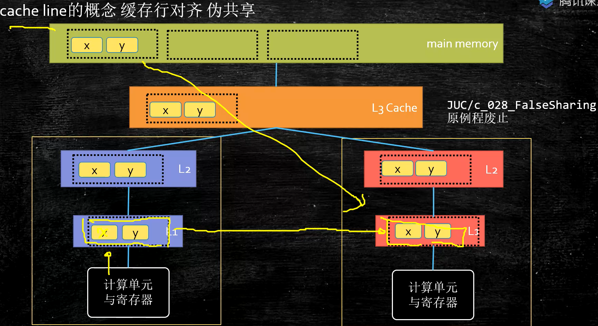
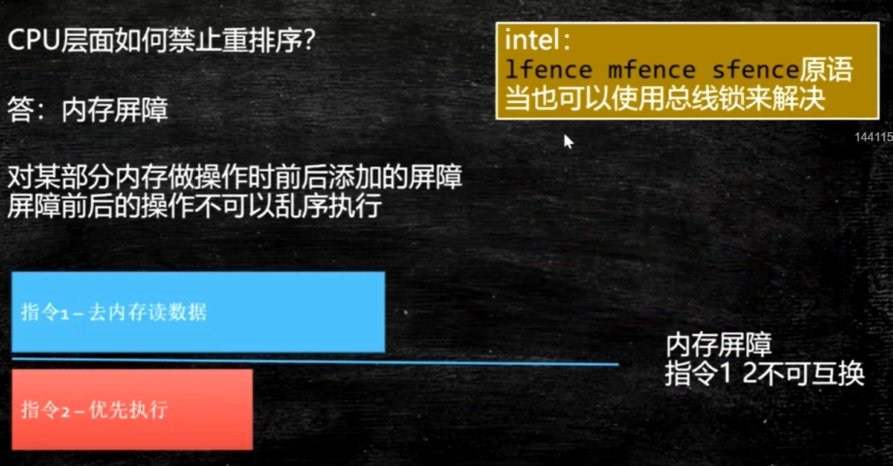
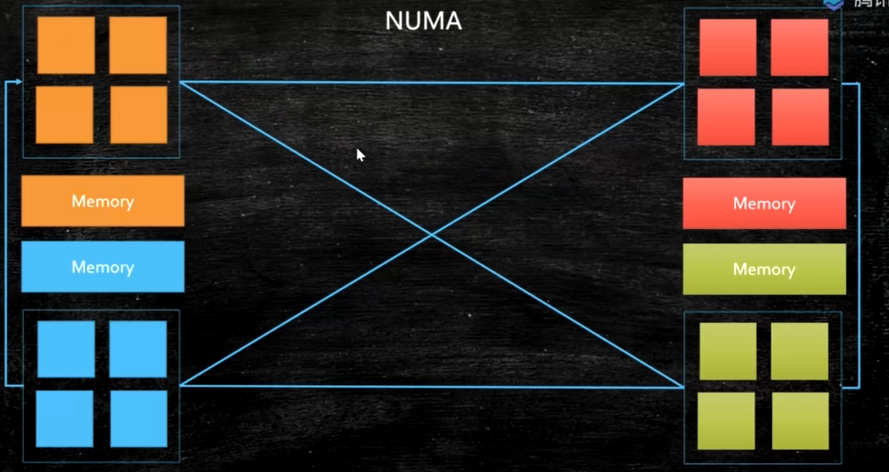
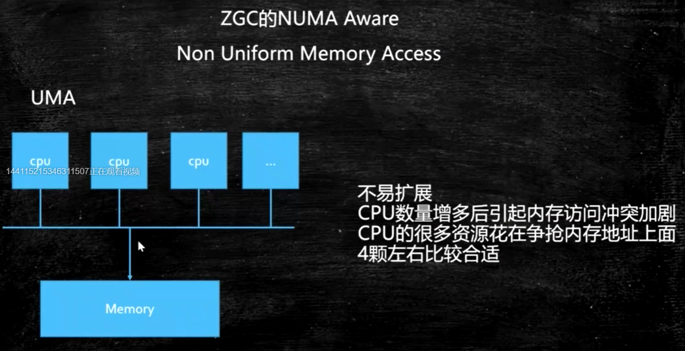
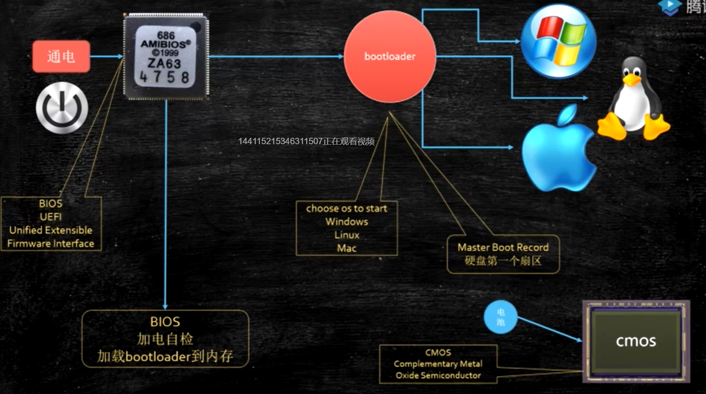

# 计算机底层知识

## 读书原则

不求甚解，观其大略

适度打开底层知识

​		你如果进到庐山里头，二话不说，蹲下头来，弯下腰，就对着某棵树某棵小草猛研究而不是说先把庐山的整体脉络跟那研究清楚了，那么你的学习方法肯定效率巨低而且特别痛苦，最重要的还是慢慢地还打击你的积极性，说我的学习怎么那么不happy啊，怎么那么特没劲那，因为你的学习方法错了，大体读明白，先拿来用，用着用着，很多道理你就明白了

▪《编码：隐匿在计算机软硬件背后的语言》

▪《深入理解计算机系统》

▪语言：C JAVA  K&R《C程序设计语言》《C Primer Plus》

▪ 数据结构与算法： -- 毕生的学习 leetCode

–《Java数据结构与算法》《算法》

–《算法导论》《计算机程序设计艺术》//难

▪操作系统：*Linux内核源码解析*  Linux内核设计与实现 30天自制操作系统

▪网络：机工《TCP/IP详解》卷一 翻译一般

▪编译原理：机工 龙书 《编译原理》 《编程语言实现模式》马语

▪数据库：SQLite源码 Derby - JDK自带数据库

## 汇编语言（机器语言）的执行过程

汇编语言的本质：机器语言的助记符 其实它就是机器语言

计算机通电 -> CPU读取内存中程序（电信号输入）

->时钟发生器不断震荡通断电 ->推动CPU内部一步一步执行

（执行多少步取决于指令需要的时钟周期）

->计算完成->写回（电信号）->写给显卡输出（sout，或者图形）

## 缓存

由于局部性原理，每次cpu从内存中**按快读取**，cpu内部的同步是以行为单位的，有可能两个寄存器读到的的数据不一致，所以就引入了**缓存一致性协议MESI**（因特尔的缓存一致性协议）

一致性协议：https://www.cnblogs.com/z00377750/p/9180644.html



有的数据缓存行装不下，这时候就要使用**锁总线**，整块总线被锁，其他cpu都不能访问内存。

使用条件：无法被缓存的数据，跨越多个缓存行的数据

**缓存行：**

缓存行越大，局部性空间效率越高，但读取时间慢

缓存行越小，局部性空间效率越低，但读取时间快

取一个折中值，目前多用：

64字节

**缓存行对齐**：对于有些特别敏感的数字，会存在线程高竞争的访问，为了保证不发生**伪共享**，可以使用缓存航对齐的编程方式

JDK7中，很多采用long padding（补齐）提高效率

JDK8，加入了@Contended注解（实验）需要加上：JVM -XX:-RestrictContended，此注解可可以保证两个数据不在同一缓存行

```java
package com.mashibing.juc.c_028_FalseSharing;

public class T03_CacheLinePadding {

    public static volatile long[] arr = new long[2];

    public static void main(String[] args) throws Exception {
        Thread t1 = new Thread(()->{
            for (long i = 0; i < 10000_0000L; i++) {
                arr[0] = i;
            }
        });

        Thread t2 = new Thread(()->{
            for (long i = 0; i < 10000_0000L; i++) {
                arr[1] = i;
            }
        });

        final long start = System.nanoTime();
        t1.start();
        t2.start();
        t1.join();
        t2.join();
        System.out.println((System.nanoTime() - start)/100_0000);
    }
}

```

```java
public class T04_CacheLinePadding {

    public static volatile long[] arr = new long[16];

    public static void main(String[] args) throws Exception {
        Thread t1 = new Thread(()->{
            for (long i = 0; i < 10000_0000L; i++) {
                arr[0] = i;
            }
        });

        Thread t2 = new Thread(()->{
            for (long i = 0; i < 10000_0000L; i++) {
                arr[8] = i;
            }
        });

        final long start = System.nanoTime();
        t1.start();
        t2.start();
        t1.join();
        t2.join();
        System.out.println((System.nanoTime() - start)/100_0000);
    }
}
```

## 乱序执行

https://preshing.com/20120515/memory-reordering-caught-in-the-act/

jvm/jmm/Disorder.java



### 禁止乱序

CPU层面：Intel -> 原语(mfence lfence sfence) 或者锁总线

JVM层级：8个hanppens-before原则（规定了不能进行指令重排序） 4个内存屏障 （LL LS SL SS）store load


as-if-serial : 不管硬件什么顺序，单线程执行的结果不变，看上去像是serial

## 合并写（不重要）

Write Combining Buffer

一般是4个字节

由于ALU速度太快，所以在写入L1的同时，写入一个WC Buffer，满了之后，再直接更新到L2

## NUMA

Non Uniform Memory Access

ZGC - NUMA aware 

分配内存会优先分配该线程所在CPU的最近内存





BIOS(Basic Input Output System) 

## 启动过程（不重要）

通电 -> bios uefi 工作 -> 自检 -> 到硬盘固定位置加载bootloader -> 读取可配置信息 -> CMOS



## 内核分类

微内核 - 弹性部署 5G IoT

宏内核 - PC phone

外核 - 科研 实验中 为应用定制操作系统 (多租户 request-based GC JVM)

## 用户态与内核态

cpu分不同的指令级别

linux内核跑在ring 0级， 用户程序跑在ring 3，对于系统的关键访问，需要经过kernel的同意，保证系统健壮性

内核执行的操作 - > 200多个系统调用 （对外暴露函数） sendfile read write pthread（创建线程） fork（创建进程） 

JVM -> 站在OS老大的角度，就是个普通程序

# 进程 线程 纤程 中断

面试高频：进程和线程有什么区别？

答案：进程就是一个程序运行起来的状态，线程是一个进程中的不同的执行路径。专业：进程是OS分配资源的基本单位，线程是执行调度的基本单位。分配资源最重要的是：独立的内存空间，线程调度执行（线程共享进程的内存空间，没有自己独立的内存空间）

进程：Linux中也成为task，是系统分配资源的基本单位

资源：独立的地址空间 内核数据结构（进程描述符...) 全局变量 数据段...

数据描述符：PCB（Process Control Block）Linux内部的数据结构，来描述一个进程、跟踪一个进程，大小不是固定的。

纤程：用户态的线程，线程中的线程，切换和调度不需要经过OS，JVM自己管理自己切换、调度

优势：

1：占有资源很少 OS : 平均消耗线程1M Fiber：平均消耗4K

2：切换比较简单 

3：启动很多个10W+

目前2020 3 22支持内置纤程的语言：Kotlin Scala Go Python(lib)... Java? （open jdk : loom）

目前是10000个Fiber -> 1个JVM线程，想办法提高效率，10000Fiber -> 10份 -> 10Threads

## 纤程的应用场景

纤程 vs 线程池：很短的计算任务，不需要和内核打交道，并发量高！

## 僵尸进程

父进程产生子进程后，会维护子进程的一个PCB结构，子进程退出，父进程释放，如果父进程没有释放，那么子进程会成为一个僵尸进程（只留PCB）。

## 孤儿进程

子进程结束前，父进程已经退出，子进程不能释放自己的PCB

孤儿进程会成为init进程的孩子，由1号进程维护

# 进程调度

2.6采用CFS调度策略：Completely Fair Scheduler

按优先级分配时间片的比例，记录每个进程的执行时间，如果有一个进程执行时间不到他应该分配的比例，优先执行

默认调度策略：

实时 （急诊） 优先级分高低 - FIFO (First In First Out)，优先级一样 - RR（Round Robin） 普通： CFS

# 中断

硬件跟操作系统内核打交道的一种机制

软中断（80中断） ==  系统调用

系统调用：int 0x80 或者 sysenter原语

通过ax寄存器填入调用号

参数通过bx cx dx si di传入内核

返回值通过ax返回

 

java读网络 – jvm read() – c库read() - > 

内核空间 -> system_call() （系统调用处理程序）

-> sys_read()

## ZGC

算法叫做：Colored Pointer

GC信息记录在指针上，不是记录在头部， immediate memory use

42位指针 寻址空间4T JDK13 -> 16T 目前为止最大16T 2^44

### CPU如何区分一个立即数 和 一条指令

总线内部分为：数据总线 地址总线 控制总线（看从哪条线过来）

地址总线目前：48位

颜色指针本质上包含了地址映射的概念

 