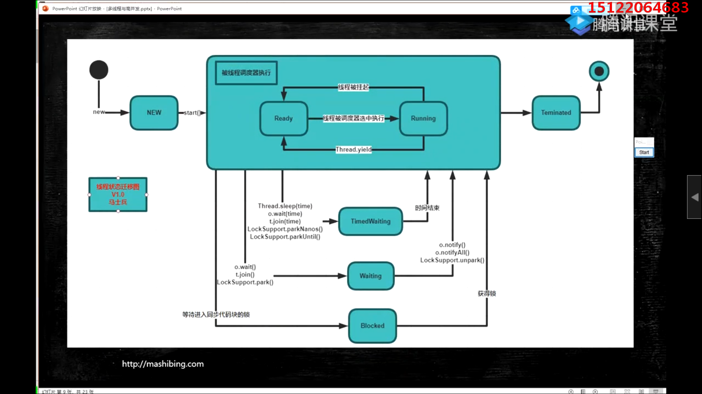
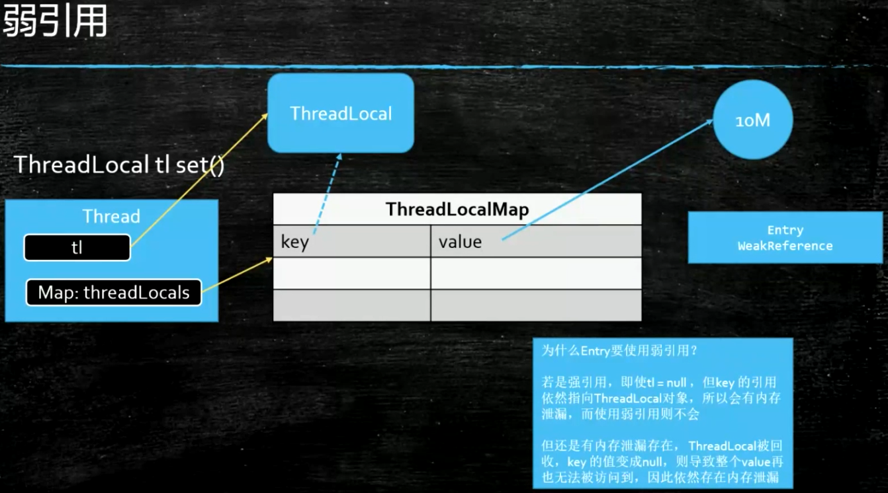
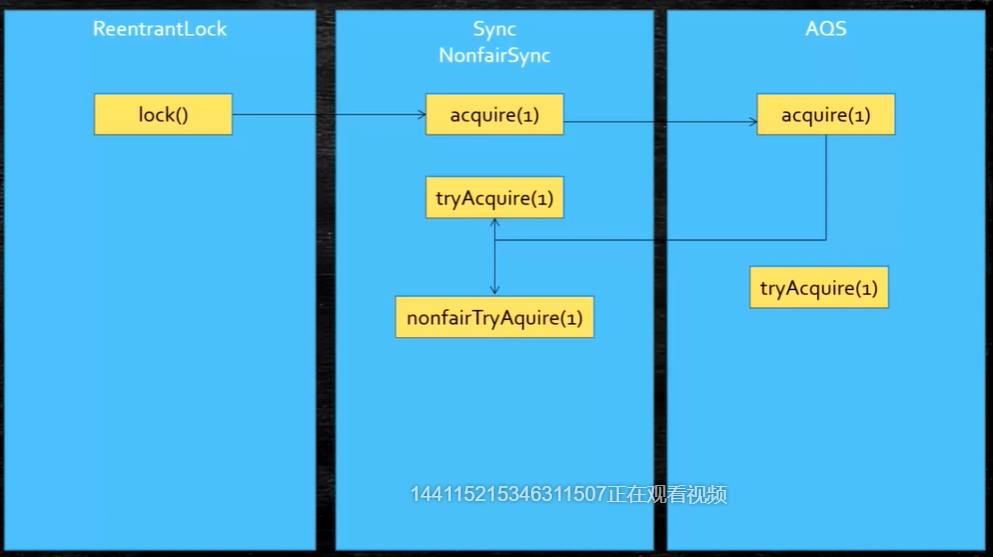
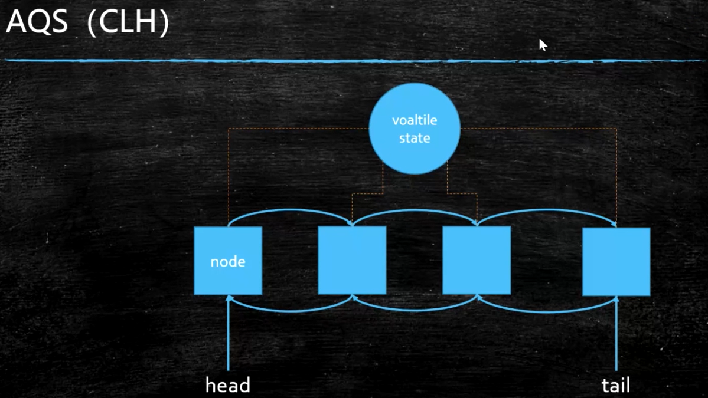
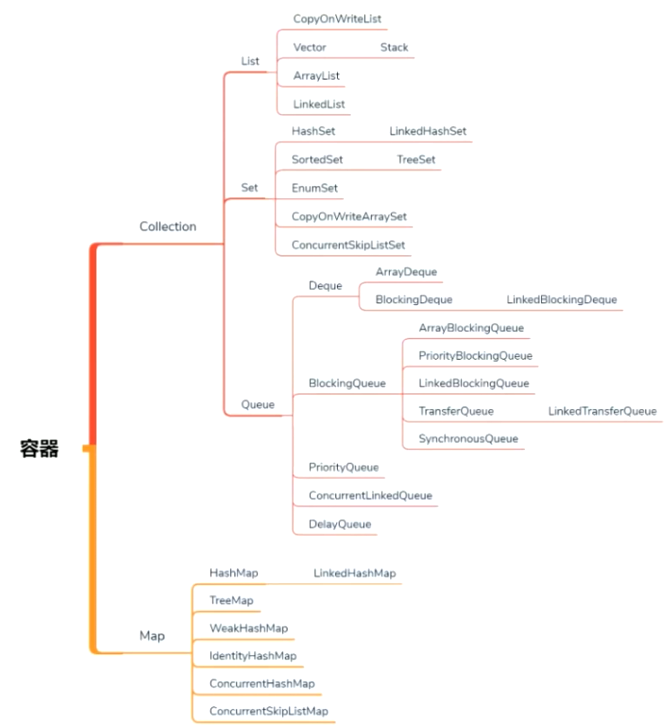
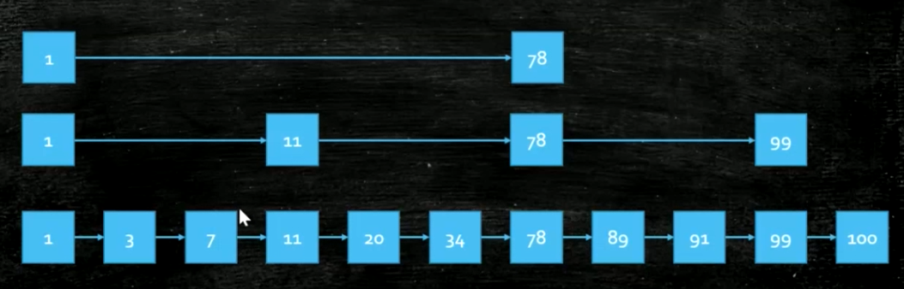
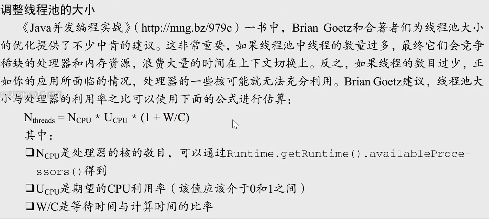
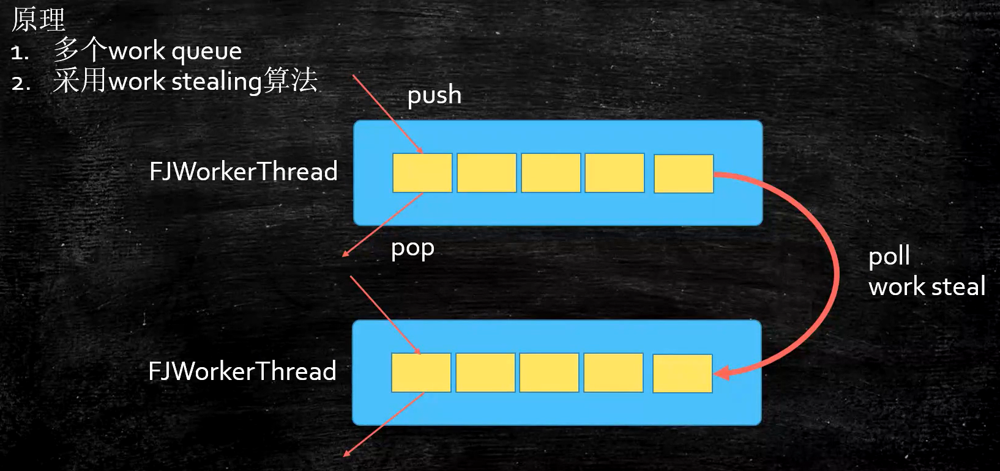

# 高并发与多线程


# 进程与线程

进程：一个在内存中运行的应用程序。

线程：一个程序中不同的执行路径。

## 进程与线程的区别		

**根本区别：**进程是操作系统资源分配的基本单位，而线程是处理器任务调度和执 行的基本单位 

**资源开销：**每个进程都有独立的代码和数据空间（程序上下文），程序之间的切 换会有较大的开销；线程可以看做轻量级的进程，同一类线程共享代码和数据空 间，每个线程都有自己独立的运行栈和程序计数器（PC），线程之间切换的开 销小。 

**包含关系：**如果一个进程内有多个线程，则执行过程不是一条线的，而是多条线 （线程）共同完成的；线程是进程的一部分，所以线程也被称为轻权进程或者轻 量级进程。 	 

**内存分配：**同一进程的线程共享本进程的地址空间和资源，而进程之间的地址空 间和资源是相互独立的 

**影响关系：**一个进程崩溃后，在保护模式下不会对其他进程产生影响，但是一个 线程崩溃整个进程都死掉。所以多进程要比多线程健壮。 

**执行过程：**每个独立的进程有程序运行的入口、顺序执行序列和程序出口。但是 线程不能独立执行，必须依存在应用程序中，由应用程序提供多个线程执行控 制，两者均可并发执行 

多个线程共享进程的**堆和方法区**的资源，每个线程有自己的**程序计数器和栈区**

​		程序计数器的作用：记录线程让出CPU的地址，待再次分到时间片后从自己私有的程序计数器知道那个地址继续执行

​		栈的作用：存储线程的局部变量，存放线程的调用栈帧

​				栈帧（stack frame）：是用于支持虚拟机进行**方法调用**和**方法执行**的数据结构，每个栈帧都包括了局部变量				表、操作数栈、动态连接和方法返回地址和其他附加信息

​		堆中主要存放对象实例，方法区用来存放JVM加载的类、常量和静态变量

## 面试题

**单核CPU设定多线程是否有意义？**

有意义，等待IO时不消耗CPU资源，让给别人来运行。

**工作线程数是不是越大越好？**

不是，线程之间的切换也是要消耗资源的，如果线程数特别大


## 启动线程的三种方式：

* Thread 

* Runnable 

* 拉姆达表达式

```java
public class T02_HowToCreateThread {
    static class MyThread extends Thread {
        @Override
        public void run() {
            System.out.println("Hello MyThread!");
        }
    }

    static class MyRun implements Runnable {
        @Override
        public void run() {
            System.out.println("Hello MyRun!");
        }
    }

    public static void main(String[] args) {
        new MyThread().start();
        new Thread(new MyRun()).start();
        
        new Thread(()->{
            System.out.println("Hello Lambda!");
        }).start();
    }

}
```

* newCachedThreadPool

  Java通过Executors提供四种线程池，分别为：
  	newCachedThreadPool创建一个可缓存线程池，如果线程池长度超过处理需要，可灵活回收空闲线程，若无可回收，则新建线程。
  	newFixedThreadPool 创建一个定长线程池，可控制线程最大并发数，超出的线程会在队列中等待。
  	newScheduledThreadPool 创建一个定长线程池，支持定时及周期性任务执行。
  	newSingleThreadExecutor 创建一个单线程化的线程池，它只会用唯一的工作线程来执行任务，保证所有任务按照指定顺序(FIFO, LIFO, 优先级)执行。

https://www.cnblogs.com/zhujiabin/p/5404771.html

```java
ExecutorService cachedThreadPool = Executors.newCachedThreadPool();
for (int i = 0; i < 10; i++) {
    final int index = i;
        try {
        	Thread.sleep(index * 1000);
        } catch (InterruptedException e) {
        	e.printStackTrace();
        }

    cachedThreadPool.execute(new Runnable() {
        @Override
        public void run() {
                System.out.println(index);
        }
    });
}
```

- ​	FutureTask（可以拿到返回值结果）

  ```java
  import java.util.concurrent.Callable;
  import java.util.concurrent.ExecutionException;
  import java.util.concurrent.FutureTask;
  
  public class CallerTask implements Callable {
      @Override
      public Object call() throws Exception {
          return "hello";
      }
  
      public static void main(String[] args) throws InterruptedException{
          FutureTask futureTask = new FutureTask<>(new CallerTask());
          //启动线程
          new Thread(futureTask).start();
          String result = null;
          try {
              result = (String) futureTask.get();
              System.out.println(result);
          } catch (ExecutionException e) {
              e.printStackTrace();
          }
      }
  }
  ```


## 线程让步（yield）和线程睡眠(sleep)区别

Thread.sleep：当前执行的线程**进入阻塞状态**，而其它任何优先级的线程都可以得到执行的机会，**即使系统中没有其它可执行的线程，处于sleep()的线程也不会执行**，sleep()是用来暂停线程的执行，sleep完会回到**就绪态**。


Thread.yield：当前执行线程**进入就绪状态**，yeild()只是让当前线程暂停一下，让系统的线程调度器重新调度一次，**完全可能的情况是：当某个线程调用了yield()线程暂停之后，线程调度器又将其调度出来重新执行。**
当某个线程调用了yield()方法暂停之后，只有优先级与当前线程相同，或者优先级比当前线程更高的处于就绪状态的线程才会获得执行机会。


### join方法

将t2线程加入到当前线程，等待t2执行完再执行t1，用来等待线程的执行结束

面试题：3个线程按顺序执行，主线程中T1调用T2join，T2调用T3join



```Java
 	    Thread thread=new Thread();
        System.out.println(thread.getState());//NEW
        thread.start();
        System.out.println(thread.getState());//RUNNABLE
            try {
                thread.join();
            } catch (InterruptedException e) {
                e.printStackTrace();
            }
        System.out.println(thread.getState());//TERMINATED
```

上下文切换：当前线程使用完时间片后，就会处于就绪态并且让出CPU让其他线程占用。

```java
public class T03_Sleep_Yield_Join {
    public static void main(String[] args) {
//        testSleep();
//        testYield();
        testJoin();
    }

    static void testSleep() {
        new Thread(()->{
            for(int i=0; i<100; i++) {
                System.out.println("A" + i);
                try {
                    Thread.sleep(500);
                    //TimeUnit.Milliseconds.sleep(500)
                } catch (InterruptedException e) {
                    e.printStackTrace();
                }
            }
        }).start();
    }

    static void testYield() {
        new Thread(()->{
            for(int i=0; i<100; i++) {
                System.out.println("A" + i);
                if(i%10 == 0) Thread.yield();


            }
        }).start();

        new Thread(()->{
            for(int i=0; i<100; i++) {
                System.out.println("------------B" + i);
                if(i%10 == 0) Thread.yield();
            }
        }).start();
    }

    static void testJoin() {
        Thread t1 = new Thread(()->{
            for(int i=0; i<100; i++) {
                System.out.println("A" + i);
                try {
                    Thread.sleep(500);
                    //TimeUnit.Milliseconds.sleep(500)
                } catch (InterruptedException e) {
                    e.printStackTrace();
                }
            }
        });

        Thread t2 = new Thread(()->{

            try {
                t1.join();
            } catch (InterruptedException e) {
                e.printStackTrace();
            }

            for(int i=0; i<100; i++) {
                System.out.println("A" + i);
                try {
                    Thread.sleep(500);
                    //TimeUnit.Milliseconds.sleep(500)
                } catch (InterruptedException e) {
                    e.printStackTrace();
                }
            }
        });

        t1.start();
        t2.start();
    }
}
```

## notify和wait

synchronized修饰的同步代码块或方法里面调用wait() 与 notify/notifyAll()方法

　当执行wait()时，线程会把持有的锁立即释放，线程加入lock的wait set 集合中，线程处于block状态，调用对应的notify或者notifyAll方法，线程处于runnable状态，竞争到锁和cpu时间就重新执行

notify（告诉其他线程来抢吧）不释放锁，wait会释放锁

1、wait()、notify/notifyAll() 方法是Object的本地final方法，无法被重写。

2、wait()使当前线程阻塞，前提是 必须先获得锁，一般配合synchronized 关键字使用，即，一般在synchronized 同步代码块里使用 wait()、notify/notifyAll() 方法。

3、 由于 wait()、notify/notifyAll() 在synchronized 代码块执行，说明当前线程一定是获取了锁的。

当线程执行wait()方法时候，会释放当前的锁，然后让出CPU，进入等待状态。

只有当 notify/notifyAll() 被执行时候，才会唤醒一个或多个正处于等待状态的线程，然后继续往下执行，直到执行完synchronized 代码块的代码或是中途遇到wait() ，再次释放锁。

也就是说，notify/notifyAll() 的执行只是唤醒沉睡的线程，而不会立即释放锁，锁的释放要看代码块的具体执行情况。所以在编程中，尽量在使用了notify/notifyAll() 后立即退出临界区，以唤醒其他线程让其获得锁

4、wait() 需要被try catch包围，以便发生异常中断也可以使wait等待的线程唤醒。

5、notify 和wait 的顺序不能错，如果A线程先执行notify方法，B线程在执行wait方法，那么B线程是无法被唤醒的。

6、notify 和 notifyAll的区别

notify方法只唤醒一个等待（对象的）线程并使该线程开始执行。所以如果有多个线程等待一个对象，这个方法只会唤醒其中一个线程，选择哪个线程取决于操作系统对多线程管理的实现。notifyAll 会唤醒所有等待(对象的)线程，尽管哪一个线程将会第一个处理取决于操作系统的实现。如果当前情况下有多个线程需要被唤醒，推荐使用notifyAll 方法。比如在生产者-消费者里面的使用，每次都需要唤醒所有的消费者或是生产者，以判断程序是否可以继续往下执行。

## 守护线程和用户线程

​		守护线程如垃圾回收线程，用户线程如main线程

​		最后一个非守护线程结束时，JVM会正常退出，不管守护线程有没有结束

​		thread.setDaemon(true)

​		如果希望主线程结束之后JVM立马退出，将子线程设置为守护线程，如果希望是主线程结束后子线程继续工作，等待子线程结束后JVM再退出，那么将子线程设置为用户线程

## ThreadLocal（ThreadLocalMap需进一步阅读源码）

​		ThreadLocal是JDK提供的线程本地变量，如果创建一个ThreadLocal变量，那么访问这个变量的每个线程都会有这个变量的一个本地副本。多线程情况下，操控的是自己本地存储的变量，从而避免了线程安全问题。

### ThreadLocal实现原理

​		Thread类中有一个threadLocals和inheritableThreadLoacls，他们都是ThreadLocalMap类型的变量（定制化的HashMap）。默认两个值都为null，每个线程的本地变量不存放在ThreadLocal中而是存放在threadLocals中，ThreadLocal只是一个工具壳，map结构可以使每个线程关联多个ThreadLocal（new 出来多个threadlocal 属于同一个线程）。

1.ThreadLocal的set方法

```java
public void set(T value) {
    Thread t = Thread.currentThread();
    ThreadLocalMap map = getMap(t);//拿到当前线程的 threadLocals
    if (map != null)
        //this是ThreadLocal的实例
        map.set(this, value);// this当前threadlocal实例，value变量值
    else
        createMap(t, value);
}
ThreadLocalMap getMap(Thread t) {
    return t.threadLocals;
}
void createMap(Thread t, T firstValue) {
    t.threadLocals = new ThreadLocalMap(this, firstValue);
}
ThreadLocalMap getMap(Thread t) {
    return t.threadLocals; //threadLocals在Thread类中定义为空
}
```

2.get（）

```java
public T get() {
    Thread t = Thread.currentThread();
    ThreadLocalMap map = getMap(t);//拿到当前线程的 threadLocals
    if (map != null) {
        //getEntry得到的是map中的一个kv对
        ThreadLocalMap.Entry e = map.getEntry(this);//Entry extends WeakReference弱引用
        if (e != null) {
            @SuppressWarnings("unchecked")
            T result = (T)e.value;
            return result;
        }
    }
    return setInitialValue();
}

/**
 * Variant of set() to establish initialValue. Used instead
 * of set() in case user has overridden the set() method.
 *
 * @return the initial value
 */
private T setInitialValue() {
    T value = initialValue();// return null
    Thread t = Thread.currentThread();
    ThreadLocalMap map = getMap(t);
    if (map != null)
        map.set(this, value);
    else
        createMap(t, value);
    return value;
}
```

### InheritableThreadLocal

​		同一个ThreadLocal变量在父线程设置值后在子线程中是获取不到的，InheritableThreadLocal可以让子线程访问父线程中设置的本地变量。

​		当父线程创建子线程时，构造函数会将父线程中的InheritableThreadLocals变量里面的本地变量复制一份保存到子线程的InheritableThreadLocals中。

### 用途

​		用在声明式事务，保证connection在一个事务中是同一个

### Java的四种引用（强软弱虚）

强引用：new 一个对象在堆中，当没有任何实例指向他时会被回收

软引用：当内存不够用时才进行回收，用作缓存

弱引用：只要gc就会回收，一般用在容器里

```java
 private void set(ThreadLocal<?> key, Object value) {
            Entry[] tab = table;
            int len = tab.length;
            int i = key.threadLocalHashCode & (len-1);

            for (Entry e = tab[i];
                 e != null;
                 e = tab[i = nextIndex(i, len)]) {
                ThreadLocal<?> k = e.get();

                if (k == key) {
                    e.value = value;
                    return;
                }

                if (k == null) {
                    replaceStaleEntry(key, value, i);
                    return;
                }
            }

            tab[i] = new Entry(key, value);
            int sz = ++size;
            if (!cleanSomeSlots(i, sz) && sz >= threshold)
                rehash();
        }
```

```java
public class T03_WeakReference {
    public static void main(String[] args) {
        WeakReference<M> m = new WeakReference<>(new M());

        System.out.println(m.get());
        System.gc();
        System.out.println(m.get());
        
        ThreadLocal<M> tl = new ThreadLocal<>();
        tl.set(new M());
        tl.remove();//不用了必须remove，不然会内存泄漏

    }
}
```



​		每一个线程都有一个map，map里是（threadLocal，值），调用set方法时会的会将threadLocalMap中的Key指向堆中threadLocal，如果tl的实例=null，threadLocalMap仍然强引用指向堆中的threadLocal，垃圾回收时threadLocal会有内存泄露

​		每次使用后仍自觉调用remove（），否则还会泄露如图文字

虚引用：值永远获取不到，写JVM，管理堆外内存，被回收时放在队列里一个值，告诉你被回收了

### ThreadLocal造成内存泄漏的原因？

ThreadLocalMap 中使用的 key 为 ThreadLocal 的弱引用,而 value 是强引用。所以，如果 ThreadLocal 没有被外部强引用的情况下，在垃圾回收的时候，key 会被清理掉，而 value 不会被清理掉。这样一来，ThreadLocalMap 中就会出现key 为null的Entry。假如我们不做任何措施的话，value 永远无法被GC 回收，这个时候就可能会产生内存泄露。ThreadLocalMap实现中已经考虑了这种情况，在调用 set()、get()、remove() 方法的时候，会清理掉 key 为 null 的记录。使用完 

ThreadLocal方法后  好手动调用remove()方法

### ThreadLocal内存泄漏解决方案？

- 每次使用完ThreadLocal，都调用它的remove()方法，清除数据。
- 在使用线程池的情况下，没有及时清理ThreadLocal，不仅是内存泄漏的问题，更严重的是可能导致业务逻辑出现问题。所以，使用ThreadLocal就跟加锁完要解锁一样，用完就清理。

# 锁的概念

​		a=0 两个线程同时访问a进行自加的操作，当第一个线程读到a=0，正准备进行+1操作时，第二个线程也去访问，发现a=0也进行+1的操作，第一个线程将结果写回a=1，第二个线程也将结果写回a=1，但是实际上a应该等于2，所以就需要加锁只有当第一个线程执行完写回的操作，才允许第二个线程进行访问。

​		**锁的对象可以时任意的不一定是要访问的那个值。**

## 悲观锁

​	   总是假设 坏的情况，每次去拿数据的时候都认为别人会修改，所以每次在拿数据的时候都会上锁，这样别人想拿这个数据就会阻塞直到它拿到锁。传统的关系型数据库里边就用到了很多这种锁机制，比如行锁，表锁等，读锁，写锁等，都是在做操作之前先上锁。再比如 Java 里面的同步原语 synchronized 关键字的实现也是悲观锁。

## 乐观锁

​		顾名思义，就是很乐观，每次去拿数据的时候都认为别人不会修改，所以不会上锁，但是在更新的时候会判断一下在此期间别人有没有去更新这个数据，可以使用版本号等机制。乐观锁适用于多读的应用类型，这样可以提高吞吐量，像数据库提供的类似于 write_condition 机制，其实都是提供的乐观锁。在 Java中 java.util.concurrent.atomic 包下面的原子变量类就是使用了乐观锁的一种实现方式 CAS 实现的。

## 公平锁和非公平锁

​		公平锁表示线程获取锁的顺序是按照线请求锁的时间早晚来决定的，非公平锁可以闯入。

​		ReentrantLock提供了非公平锁和公平锁

​		公平锁:  ReentrantLock pairLock = new ReentrantLock(**true**)

​		非公平锁:  ReentrantLock pairLock = new ReentrantLock(**false**)，不传参默认非公平

​		公平锁带来性能开销，能不用就不用

## 独占锁和共享锁

​		独占锁保证任何时候只有一个线程能得到锁，ReentrantLock是独占锁，**悲观锁**

​		共享锁可以同时由多个线程持有，ReadWhiteLock读写锁，**乐观锁**

## Synchronized关键字

​		不同虚拟机实现的方式不同，HotSpot在对象的头部的64位中拿出两位，记录该对象是否被锁定**（mark word可以深入了解）**两位的组合分别是不同锁的类型。

​		锁定当前对象

​		**synchronized(this){  }等同于直接在方法前加synchronized**

​		**synchronied修饰静态方法锁是加在类上，修饰非静态方法只是锁当前对象**

## Synchronized语义

​		进入sync块：把sync块内使用到的变量从线程的工作空间清除，使用变量时从主存中读取

​		退出sync块：把sync块内的共享变量写回到主存

​		替换成加锁和解锁的语义同理

​		

```java
public class Test implements Runnable{
    private int count=100;
    public static void main(String[] args) {
        Test test=new Test();
        for (int i = 0; i < 100; i++) {
            new Thread(test,"Thread"+i).start();
        }
    }

    @Override
    //synchronied关键字保证了输出结果的正确，如果不加有可能count--后还没来得及输出第二个线程又进入导致输出错误
    public synchronized void run() {
        count--;
        System.out.println(Thread.currentThread().getName()+"count = "+count);
    }
}
```


```java
/**
Thread-0 m1 start... 
Thread-1 m2 start...  m1没执行完m2可以输出说明同步方法和非同步方法可以同时调用
Thread-1 m2 end...
Thread-0 m1 end...
*/
public class Test implements Runnable{
    private int count=100;
    public static void main(String[] args) {
        Test test1=new Test();

        new Thread(()->test1.m1()).start();
        new Thread(()->test1.m2()).start();

    }

    public synchronized void m1(){
        System.out.println(Thread.currentThread().getName()+" m1 start...");
        try {
            Thread.sleep(10000);
        } catch (InterruptedException e) {
            e.printStackTrace();
        }
        System.out.println(Thread.currentThread().getName()+" m1 end...");
    }
    public  void m2(){
        System.out.println(Thread.currentThread().getName()+" m2 start...");

        try {
            Thread.sleep(5000);
        } catch (InterruptedException e) {
            e.printStackTrace();
        }
        System.out.println(Thread.currentThread().getName()+" m2 end...");
    }
    @Override
    public synchronized void run() {
    }
}
```

​		同步方法和非同步方法可以同时调用，调用非同步方法不需要拿到对象的锁。

​		写方法上加锁，读方法不加锁，写的时候可能会脏读（同步方法和非同步方法可以同时调用，还没有写入成功，另一个线程就开始读），需要两个方法都加锁，调用方法时必须等当前方法执行完后才能调用下一个方法，因为锁是在整个对象上。

```java
public class Account {
   String name;
   double balance;
   
   public synchronized void set(String name, double balance) {
      this.name = name;

      try {
         Thread.sleep(2000);
      } catch (InterruptedException e) {
         e.printStackTrace();
      }

      
      this.balance = balance;
   }
   
   public /*synchronized*/ double getBalance(String name) {
      return this.balance;
   }
   
   
   public static void main(String[] args) {
      Account a = new Account();
      new Thread(()->a.set("zhangsan", 100.0)).start();
      
      try {
         TimeUnit.SECONDS.sleep(1);
      } catch (InterruptedException e) {
         e.printStackTrace();
      }
      
      System.out.println(a.getBalance("zhangsan"));//0.0
      
      try {
         TimeUnit.SECONDS.sleep(2);
      } catch (InterruptedException e) {
         e.printStackTrace();
      }
      
      System.out.println(a.getBalance("zhangsan"));//100.0
   }
}
```

​		**锁的对象不能用String常量 Integer（包装类） Long（基础数据类型）**


## Synchronied 可重入

​		m1、m2都加synchronied，m1调用m2,由于是可重入锁，发现已经拿到相同的锁可以继续执行，否则就会产生死锁。

​		关联一个计数器默认值为0，表示当前没有任何线程占用，当线程获取了该锁时，计数器变成1，当该线程再次获取锁时+1，释放锁-1。为0时被阻塞的线程被唤醒回来竞争该锁。

​		父类方法m1 子类方法m1 都加syn 子类方法m1中调用super.m1,如果不可重入就会发生死锁。

```java
public class T {
   synchronized void m() {
      System.out.println("m start");
      try {
         TimeUnit.SECONDS.sleep(1);
      } catch (InterruptedException e) {
         e.printStackTrace();
      }
      System.out.println("m end");
   }
   
   public static void main(String[] args) {
      new TT().m();
   }
   
}

class TT extends T {
   @Override
   synchronized void m() {
      System.out.println("child m start");
      super.m();//锁的还是this TT
      System.out.println("child m end");
   }
}
```

​		**程序中如果出现异常，默认锁会被释放**

## Synchronied底层实现

JDK早期 重量级 -OS 需要找操作系统区申请锁，效率非常低。

后来的改进

（sync）锁升级的概念：无锁->偏向锁->自旋锁->系统锁

​		https://www.jianshu.com/p/b43b7bf5e052

​		https://www.jianshu.com/p/16c8b3707436

​		synchronied（Object）

​		markdown 记录这个线程的ID（偏向锁），默认只有一个对象访问，下次如果还是这个对象直接执行

​		如果有线程争用，就升级为**自旋锁**（默认旋转10次，占CPU在用户态不经历内核态，效率高过内核态），如果还得不到锁，升级为重量级锁，申请OS，进入等待队列，不占CPU进入等待，等待CPU调用。

​		**加锁的代码执行时间长，线程数多的用系统锁**

一个线程获得了锁执行时间很长，其他线程在那自旋受不了

​		**加锁的代码执行时间短且，线程不能太多，用自旋锁**

​		


# Volatite（可变的、易变的）

## 		保证线程可见性

​		--缓存一致性协议（MESI）

​		保证一个线程修改堆中的共享数据，另一个线程可以马上读到。

​		线程在写入变量时，直接写入主存。

## 		禁止指令重排序（CPU）

​		

```java
/**
 * 单例模式的双重检查
 * @author admin
 */
public class DoubleCheck {
    private static /*volatile*/ DoubleCheck INSTANCE;

    private DoubleCheck(){

    }

    public static DoubleCheck getInstance() {
        //业务逻辑代码省略
        if (INSTANCE == null) {
            //双重检查
            synchronized (DoubleCheck.class) {
                if (INSTANCE == null) {
                    try {
                        Thread.sleep(1);
                    } catch (InterruptedException e) {
                        e.printStackTrace();
                    }
                    INSTANCE = new DoubleCheck();
                }
            }

        }
        return INSTANCE;
    }

    public void  m(){
        System.out.println("m");
    }

    public static void main(String[] args) {
        for (int i = 0; i < 100; i++) {
            new Thread(()->{
                System.out.println(DoubleCheck.getInstance().hashCode());
            }).start();
        }
    }
}
```

new 对象的过程

1.申请内存 赋值默认值 

2.真正赋值

3.将栈中实例指向堆中对象

**该过程可能发生指令重排序**超高并发时有可能产生，if判断时还没有进行赋值（sleep（1）），第二个线程直接取到了没有赋值的数值，比如库存后果很严重，volatile禁止了指令重排序，syn只能保证原子性

**volatite不能替代synchronied，只能保证线程的可见性不能保证线程的原子性**

只在面试的时候用volatile，尽量别修饰引用类型，引用类型引用的值改变观察不到。


# CAS（Compare And Set/Swap 无锁优化 自旋 乐观锁）

java.util.concurrent.atomic 包中Atomic都是以CAS实现的

AtomicInteger类中的incrementAndGet（）方法 代替count++实现线程安全。

**cas(V,Expected,NewValue)**

​	if V==E --判断是否与期望值相同，没有其他线程进来改变，**CPU原语不会被打断**

​		V=NEW

​		else

​		执行失败或者更新期望值再试一次

​	

**ABA问题**

​		期望值被改变后又被改回来，不影响cas。

​		解决：

​				int类型不用管

​				其他类型需要加版本号，检查版本号


### Unsafe类（cas调用的类）

​		直接操作内存，相当于C++

​		Atomic比syn效率高，因为他不需要锁，不用申请系统调用

### LongAdder

​		用到了分段锁，超高并发有优势

### ReentrantLock vs synchronized

​		reentrantLock（需要手动解锁）可以替代sync（自动解锁）

​		reentrantLock可以进入不同的等待队列

​		底层是cas vs sync（四种锁的升级）

​		可以申请trylook尝试锁定

​		lockinterupptibly可以被打断加锁

​		可以进行公平锁和非公平锁的切换

### 公平锁和非公平锁

​		公平锁需要先检查等待队列有没有等待的线程（先来后到），非公平锁来了就抢锁

### AtomicInteger 

​		count++线程不安全改用	count.incrementAndGet(); 内部采用了CAS机制，无锁操作效率更高。

### CountDownLatch

​		门栓，等待线程结束后再开门

​		这N个子线程是并行执行的，每个子线程执行完后countDown()一次，state会CAS(Compare and Swap)减1。等到所有子线程都执行完后(即state=0)，会unpark()主调用线程，然后主调用线程就会从 await()函数返回，继续后余动作。

​		latch.await();拴住了	

​		latch.countDown();	自减操作，到0门开

### CyclicBarrier

​		循环栅栏，人满了才推到栅栏，人走了栅栏再起来

### Phaser

​		相当于不同阶段有不同的栅栏，按顺序执行

​		栅栏被推到时自动调用onAdvance方法

​		phaser.arriveAndAwaitAdance();//进入下一阶段

​		phaser.arriverAndDeregister();//不进入下一阶段

​		

### 读写锁ReadWriteLock（重点）

**ReadWriteLock 是什么**

首先明确一下，不是说 ReentrantLock 不好，只是 ReentrantLock 某些时候有局限。如果使用 ReentrantLock，可能本身是为了防止线程 A 在写数据、线程 B 在读数据造成的数据不一致，但这样，如果线程 C 在读数据、线程 D 也在读数据，读数据是不会改变数据的，没有必要加锁，但是还是加锁了，降低了程序的性能。因为这个，才诞生了读写锁 ReadWriteLock。

ReadWriteLock 是一个读写锁接口，读写锁是用来提升并发程序性能的锁分离

技术，ReentrantReadWriteLock 是 ReadWriteLock 接口的一个具体实现，实现了读写的分离，读锁是共享的，写锁是独占的，读和读之间不会互斥，读和写、写和读、写和写之间才会互斥，提升了读写的性能。

而读写锁有以下三个重要的特性：

（1）  公平选择性：支持非公平（默认）和公平的锁获取方式，吞吐量还是非公平优于公平。

（2）  重进入：读锁和写锁都支持线程重进入。

（3）  锁降级：遵循获取写锁、获取读锁再释放写锁的次序，写锁能够降级成为读锁。


### Semaphore

​		信号灯，亮的时候可以执行，不亮的时候不能执行

- 限流（车道收费站）

  aquire得到这把锁

​		Semaphore有一个构造函数，可以传入一个 int 型整数 n，表示某段代码 多只有 n 个线程可以访问，如果超出了 n，那么请等待，等到某个线程执行完毕这段代码块，下一个线程再进入。由此可以看出如果 Semaphore 构造函数中传入的 int 型整数 n=1，相当于变成了一个 synchronized 了。

Semaphore(信号量)-允许多个线程同时访问： synchronized 和 

ReentrantLock 都是一次只允许一个线程访问某个资源，Semaphore(信号量) 可以指定多个线程同时访问某个资源。

### Exchanger

​	Exchanger是一个用于线程间协作的工具类，用于两个线程间交换数据。它提供了一个交换的同步点，在这个同步点两个线程能够交换数据。交换数据是通过 exchange方法来实现的，如果一个线程先执行exchange方法，那么它会同步等待另一个线程也执行exchange方法，这个时候两个线程就都达到了同步点，两个线程就可以交换数据。

## LockSupport

```java
public class TestLockSupport {
    public static void main(String[] args) {
       Thread t= new Thread(()->{
           for (int i = 0; i <10 ; i++) {
               System.out.println(i);
               if (i==5){
                   LockSupport.park();
               }
               if (i==8){
                   LockSupport.park();
               }
               try {
                   TimeUnit.SECONDS.sleep(1);
               } catch (InterruptedException e) {
                   e.printStackTrace();
               }
           }
       });
       t.start();

       //预判你的park，可以解除停车一次，底层是Safe类的C++实现
       LockSupport.unpark(t);
        /*try {
            TimeUnit.SECONDS.sleep(8);
        } catch (InterruptedException e) {
            e.printStackTrace();
        }

        System.out.println("after 8 seconds!");

        LockSupport.unpark(t);*/
    }
}
```

## 面试题

```java
/**
 * 曾经的面试题：（淘宝？）
 * 实现一个容器，提供两个方法，add，size
 * 写两个线程，线程1添加10个元素到容器中，线程2实现监控元素的个数，当个数到5个时，线程2给出提示并结束
 * 
 * 分析下面这个程序，能完成这个功能吗？
 * @author m
 */

public class T01_WithoutVolatile {

   List lists = new ArrayList();

   public void add(Object o) {
      lists.add(o);
   }

   public int size() {
      return lists.size();
   }
   
   public static void main(String[] args) {
      T01_WithoutVolatile c = new T01_WithoutVolatile();

      new Thread(() -> {
         for(int i=0; i<10; i++) {
            c.add(new Object());
            System.out.println("add " + i);
            
            try {
               TimeUnit.SECONDS.sleep(1);
            } catch (InterruptedException e) {
               e.printStackTrace();
            }
         }
      }, "t1").start();
      
      new Thread(() -> {
         while(true) {
            if(c.size() == 5) {
               break;
            }
         }
         System.out.println("t2 结束");
      }, "t2").start();
   }
}
```

```java
public class T02_WithVolatile {

   //添加volatile，使t2能够得到通知
   //volatile List lists = new LinkedList(); 尽量不要修饰引用值，引用里面的值改变了观察不到
   volatile List lists = Collections.synchronizedList(new LinkedList<>());

   public void add(Object o) {
      lists.add(o);
   }

   public int size() {
      return lists.size();
   }

   public static void main(String[] args) {

      T02_WithVolatile c = new T02_WithVolatile();
      new Thread(() -> {
         for(int i=0; i<10; i++) {
            c.add(new Object());
            System.out.println("add " + i);
            
            /*try {
               TimeUnit.SECONDS.sleep(1);
            } catch (InterruptedException e) {
               e.printStackTrace();
            }*/
         }
      }, "t1").start();
      
      new Thread(() -> {
         while(true) {
            if(c.size() == 5) {
               break;
            }
         }
         System.out.println("t2 结束");
      }, "t2").start();
   }
}
```

使用wait () notify() 不行

```java
public class T03_NotifyHoldingLock { //wait notify

   //添加volatile，使t2能够得到通知
   volatile List lists = new ArrayList();

   public void add(Object o) {
      lists.add(o);
   }

   public int size() {
      return lists.size();
   }
   
   public static void main(String[] args) {
      T03_NotifyHoldingLock c = new T03_NotifyHoldingLock();
      
      final Object lock = new Object();
      
      new Thread(() -> {
         synchronized(lock) {
            System.out.println("t2启动");
            if(c.size() != 5) {
               try {
                  lock.wait();
               } catch (InterruptedException e) {
                  e.printStackTrace();
               }
            }
            System.out.println("t2 结束");
         }
         
      }, "t2").start();
      
      try {
         TimeUnit.SECONDS.sleep(1);
      } catch (InterruptedException e1) {
         e1.printStackTrace();
      }

      new Thread(() -> {
         System.out.println("t1启动");
         synchronized(lock) {
            for(int i=0; i<10; i++) {
               c.add(new Object());
               System.out.println("add " + i);
               
               if(c.size() == 5) {
                  lock.notify();//不释放锁
               }
               
               try {
                  TimeUnit.SECONDS.sleep(1);
               } catch (InterruptedException e) {
                  e.printStackTrace();
               }
            }
         }
      }, "t1").start();
      
      
   }
}
```

解决

```java
/**
 * 曾经的面试题：（淘宝？）
 * 实现一个容器，提供两个方法，add，size
 * 写两个线程，线程1添加10个元素到容器中，线程2实现监控元素的个数，当个数到5个时，线程2给出提示并结束
 * 
 * 给lists添加volatile之后，t2能够接到通知，但是，t2线程的死循环很浪费cpu，如果不用死循环，该怎么做呢？
 * 
 * 这里使用wait和notify做到，wait会释放锁，而notify不会释放锁
 * 需要注意的是，运用这种方法，必须要保证t2先执行，也就是首先让t2监听才可以
 * 
 * 阅读下面的程序，并分析输出结果
 * 可以读到输出结果并不是size=5时t2退出，而是t1结束时t2才接收到通知而退出
 * 想想这是为什么？
 * 
 * notify之后，t1必须释放锁，t2退出后，也必须notify，通知t1继续执行（z执行完了已经释放了锁）
 * 整个通信过程比较繁琐
 * @author mashibing
 */
package com.mashibing.juc.c_020_01_Interview;

import java.util.ArrayList;
import java.util.List;
import java.util.concurrent.TimeUnit;


public class T04_NotifyFreeLock {

   //添加volatile，使t2能够得到通知
   volatile List lists = new ArrayList();

   public void add(Object o) {
      lists.add(o);
   }

   public int size() {
      return lists.size();
   }
   
   public static void main(String[] args) {
      T04_NotifyFreeLock c = new T04_NotifyFreeLock();
      
      final Object lock = new Object();
      
      new Thread(() -> {
         synchronized(lock) {
            System.out.println("t2启动");
            if(c.size() != 5) {
               try {
                  lock.wait();
               } catch (InterruptedException e) {
                  e.printStackTrace();
               }
            }
            System.out.println("t2 结束");
            //通知t1继续执行
            lock.notify();
         }
         
      }, "t2").start();
      
      try {
         TimeUnit.SECONDS.sleep(1);
      } catch (InterruptedException e1) {
         e1.printStackTrace();
      }

      new Thread(() -> {
         System.out.println("t1启动");
         synchronized(lock) {
            for(int i=0; i<10; i++) {
               c.add(new Object());
               System.out.println("add " + i);
               
               if(c.size() == 5) {
                  lock.notify();
                  //释放锁，让t2得以执行
                  try {
                     lock.wait();
                  } catch (InterruptedException e) {
                     e.printStackTrace();
                  }
               }
               
               try {
                  TimeUnit.SECONDS.sleep(1);
               } catch (InterruptedException e) {
                  e.printStackTrace();
               }
            }
         }
      }, "t1").start();
      
      
   }
}
```

使用CountDownLatch

```java
/**
 * 曾经的面试题：（淘宝？）
 * 实现一个容器，提供两个方法，add，size
 * 写两个线程，线程1添加10个元素到容器中，线程2实现监控元素的个数，当个数到5个时，线程2给出提示并结束
 * 
 * 给lists添加volatile之后，t2能够接到通知，但是，t2线程的死循环很浪费cpu，如果不用死循环，该怎么做呢？
 * 
 * 这里使用wait和notify做到，wait会释放锁，而notify不会释放锁
 * 需要注意的是，运用这种方法，必须要保证t2先执行，也就是首先让t2监听才可以
 * 
 * 阅读下面的程序，并分析输出结果
 * 可以读到输出结果并不是size=5时t2退出，而是t1结束时t2才接收到通知而退出
 * 想想这是为什么？
 * 
 * notify之后，t1必须释放锁，t2退出后，也必须notify，通知t1继续执行
 * 整个通信过程比较繁琐
 * 
 * 使用Latch（门闩）替代wait notify来进行通知
 * 好处是通信方式简单，同时也可以指定等待时间
 * 使用await和countdown方法替代wait和notify
 * CountDownLatch不涉及锁定，当count的值为零时当前线程继续运行
 * 当不涉及同步，只是涉及线程通信的时候，用synchronized + wait/notify就显得太重了
 * 这时应该考虑countdownlatch/cyclicbarrier/semaphore
 * @author mashibing
 */
package com.mashibing.juc.c_020_01_Interview;

import java.util.ArrayList;
import java.util.List;
import java.util.concurrent.CountDownLatch;
import java.util.concurrent.TimeUnit;

public class T05_CountDownLatch {

   // 添加volatile，使t2能够得到通知
   volatile List lists = new ArrayList();

   public void add(Object o) {
      lists.add(o);
   }

   public int size() {
      return lists.size();
   }

   public static void main(String[] args) {
      T05_CountDownLatch c = new T05_CountDownLatch();

      CountDownLatch latch = new CountDownLatch(1);

      new Thread(() -> {
         System.out.println("t2启动");
         if (c.size() != 5) {
            try {
               latch.await();
               
               //也可以指定等待时间
               //latch.await(5000, TimeUnit.MILLISECONDS);
            } catch (InterruptedException e) {
               e.printStackTrace();
            }
         }
         System.out.println("t2 结束");

      }, "t2").start();

      try {
         TimeUnit.SECONDS.sleep(1);
      } catch (InterruptedException e1) {
         e1.printStackTrace();
      }

      new Thread(() -> {
         System.out.println("t1启动");
         for (int i = 0; i < 10; i++) {
            c.add(new Object());
            System.out.println("add " + i);

            if (c.size() == 5) {
               // 打开门闩，让t2得以执行
               latch.countDown();
            }

            /*try {
               TimeUnit.SECONDS.sleep(1);
            } catch (InterruptedException e) {
               e.printStackTrace();
            }*/
         }

      }, "t1").start();

   }
}
```

```java
/**
 * 曾经的面试题：（淘宝？）
 * 实现一个容器，提供两个方法，add，size
 * 写两个线程，线程1添加10个元素到容器中，线程2实现监控元素的个数，当个数到5个时，线程2给出提示并结束
 * 
 * 给lists添加volatile之后，t2能够接到通知，但是，t2线程的死循环很浪费cpu，如果不用死循环，该怎么做呢？
 * 
 * 这里使用wait和notify做到，wait会释放锁，而notify不会释放锁
 * 需要注意的是，运用这种方法，必须要保证t2先执行，也就是首先让t2监听才可以
 * 
 * 阅读下面的程序，并分析输出结果
 * 可以读到输出结果并不是size=5时t2退出，而是t1结束时t2才接收到通知而退出
 * 想想这是为什么？
 * 
 * notify之后，t1必须释放锁，t2退出后，也必须notify，通知t1继续执行
 * 整个通信过程比较繁琐
 * 
 * 使用Latch（门闩）替代wait notify来进行通知
 * 好处是通信方式简单，同时也可以指定等待时间
 * 使用await和countdown方法替代wait和notify
 * CountDownLatch不涉及锁定，当count的值为零时当前线程继续运行
 * 当不涉及同步，只是涉及线程通信的时候，用synchronized + wait/notify就显得太重了
 * 这时应该考虑countdownlatch/cyclicbarrier/semaphore
 * @author mashibing
 */
package com.mashibing.juc.c_020_01_Interview;

import java.util.ArrayList;
import java.util.List;
import java.util.concurrent.CountDownLatch;
import java.util.concurrent.TimeUnit;
import java.util.concurrent.locks.LockSupport;

//TODO park unpark

public class T06_LockSupport {

   // 添加volatile，使t2能够得到通知
   volatile List lists = new ArrayList();

   public void add(Object o) {
      lists.add(o);
   }

   public int size() {
      return lists.size();
   }

   public static void main(String[] args) {
      T06_LockSupport c = new T06_LockSupport();

      CountDownLatch latch = new CountDownLatch(1);

      Thread t2 = new Thread(() -> {
         System.out.println("t2启动");
         if (c.size() != 5) {

            LockSupport.park();

         }
         System.out.println("t2 结束");


      }, "t2");

      t2.start();

      try {
         TimeUnit.SECONDS.sleep(1);
      } catch (InterruptedException e1) {
         e1.printStackTrace();
      }

      new Thread(() -> {
         System.out.println("t1启动");
         for (int i = 0; i < 10; i++) {
            c.add(new Object());
            System.out.println("add " + i);

            if (c.size() == 5) {
               LockSupport.unpark(t2);
            }

            /*try {
               TimeUnit.SECONDS.sleep(1);
            } catch (InterruptedException e) {
               e.printStackTrace();
            }*/
         }

      }, "t1").start();

   }
}
```

```java
/**
 * 曾经的面试题：（淘宝？）
 * 实现一个容器，提供两个方法，add，size
 * 写两个线程，线程1添加10个元素到容器中，线程2实现监控元素的个数，当个数到5个时，线程2给出提示并结束
 * 
 * 给lists添加volatile之后，t2能够接到通知，但是，t2线程的死循环很浪费cpu，如果不用死循环，该怎么做呢？
 * 
 * 这里使用wait和notify做到，wait会释放锁，而notify不会释放锁
 * 需要注意的是，运用这种方法，必须要保证t2先执行，也就是首先让t2监听才可以
 * 
 * 阅读下面的程序，并分析输出结果
 * 可以读到输出结果并不是size=5时t2退出，而是t1结束时t2才接收到通知而退出
 * 想想这是为什么？
 * 
 * notify之后，t1必须释放锁，t2退出后，也必须notify，通知t1继续执行
 * 整个通信过程比较繁琐
 * 
 * 使用Latch（门闩）替代wait notify来进行通知
 * 好处是通信方式简单，同时也可以指定等待时间
 * 使用await和countdown方法替代wait和notify
 * CountDownLatch不涉及锁定，当count的值为零时当前线程继续运行
 * 当不涉及同步，只是涉及线程通信的时候，用synchronized + wait/notify就显得太重了
 * 这时应该考虑countdownlatch/cyclicbarrier/semaphore
 * @author mashibing
 */
package com.mashibing.juc.c_020_01_Interview;

import java.util.ArrayList;
import java.util.List;
import java.util.concurrent.CountDownLatch;
import java.util.concurrent.TimeUnit;
import java.util.concurrent.locks.LockSupport;

//TODO park unpark

public class T07_LockSupport_WithoutSleep {

   // 添加volatile，使t2能够得到通知
   volatile List lists = new ArrayList();

   public void add(Object o) {
      lists.add(o);
   }

   public int size() {
      return lists.size();
   }

   static Thread t1 = null, t2 = null;

   public static void main(String[] args) {
      T07_LockSupport_WithoutSleep c = new T07_LockSupport_WithoutSleep();

      t1 = new Thread(() -> {
         System.out.println("t1启动");
         for (int i = 0; i < 10; i++) {
            c.add(new Object());
            System.out.println("add " + i);

            if (c.size() == 5) {
               LockSupport.unpark(t2);
               LockSupport.park();
            }
         }
      }, "t1");

      t2 = new Thread(() -> {
         //System.out.println("t2启动");
         //if (c.size() != 5) {

            LockSupport.park();

         //}
         System.out.println("t2 结束");
         LockSupport.unpark(t1);


      }, "t2");

      t2.start();
      t1.start();


   }
}
```

```java
package com.mashibing.juc.c_020_01_Interview;

import java.util.ArrayList;
import java.util.List;
import java.util.concurrent.Semaphore;
import java.util.concurrent.locks.LockSupport;

public class T08_Semaphore {
    // 添加volatile，使t2能够得到通知
    volatile List lists = new ArrayList();

    public void add(Object o) {
        lists.add(o);
    }

    public int size() {
        return lists.size();
    }

    static Thread t1 = null, t2 = null;

    public static void main(String[] args) {
        T08_Semaphore c = new T08_Semaphore();
        Semaphore s = new Semaphore(1);

        t1 = new Thread(() -> {
            try {
                s.acquire();
                for (int i = 0; i < 5; i++) {
                    c.add(new Object());
                    System.out.println("add " + i);


                }
                s.release();
            } catch (InterruptedException e) {
                e.printStackTrace();
            }

            try {
                t2.start();
                t2.join();
            } catch (InterruptedException e) {
                e.printStackTrace();
            }

            try {
                s.acquire();
                for (int i = 5; i < 10; i++) {
                    System.out.println(i);
                }
                s.release();
            } catch (InterruptedException e) {
                e.printStackTrace();
            }

        }, "t1");

        t2 = new Thread(() -> {
            try {
                s.acquire();
                System.out.println("t2 结束");
                s.release();
            } catch (InterruptedException e) {
                e.printStackTrace();
            }
        }, "t2");

        //t2.start();
        t1.start();
    }
}
```

## 面试题2

背下来第二个

```java
/**
 * 面试题：写一个固定容量同步容器，拥有put和get方法，以及getCount方法，
 * 能够支持2个生产者线程以及10个消费者线程的阻塞调用
 * 
 * 使用wait和notify/notifyAll来实现
 * 
 * @author mashibing
 */
package com.mashibing.juc.c_021_01_interview;

import java.util.LinkedList;
import java.util.concurrent.TimeUnit;

public class MyContainer1<T> {
   final private LinkedList<T> lists = new LinkedList<>();
   final private int MAX = 10; //最多10个元素
   private int count = 0;
   
   
   public synchronized void put(T t) {
      while(lists.size() == MAX) { //想想为什么用while而不是用if？
         try {
            this.wait(); //effective java
         } catch (InterruptedException e) {
            e.printStackTrace();
         }
      }
      
      lists.add(t);
      ++count;
      this.notifyAll(); //通知消费者线程进行消费
   }
   
   public synchronized T get() {
      T t = null;
      while(lists.size() == 0) {
         try {
            this.wait();
         } catch (InterruptedException e) {
            e.printStackTrace();
         }
      }
      t = lists.removeFirst();
      count --;
      this.notifyAll(); //通知生产者进行生产
      return t;
   }
   
   public static void main(String[] args) {
      MyContainer1<String> c = new MyContainer1<>();
      //启动消费者线程
      for(int i=0; i<10; i++) {
         new Thread(()->{
            for(int j=0; j<5; j++) System.out.println(c.get());
         }, "c" + i).start();
      }
      
      try {
         TimeUnit.SECONDS.sleep(2);
      } catch (InterruptedException e) {
         e.printStackTrace();
      }
      
      //启动生产者线程
      for(int i=0; i<2; i++) {
         new Thread(()->{
            for(int j=0; j<25; j++) c.put(Thread.currentThread().getName() + " " + j);
         }, "p" + i).start();
      }
   }
}
```

```java
/**
 * 面试题：写一个固定容量同步容器，拥有put和get方法，以及getCount方法，
 * 能够支持2个生产者线程以及10个消费者线程的阻塞调用
 * 
 * 使用wait和notify/notifyAll来实现
 * 
 * 使用Lock和Condition来实现
 * 对比两种方式，Condition的方式可以更加精确的指定哪些线程被唤醒
 * 
 * @author mashibing
 */
package com.mashibing.juc.c_021_01_interview;

import java.util.LinkedList;
import java.util.concurrent.TimeUnit;
import java.util.concurrent.locks.Condition;
import java.util.concurrent.locks.Lock;
import java.util.concurrent.locks.ReentrantLock;

public class MyContainer2<T> {
   final private LinkedList<T> lists = new LinkedList<>();
   final private int MAX = 10; //最多10个元素
   private int count = 0;
   
   private Lock lock = new ReentrantLock();
   private Condition producer = lock.newCondition();//进入不同的等地啊队列
   private Condition consumer = lock.newCondition();
   
   public void put(T t) {
      try {
         lock.lock();
         while(lists.size() == MAX) { //想想为什么用while而不是用if？
            producer.await();
         }
         
         lists.add(t);
         ++count;
         consumer.signalAll(); //通知消费者线程进行消费
      } catch (InterruptedException e) {
         e.printStackTrace();
      } finally {
         lock.unlock();
      }
   }
   
   public T get() {
      T t = null;
      try {
         lock.lock();
         while(lists.size() == 0) {
            consumer.await();
         }
         t = lists.removeFirst();
         count --;
         producer.signalAll(); //通知生产者进行生产
      } catch (InterruptedException e) {
         e.printStackTrace();
      } finally {
         lock.unlock();
      }
      return t;
   }
   
   public static void main(String[] args) {
      MyContainer2<String> c = new MyContainer2<>();
      //启动消费者线程
      for(int i=0; i<10; i++) {
         new Thread(()->{
            for(int j=0; j<5; j++) System.out.println(c.get());
         }, "c" + i).start();
      }
      
      try {
         TimeUnit.SECONDS.sleep(2);
      } catch (InterruptedException e) {
         e.printStackTrace();
      }
      
      //启动生产者线程
      for(int i=0; i<2; i++) {
         new Thread(()->{
            for(int j=0; j<25; j++) c.put(Thread.currentThread().getName() + " " + j);
         }, "p" + i).start();
      }
   }
}
```

# 阅读源码的原则

跑不起来不读，存在多态子类好多实现相同方法

读源码先读骨架

解决问题就好 （不要都读）

一条线索到底

无关细节略过

一般不读静态

一般动态读法



自己画泳道图

插件plantUML

再画继承图

# AQS(AbstractQueuedSynchronizer)

## 原理



上边是state用了volatite

state=0代表没有上锁

下边是一个线程双向队列链表，入队出队用了CAS

双向链表的作用，入队的时候需要看前面节点的状态，如果被取消直接跳过该节点

## 获取锁的步骤

- 当一个线程发现state=0时，通过CAS操作获取锁，如果发现当前线程已经获取到这把锁，state++（重入）
- 当线程没有获得到这把锁时，把当前线程扔到等待队列里

```java
/**
 *	lock（）加锁过程
 */
ReentrantLock lock = new ReentrantLock("true");//公平锁true,sync=new FairSync()
lock.lock();
```

ReentrantLock 中有三个内部类，FairSync（公平锁）和NonfairSync 非公平锁）都继承于Sync，Sync又继承于AbstractQueuedSynchronizer

```java
/**
 * ReentrantLock 
 */
public void lock() {
    sync.lock();
}
```

```java
/**
 * ReentrantLock内部类
 */
 static final class FairSync extends Sync {
        private static final long serialVersionUID = -3000897897090466540L;

        final void lock() {
            acquire(1);
        }
```

```java
/**
  *	AbstractQueuedSynchronizer
  */
public final void acquire(int arg) {
    if (!tryAcquire(arg) &&
        acquireQueued(addWaiter(Node.EXCLUSIVE), arg))//没有获得锁进入等待队列（排他EXCLUSIVE）
        selfInterrupt();
}
```

```java
/**
  *	FairSync 
  */
protected final boolean tryAcquire(int acquires) {
    final Thread current = Thread.currentThread();
    int c = getState();// AbstractQueuedSynchronizer类中的 private volatile int state;
    if (c == 0) { //没人占用
        if (!hasQueuedPredecessors() && //队列里是否有等待的其他线程
            compareAndSetState(0, acquires)) {//CAS操作获取锁
            setExclusiveOwnerThread(current);//设当前线程占有这把锁
            return true;
        }
    }
    else if (current == getExclusiveOwnerThread()) {//当前线程已经获得这把锁了
        int nextc = c + acquires;
        if (nextc < 0)
            throw new Error("Maximum lock count exceeded");
        setState(nextc); //state++
        return true;
    }
    return false;
}
```

```Java
/**
 * Creates and enqueues node for current thread and given mode.
 * 没有获取到锁时
 * @param mode Node.EXCLUSIVE for exclusive, Node.SHARED for shared
 * @return the new node
 */
private Node addWaiter(Node mode) {
    Node node = new Node(Thread.currentThread(), mode);
    Node pred = tail;//记录当前线程的尾节点
    if (pred != null) {//不断循环判断，直到当前节点被加到队尾，
        node.prev = pred;//当前线程节点指向前一个节点
        if (compareAndSetTail(pred, node)) {//CAS操作防止好多线程同时加到队列尾，pred记录的队尾（期望值），现在的队尾是否和pred一样（没有被其他线程打断），CAS操作不用把整个队列上锁了效率高的原因
            pred.next = node;
            return node;
        }
    }
    enq(node);
    return node;
}
```

## 细节VarHandle（JDK1.9后）

C/C++实现，调用CPU原语，普通属性也能进行原子性操作，比反射快直接操作二进制码

```java
public class T01_HelloVarHandle {

    int x = 8;

    private static VarHandle handle;

    static {
        try {
            //handle指向x的内存地址=8
            handle = MethodHandles.lookup().findVarHandle(T01_HelloVarHandle.class, "x", int.class);
        } catch (NoSuchFieldException e) {
            e.printStackTrace();
        } catch (IllegalAccessException e) {
            e.printStackTrace();
        }
    }

    public static void main(String[] args) {
        T01_HelloVarHandle t = new T01_HelloVarHandle();

        //plain read / write
        System.out.println((int)handle.get(t));
        handle.set(t,9);
        System.out.println(t.x);

        handle.compareAndSet(t, 9, 10);//cas
        System.out.println(t.x);

        handle.getAndAdd(t, 10);//原子性操作
        System.out.println(t.x);

    }
}
```

# 容器



## 发展历程

### Vector和hashtable

早期只有Vector和hashtable自带锁，现在几乎都不使用有缺陷。hashtable所有方法都加了syn。

### hashMap

然后又有了hashMap把所有syn都去掉了。

### Collections.synchronizedMap

但是hashMap没有锁又想使用，sun公司又添加了一个类Collections，中有一个方法

```java
Collections.synchronizedMap（new HashMap);
```

然而，这个方法加锁又特别重，并没有比hashtable效率高多少

### ConcurrentHashMap

ConcurrentHashMap是Java中的一个线程安全且高效的HashMap实现。平时涉及高并发如果要用map结构，那第一时间想到的就是它。相对于hashmap来说，ConcurrentHashMap就是线程安全的map，其中利用了锁分段的思想提高了并发度。

那么它到底是如何实现线程安全的？

ConcurrentHashMap 中则是一次锁住一个桶。ConcurrentHashMap 默认将 hash 表分为 16 个桶，诸如 get，put，remove 等常用操作只锁当前需要用到的桶。

JDK 1.6版本关键要素：

-  segment继承了ReentrantLock充当锁的角色，为每一个segment提供了线程安全的保障；
-  segment维护了哈希散列表的若干个桶，每个桶由HashEntry构成的链表。

JDK1.8后，ConcurrentHashMap抛弃了原有的Segment 分段锁，而采用了 

CAS + synchronized 来保证并发安全性，同时加入了更多的辅助变量来提高并发度。

### TreeMap

是通过红黑树进行实现

### ConcurrentSkipListMap

没有ConcurrentTreeMap，因为CAS在树上太复杂，所以采用跳表来实现ConcurrentSkipListMap**高并发并且排序**。

**跳表**

在链表的基础上，加了好几层，每层存放关键元素，查询时从上往下传



### Queue

ArrayList线程不安全，Vector线程安全，但是在判断和操作之间还是有线程安全的问题，然后又有了Queue

BlockingQueue 接口是 Queue 的子接口，它的主要用途并不是作为容器，而是作为线程同步的的工具，因此他具有一个很明显的特性，当生产者线程试图向 BlockingQueue 放入元素时，如果队列已满，则线程被阻塞，当消费者线程试图从中取出一个元素时，如果队列为空，则该线程会被阻塞，正是因为它所具有这个特性，所以在程序中多个线程交替向 BlockingQueue 中放入元素，取出元素，它可以很好的控制线程之间的通信。

Queue中提供的多线程接口

offer（原来的add，加不进去会抛异常）会有返回值是否添加成功

peek取数据并不remove

poll取数据并且remove

### CopyOnWriteArrayList

写时复制，当需要往list中添加元素的时候，把里面的元素再复制一份。提高效率，因为读的时候不加锁，写的时候把array复制并扩展出一个新元素出来，然后把新添加的元素放到最后一位，把老的引用指向新的。（写的效率比较低）

适合读多写少的的场景

CopyOnWriteArrayList 的缺点

1. 由于写操作的时候，需要拷贝数组，会消耗内存，如果原数组的内容比较多的情况下，可能导致 young gc 或者 full gc。
2. 不能用于实时读的场景，像拷贝数组、新增元素都需要时间，所以调用一个 set 操作后，读取到数据可能还是旧的，虽然CopyOnWriteArrayList 能做到   终一致性,但是还是没法满足实时性要求。
3. 由于实际使用中可能没法保证 CopyOnWriteArrayList 到底要放置多少数据，万一数据稍微有点多，每次 add/set 都要重新复制数组，这个代价实在太高昂了。在高性能的互联网应用中，这种操作分分钟引起故障。

### BlockingQueue

阻塞队列有四种实现，LinkedBlockingQueue无界的，ArrayBlockingQueue有界的，DalayQueue实现在时间上的排序，SynchronusQueue用于两个线程之间传递任务。还有一种TransferQueue前面几种的组合

### LinkedBlockingQueue

链表实现，无界队列（没有设定队列大小）一直添加，增加了两个方法put和take

put一定要装，如果满了线程会阻塞直到可以装了

take一定要取，如果空了就阻塞知道有值了

### 面试题

Queue和List的区别 Queue添加了许多线程友好的api offer peek poll

### DalayQueue

按照等待的时间来进行排序，时间越短的越先输出

### SynchronusQueue

容量为0，不是用来装东西的，两个线程之间传递数据，当阻塞的时候有人等着拿才能往里装put方法，其实没有装只是传递给等等待的人  

### TransferQueue

添加了transfer方法，往队列里装，装完在这等着（阻塞）直到有人取走，put是满了才阻塞，这个是来了就阻塞。

使用场景：等待用户付款成功了才返回结果

### 面试题

```
//要求用线程顺序打印A1B2C3....Z26
```

```java
/Locksupport park 当前线程阻塞（停止）
//unpark(Thread t)

public class T02_00_LockSupport {


    static Thread t1 = null, t2 = null;

    public static void main(String[] args) throws Exception {
        char[] aI = "1234567".toCharArray();
        char[] aC = "ABCDEFG".toCharArray();

        t1 = new Thread(() -> {

                for(char c : aI) {
                    System.out.print(c);
                    LockSupport.unpark(t2); //叫醒T2
                    LockSupport.park(); //T1阻塞
                }

        }, "t1");

        t2 = new Thread(() -> {

            for(char c : aC) {
                LockSupport.park(); //t2阻塞
                System.out.print(c);
                LockSupport.unpark(t1); //叫醒t1
            }

        }, "t2");

        t1.start();
        t2.start();
    }
}
```

```java
public class T06_00_sync_wait_notify {
    public static void main(String[] args) {
        final Object o = new Object();

        char[] aI = "1234567".toCharArray();
        char[] aC = "ABCDEFG".toCharArray();

        new Thread(()->{
            synchronized (o) {
                for(char c : aI) {
                    System.out.print(c);
                    try {
                        o.notify();
                        o.wait(); //让出锁
                    } catch (InterruptedException e) {
                        e.printStackTrace();
                    }
                }

                o.notify(); //必须，否则无法停止程序
            }

        }, "t1").start();

        new Thread(()->{
            synchronized (o) {
                for(char c : aC) {
                    System.out.print(c);
                    try {
                        o.notify();
                        o.wait();
                    } catch (InterruptedException e) {
                        e.printStackTrace();
                    }
                }

                o.notify();
            }
        }, "t2").start();
    }
}

//如果我想保证t2在t1之前打印，也就是说保证首先输出的是A而不是1，这个时候该如何做？
```

```java
public class T08_00_lock_condition {

    public static void main(String[] args) {

        char[] aI = "1234567".toCharArray();
        char[] aC = "ABCDEFG".toCharArray();

        Lock lock = new ReentrantLock();
        Condition condition = lock.newCondition();

        new Thread(()->{
            try {
                lock.lock();

                for(char c : aI) {
                    System.out.print(c);
                    condition.signal();
                    condition.await();
                }

                condition.signal();

            } catch (Exception e) {
                e.printStackTrace();
            } finally {
                lock.unlock();
            }

        }, "t1").start();

        new Thread(()->{
            try {
                lock.lock();

                for(char c : aC) {
                    System.out.print(c);
                    condition.signal();
                    condition.await();
                }

                condition.signal();

            } catch (Exception e) {
                e.printStackTrace();
            } finally {
                lock.unlock();
            }

        }, "t2").start();
    }
}
```

```java
public class T03_00_cas {

    enum ReadyToRun {T1, T2}

    static volatile ReadyToRun r = ReadyToRun.T1; //思考为什么必须volatile

    public static void main(String[] args) {

        char[] aI = "1234567".toCharArray();
        char[] aC = "ABCDEFG".toCharArray();

        new Thread(() -> {

            for (char c : aI) {
                while (r != ReadyToRun.T1) {}
                System.out.print(c);
                r = ReadyToRun.T2;
            }

        }, "t1").start();

        new Thread(() -> {

            for (char c : aC) {
                while (r != ReadyToRun.T2) {}
                System.out.print(c);
                r = ReadyToRun.T1;
            }
        }, "t2").start();
    }
}
```

```java
public class T04_00_BlockingQueue {


    static BlockingQueue<String> q1 = new ArrayBlockingQueue(1);
    static BlockingQueue<String> q2 = new ArrayBlockingQueue(1);

    public static void main(String[] args) throws Exception {
        char[] aI = "1234567".toCharArray();
        char[] aC = "ABCDEFG".toCharArray();

        new Thread(() -> {

            for(char c : aI) {
                System.out.print(c);
                try {
                    q1.put("ok");
                    q2.take();
                } catch (InterruptedException e) {
                    e.printStackTrace();
                }
            }

        }, "t1").start();

        new Thread(() -> {

            for(char c : aC) {
                try {
                    q1.take();
                } catch (InterruptedException e) {
                    e.printStackTrace();
                }
                System.out.print(c);
                try {
                    q2.put("ok");
                } catch (InterruptedException e) {
                    e.printStackTrace();
                }
            }

        }, "t2").start();


    }
}
```

# 线程池

## Executor接口

```java
void execute(Runnable command);
```

命令和运行分开，运行的方式可以自己定义

## ExecutorService接口

```java
public interface ExecutorService extends Executor {
```

进行拓展

### Callable

call方法相当于runnable的run方法，但是有返回值

callable和future分离

```java
public class T03_Callable {
    public static void main(String[] args) throws ExecutionException, InterruptedException {
        Callable<String> c = new Callable() {
            @Override
            public String call() throws Exception {
                return "Hello Callable";
            }
        };

        ExecutorService service = Executors.newCachedThreadPool();
        Future<String> future = service.submit(c); //异步，交给线程池主线程该干嘛干嘛

        System.out.println(future.get());//阻塞，直到有结果才会返回

        service.shutdown();
    }

}
```

### Future

存储将来执行产生的结果

```java
public class T06_00_Future {
   public static void main(String[] args) throws InterruptedException, ExecutionException {
      
      FutureTask<Integer> task = new FutureTask<>(()->{//任务和结果封装到一起，实现了Runnable和Future
         TimeUnit.MILLISECONDS.sleep(500);
         return 1000;
      }); //new Callable () { Integer call();}
      
      new Thread(task).start();
      
      System.out.println(task.get()); //阻塞


   }
}
```

### FutureTask

Future+Runnable

### CompletableFuture

任务的管理者，可以使某个任务或全部任务完成后，去执行一系列操作

可以用拉姆达表达式的写法进行链式处理

## ThreadPoolExecutor

```java
public class ThreadPoolExecutor extends AbstractExecutorService 
```

线程池的执行器，往里面扔任务

### 线程池的7个参数（背）

corePoolSize核心线程数：永远活着

maxmunPoolSize最大线程数

keepAliveTime生存时间：如果一个线程长时间不干活，归还给操作系统

生存时间单位

任务队列：各种各样的BlockQueue

线程工厂：产生线程，可以自定义

拒绝策略：JDK四种，可以自定义

​	abort：抛异常

​	discard：扔掉不抛异常

​	discardOldest：扔掉排队时间最久的

​	callerRuns：调用者处理任务

### 线程池有什么优点？

- 降低资源消耗：重用存在的线程，减少对象创建销毁的开销。
- 提高响应速度。可有效的控制  大并发线程数，提高系统资源的使用率，同时避免过多资源竞争，避免堵塞。当任务到达时，任务可以不需要的等到线程创建就能立即执行。
- 提高线程的可管理性。线程是稀缺资源，如果无限制的创建，不仅会消耗系统资源，还会降低系统的稳定性，使用线程池可以进行统一的分配，调优和监控。
- 附加功能：提供定时执行、定期执行、单线程、并发数控制等功能。综上所述使用线程池框架 Executor 能更好的管理线程、提供系统资源使用率。

### 线程池都有哪些状态？

- RUNNING：这是   正常的状态，接受新的任务，处理等待队列中的任务。 SHUTDOWN：不接受新的任务提交，但是会继续处理等待队列中的任务。
- STOP：不接受新的任务提交，不再处理等待队列中的任务，中断正在执行任务的线程。
- ​          TIDYING：所有的任务都销毁了，workCount 为 0，线程池的状态在转换为 
- TIDYING 状态时，会执行钩子方法 terminated()。
- ​           TERMINATED：terminated()方法结束后，线程池的状态就会变成这个。

### Executors线程池工厂

（1）  newSingleThreadExecutor：创建一个单线程的线程池。这个线程池只有一个线程在工作，也就是相当于单线程串行执行所有任务。如果这个唯一的线程因为异常结束，那么会有一个新的线程来替代它。此线程池保证所有任务的执行顺序按照任务的提交顺序执行。

（2）  newFixedThreadPool：创建固定大小的线程池。每次提交一个任务就创建一个线程，直到线程达到线程池的大大小。线程池的大小一旦达到 大值就会保持不变，如果某个线程因为执行异常而结束，那么线程池会补充一个新线程。如果希望在服务器上使用线程池，建议使用 newFixedThreadPool方法来创建线程池，这样能获得更好的性能。

（3）  newCachedThreadPool：创建一个可缓存的线程池。如果线程池的大小超过了处理任务所需要的线程，那么就会回收部分空闲（60 秒不执行任务）的线程，当任务数增加时，此线程池又可以智能的添加新线程来处理任务。此线程池不会对线程池大小做限制，线程池大小完全依赖于操作系统（或者说 JVM）能够创建的 大线程大小。

（4）  newScheduledThreadPool：创建一个大小无限的线程池。此线程池支持定时以及周期性执行任务的需求。

```java
//为什么要有单线程线程池？
//有任务队列 生命周期管理 
ExecutorService service = Executors.newSingleThreadExecutor();//线程池只有一个线程
public static ExecutorService newSingleThreadExecutor() {
        return new FinalizableDelegatedExecutorService
            (new ThreadPoolExecutor(1, 1,
                                    0L, TimeUnit.MILLISECONDS,
                                    new LinkedBlockingQueue<Runnable>()));
    }
```

```java
ExecutorService service = Executors.newCachedThreadPool();//一般不用
  public static ExecutorService newCachedThreadPool() {
        return new ThreadPoolExecutor(0, Integer.MAX_VALUE,//没有核心线程，来一个起一个
                                      60L, TimeUnit.SECONDS,
                                      new SynchronousQueue<Runnable>());//来一个必须拿走
    }
```

```java
ExecutorService service = Executors.newFixedThreadPool(cpuCoreNum);
public static ExecutorService newFixedThreadPool(int nThreads) {
        return new ThreadPoolExecutor(nThreads, nThreads,
                                      0L, TimeUnit.MILLISECONDS,
                                      new LinkedBlockingQueue<Runnable>());
    }
```



### Cached vs Fixed

阿里都不用自己估算

```java
//定时执行，隔多长时间运行
ScheduledExecutorService service = Executors.newScheduledThreadPool(4);
  public ScheduledThreadPoolExecutor(int corePoolSize) {
        super(corePoolSize, Integer.MAX_VALUE, 0, NANOSECONDS,
              new DelayedWorkQueue());
    }
```

# ThreadPoolExecutor源码解析

### 1、常用变量的解释

```java
// 1. `ctl`，可以看做一个int类型的数字，高3位表示线程池状态，低29位表示worker数量
private final AtomicInteger ctl = new AtomicInteger(ctlOf(RUNNING, 0));
// 2. `COUNT_BITS`，`Integer.SIZE`为32，所以`COUNT_BITS`为29
private static final int COUNT_BITS = Integer.SIZE - 3;
// 3. `CAPACITY`，线程池允许的最大线程数。1左移29位，然后减1，即为 2^29 - 1
private static final int CAPACITY   = (1 << COUNT_BITS) - 1;

// runState is stored in the high-order bits
// 4. 线程池有5种状态，按大小排序如下：RUNNING < SHUTDOWN < STOP < TIDYING < TERMINATED
private static final int RUNNING    = -1 << COUNT_BITS;
private static final int SHUTDOWN   =  0 << COUNT_BITS;
private static final int STOP       =  1 << COUNT_BITS;
private static final int TIDYING    =  2 << COUNT_BITS;
private static final int TERMINATED =  3 << COUNT_BITS;

// Packing and unpacking ctl
// 5. `runStateOf()`，获取线程池状态，通过按位与操作，低29位将全部变成0
private static int runStateOf(int c)     { return c & ~CAPACITY; }
// 6. `workerCountOf()`，获取线程池worker数量，通过按位与操作，高3位将全部变成0
private static int workerCountOf(int c)  { return c & CAPACITY; }
// 7. `ctlOf()`，根据线程池状态和线程池worker数量，生成ctl值
private static int ctlOf(int rs, int wc) { return rs | wc; }

/*
 * Bit field accessors that don't require unpacking ctl.
 * These depend on the bit layout and on workerCount being never negative.
 */
// 8. `runStateLessThan()`，线程池状态小于xx
private static boolean runStateLessThan(int c, int s) {
    return c < s;
}
// 9. `runStateAtLeast()`，线程池状态大于等于xx
private static boolean runStateAtLeast(int c, int s) {
    return c >= s;
}
```

### 2、构造方法

```java
public ThreadPoolExecutor(int corePoolSize,
                          int maximumPoolSize,
                          long keepAliveTime,
                          TimeUnit unit,
                          BlockingQueue<Runnable> workQueue,
                          ThreadFactory threadFactory,
                          RejectedExecutionHandler handler) {
    // 基本类型参数校验
    if (corePoolSize < 0 ||
        maximumPoolSize <= 0 ||
        maximumPoolSize < corePoolSize ||
        keepAliveTime < 0)
        throw new IllegalArgumentException();
    // 空指针校验
    if (workQueue == null || threadFactory == null || handler == null)
        throw new NullPointerException();
    this.corePoolSize = corePoolSize;
    this.maximumPoolSize = maximumPoolSize;
    this.workQueue = workQueue;
    // 根据传入参数`unit`和`keepAliveTime`，将存活时间转换为纳秒存到变量`keepAliveTime `中
    this.keepAliveTime = unit.toNanos(keepAliveTime);
    this.threadFactory = threadFactory;
    this.handler = handler;
}
```

### 3、提交执行task的过程

```java
public void execute(Runnable command) {
    if (command == null)
        throw new NullPointerException();
    /*
     * Proceed in 3 steps:
     *
     * 1. If fewer than corePoolSize threads are running, try to
     * start a new thread with the given command as its first
     * task.  The call to addWorker atomically checks runState and
     * workerCount, and so prevents false alarms that would add
     * threads when it shouldn't, by returning false.
     *
     * 2. If a task can be successfully queued, then we still need
     * to double-check whether we should have added a thread
     * (because existing ones died since last checking) or that
     * the pool shut down since entry into this method. So we
     * recheck state and if necessary roll back the enqueuing if
     * stopped, or start a new thread if there are none.
     *
     * 3. If we cannot queue task, then we try to add a new
     * thread.  If it fails, we know we are shut down or saturated
     * and so reject the task.
     */
    int c = ctl.get();
    // worker数量比核心线程数小，直接创建worker执行任务
    if (workerCountOf(c) < corePoolSize) {
        if (addWorker(command, true))
            return;
        c = ctl.get();
    }
    // worker数量超过核心线程数，任务直接进入队列
    if (isRunning(c) && workQueue.offer(command)) {
        int recheck = ctl.get();
        // 线程池状态不是RUNNING状态，说明执行过shutdown命令，需要对新加入的任务执行reject()操作。
        // 这儿为什么需要recheck，是因为任务入队列前后，线程池的状态可能会发生变化。
        if (! isRunning(recheck) && remove(command))
            reject(command);
        // 这儿为什么需要判断0值，主要是在线程池构造方法中，核心线程数允许为0
        else if (workerCountOf(recheck) == 0)
            addWorker(null, false);
    }
    // 如果线程池不是运行状态，或者任务进入队列失败，则尝试创建worker执行任务。
    // 这儿有3点需要注意：
    // 1. 线程池不是运行状态时，addWorker内部会判断线程池状态
    // 2. addWorker第2个参数表示是否创建核心线程
    // 3. addWorker返回false，则说明任务执行失败，需要执行reject操作
    else if (!addWorker(command, false))
        reject(command);
}
```

### 4、addworker源码解析

```java
private boolean addWorker(Runnable firstTask, boolean core) {
    retry:
    // 外层自旋
    for (;;) {
        int c = ctl.get();
        int rs = runStateOf(c);

        // 这个条件写得比较难懂，我对其进行了调整，和下面的条件等价
        // (rs > SHUTDOWN) || 
        // (rs == SHUTDOWN && firstTask != null) || 
        // (rs == SHUTDOWN && workQueue.isEmpty())
        // 1. 线程池状态大于SHUTDOWN时，直接返回false
        // 2. 线程池状态等于SHUTDOWN，且firstTask不为null，直接返回false
        // 3. 线程池状态等于SHUTDOWN，且队列为空，直接返回false
        // Check if queue empty only if necessary.
        if (rs >= SHUTDOWN &&
            ! (rs == SHUTDOWN &&
               firstTask == null &&
               ! workQueue.isEmpty()))
            return false;

        // 内层自旋
        for (;;) {
            int wc = workerCountOf(c);
            // worker数量超过容量，直接返回false
            if (wc >= CAPACITY ||
                wc >= (core ? corePoolSize : maximumPoolSize))
                return false;
            // 使用CAS的方式增加worker数量。
            // 若增加成功，则直接跳出外层循环进入到第二部分
            if (compareAndIncrementWorkerCount(c))
                break retry;
            c = ctl.get();  // Re-read ctl
            // 线程池状态发生变化，对外层循环进行自旋
            if (runStateOf(c) != rs)
                continue retry;
            // 其他情况，直接内层循环进行自旋即可
            // else CAS failed due to workerCount change; retry inner loop
        } 
    }
    boolean workerStarted = false;
    boolean workerAdded = false;
    Worker w = null;
    try {
        w = new Worker(firstTask);
        final Thread t = w.thread;
        if (t != null) {
            final ReentrantLock mainLock = this.mainLock;
            // worker的添加必须是串行的，因此需要加锁
            mainLock.lock();
            try {
                // Recheck while holding lock.
                // Back out on ThreadFactory failure or if
                // shut down before lock acquired.
                // 这儿需要重新检查线程池状态
                int rs = runStateOf(ctl.get());

                if (rs < SHUTDOWN ||
                    (rs == SHUTDOWN && firstTask == null)) {
                    // worker已经调用过了start()方法，则不再创建worker
                    if (t.isAlive()) // precheck that t is startable
                        throw new IllegalThreadStateException();
                    // worker创建并添加到workers成功
                    workers.add(w);
                    // 更新`largestPoolSize`变量
                    int s = workers.size();
                    if (s > largestPoolSize)
                        largestPoolSize = s;
                    workerAdded = true;
                }
            } finally {
                mainLock.unlock();
            }
            // 启动worker线程
            if (workerAdded) {
                t.start();
                workerStarted = true;
            }
        }
    } finally {
        // worker线程启动失败，说明线程池状态发生了变化（关闭操作被执行），需要进行shutdown相关操作
        if (! workerStarted)
            addWorkerFailed(w);
    }
    return workerStarted;
}
```

### 5、线程池worker任务单元

```java
private final class Worker
    extends AbstractQueuedSynchronizer
    implements Runnable
{
    /**
     * This class will never be serialized, but we provide a
     * serialVersionUID to suppress a javac warning.
     */
    private static final long serialVersionUID = 6138294804551838833L;

    /** Thread this worker is running in.  Null if factory fails. */
    final Thread thread;
    /** Initial task to run.  Possibly null. */
    Runnable firstTask;
    /** Per-thread task counter */
    volatile long completedTasks;

    /**
     * Creates with given first task and thread from ThreadFactory.
     * @param firstTask the first task (null if none)
     */
    Worker(Runnable firstTask) {
        setState(-1); // inhibit interrupts until runWorker
        this.firstTask = firstTask;
        // 这儿是Worker的关键所在，使用了线程工厂创建了一个线程。传入的参数为当前worker
        this.thread = getThreadFactory().newThread(this);
    }

    /** Delegates main run loop to outer runWorker  */
    public void run() {
        runWorker(this);
    }

    // 省略代码...
}
```

### 6、核心线程执行逻辑-runworker

```java
final void runWorker(Worker w) {
    Thread wt = Thread.currentThread();
    Runnable task = w.firstTask;
    w.firstTask = null;
    // 调用unlock()是为了让外部可以中断
    w.unlock(); // allow interrupts
    // 这个变量用于判断是否进入过自旋（while循环）
    boolean completedAbruptly = true;
    try {
        // 这儿是自旋
        // 1. 如果firstTask不为null，则执行firstTask；
        // 2. 如果firstTask为null，则调用getTask()从队列获取任务。
        // 3. 阻塞队列的特性就是：当队列为空时，当前线程会被阻塞等待
        while (task != null || (task = getTask()) != null) {
            // 这儿对worker进行加锁，是为了达到下面的目的
            // 1. 降低锁范围，提升性能
            // 2. 保证每个worker执行的任务是串行的
            w.lock();
            // If pool is stopping, ensure thread is interrupted;
            // if not, ensure thread is not interrupted.  This
            // requires a recheck in second case to deal with
            // shutdownNow race while clearing interrupt
            // 如果线程池正在停止，则对当前线程进行中断操作
            if ((runStateAtLeast(ctl.get(), STOP) ||
                 (Thread.interrupted() &&
                  runStateAtLeast(ctl.get(), STOP))) &&
                !wt.isInterrupted())
                wt.interrupt();
            // 执行任务，且在执行前后通过`beforeExecute()`和`afterExecute()`来扩展其功能。
            // 这两个方法在当前类里面为空实现。
            try {
                beforeExecute(wt, task);
                Throwable thrown = null;
                try {
                    task.run();
                } catch (RuntimeException x) {
                    thrown = x; throw x;
                } catch (Error x) {
                    thrown = x; throw x;
                } catch (Throwable x) {
                    thrown = x; throw new Error(x);
                } finally {
                    afterExecute(task, thrown);
                }
            } finally {
                // 帮助gc
                task = null;
                // 已完成任务数加一 
                w.completedTasks++;
                w.unlock();
            }
        }
        completedAbruptly = false;
    } finally {
        // 自旋操作被退出，说明线程池正在结束
        processWorkerExit(w, completedAbruptly);
    }
}
```

## ForkJoinPool

分解、汇总任务，每个线程有自己的任务队列

CPU密集型

用很少的线程执行很多的任务

```java
//每一个线程都有自己单独的队列，当某一个线程执行完自己的任务后，就会去另一个队列偷，偷的时候要加锁
ExecutorService service = Executors.newWorkStealingPool();
 return new ForkJoinPool
            (Runtime.getRuntime().availableProcessors(),
             ForkJoinPool.defaultForkJoinWorkerThreadFactory,
             null, true);

```



# JMH

Java测试框架http://openjdk.java.net/projects/code-tools/jmh/

## 创建JMH测试

1. 创建Maven项目，添加依赖

   ```xml
   <?xml version="1.0" encoding="UTF-8"?>
   <project xmlns="http://maven.apache.org/POM/4.0.0"
            xmlns:xsi="http://www.w3.org/2001/XMLSchema-instance"
            xsi:schemaLocation="http://maven.apache.org/POM/4.0.0 http://maven.apache.org/xsd/maven-4.0.0.xsd">
       <modelVersion>4.0.0</modelVersion>
   
       <properties>
           <project.build.sourceEncoding>UTF-8</project.build.sourceEncoding>
           <encoding>UTF-8</encoding>
           <java.version>1.8</java.version>
           <maven.compiler.source>1.8</maven.compiler.source>
           <maven.compiler.target>1.8</maven.compiler.target>
       </properties>
   
       <groupId>mashibing.com</groupId>
       <artifactId>HelloJMH2</artifactId>
       <version>1.0-SNAPSHOT</version>
   
   
       <dependencies>
           <!-- https://mvnrepository.com/artifact/org.openjdk.jmh/jmh-core -->
           <dependency>
               <groupId>org.openjdk.jmh</groupId>
               <artifactId>jmh-core</artifactId>
               <version>1.21</version>
           </dependency>
   
           <!-- https://mvnrepository.com/artifact/org.openjdk.jmh/jmh-generator-annprocess -->
           <dependency>
               <groupId>org.openjdk.jmh</groupId>
               <artifactId>jmh-generator-annprocess</artifactId>
               <version>1.21</version>
               <scope>test</scope>
           </dependency>
       </dependencies>
   
   
   </project>
   ```

2. idea安装JMH插件 JMH plugin v1.0.3

3. 由于用到了注解，打开运行程序注解配置

   > compiler -> Annotation Processors -> Enable Annotation Processing

4. 定义需要测试类PS (ParallelStream)

   ```java
   package com.mashibing.jmh;
   
   import java.util.ArrayList;
   import java.util.List;
   import java.util.Random;
   
   public class PS {
   
   	static List<Integer> nums = new ArrayList<>();
   	static {
   		Random r = new Random();
   		for (int i = 0; i < 10000; i++) nums.add(1000000 + r.nextInt(1000000));
   	}
   
   	static void foreach() {
   		nums.forEach(v->isPrime(v));
   	}
   
   	static void parallel() {
   		nums.parallelStream().forEach(PS::isPrime);
   	}
   	
   	static boolean isPrime(int num) {
   		for(int i=2; i<=num/2; i++) {
   			if(num % i == 0) return false;
   		}
   		return true;
   	}
   }
   ```

5. 写单元测试

   > 这个测试类一定要在test package下面
   >
   > ```java
   > package com.mashibing.jmh;
   > 
   > import org.openjdk.jmh.annotations.Benchmark;
   > 
   > import static org.junit.jupiter.api.Assertions.*;
   > 
   > public class PSTest {
   >     @Benchmark
   >     public void testForEach() {
   >         PS.foreach();
   >     }
   > }
   > ```

6. 运行测试类，如果遇到下面的错误：

   ```java
   ERROR: org.openjdk.jmh.runner.RunnerException: ERROR: Exception while trying to acquire the JMH lock (C:\WINDOWS\/jmh.lock): C:\WINDOWS\jmh.lock (拒绝访问。), exiting. Use -Djmh.ignoreLock=true to forcefully continue.
   	at org.openjdk.jmh.runner.Runner.run(Runner.java:216)
   	at org.openjdk.jmh.Main.main(Main.java:71)
   ```

   这个错误是因为JMH运行需要访问系统的TMP目录，解决办法是：

   打开RunConfiguration -> Environment Variables -> include system environment viables

7. 阅读测试报告

## JMH中的基本概念

1. Warmup 预热，由于JVM中对于特定代码会存在优化（本地化），预热对于测试结果很重要
2. Mesurement 总共执行多少次测试
3. Timeout
4. Threads 线程数，由fork指定
5. Benchmark mode 基准测试的模式
6. Benchmark 测试哪一段代码

## Next

官方样例： http://hg.openjdk.java.net/code-tools/jmh/file/tip/jmh-samples/src/main/java/org/openjdk/jmh/samples/

# Disruptor

速度最快的MQ，性能极高，无锁CAS，单机支持高并发

## 介绍

主页：http://lmax-exchange.github.io/disruptor/

源码：https://github.com/LMAX-Exchange/disruptor

GettingStarted: https://github.com/LMAX-Exchange/disruptor/wiki/Getting-Started

api: http://lmax-exchange.github.io/disruptor/docs/index.html

maven: https://mvnrepository.com/artifact/com.lmax/disruptor

## Disruptor的特点

对比ConcurrentLinkedQueue : 链表实现

JDK中没有ConcurrentArrayQueue

Disruptor是数组实现的

无锁，高并发，使用环形Buffer，直接覆盖（不用清除）旧的数据，降低GC频率

实现了基于事件的生产者消费者模式（观察者模式）

## RingBuffer

环形队列

RingBuffer的序号，指向下一个可用的元素

采用数组实现，没有首尾指针

对比ConcurrentLinkedQueue，用数组实现的速度更快

> 假如长度为8，当添加到第12个元素的时候在哪个序号上呢？用12%8决定
>
> 当Buffer被填满的时候到底是覆盖还是等待，由Producer决定
>
> 长度设为2的n次幂，利于二进制计算，例如：12%8 = 12 & (8 - 1) pos = num & (size -1)

## Disruptor开发步骤

1. 定义Event - 队列中需要处理的元素

2. 定义Event工厂，用于填充队列

   > 这里牵扯到效率问题：disruptor初始化的时候，会调用Event工厂，对ringBuffer进行内存的提前分配
   >
   > GC产频率会降低

3. 定义EventHandler（消费者），处理容器中的元素

## 事件发布模板

```java
long sequence = ringBuffer.next();  // Grab the next sequence
try {
    LongEvent event = ringBuffer.get(sequence); // Get the entry in the Disruptor
    // for the sequence
    event.set(8888L);  // Fill with data
} finally {
    ringBuffer.publish(sequence);
}
```

## 使用EventTranslator发布事件

```java
//===============================================================
        EventTranslator<LongEvent> translator1 = new EventTranslator<LongEvent>() {
            @Override
            public void translateTo(LongEvent event, long sequence) {
                event.set(8888L);
            }
        };

        ringBuffer.publishEvent(translator1);

        //===============================================================
        EventTranslatorOneArg<LongEvent, Long> translator2 = new EventTranslatorOneArg<LongEvent, Long>() {
            @Override
            public void translateTo(LongEvent event, long sequence, Long l) {
                event.set(l);
            }
        };

        ringBuffer.publishEvent(translator2, 7777L);

        //===============================================================
        EventTranslatorTwoArg<LongEvent, Long, Long> translator3 = new EventTranslatorTwoArg<LongEvent, Long, Long>() {
            @Override
            public void translateTo(LongEvent event, long sequence, Long l1, Long l2) {
                event.set(l1 + l2);
            }
        };

        ringBuffer.publishEvent(translator3, 10000L, 10000L);

        //===============================================================
        EventTranslatorThreeArg<LongEvent, Long, Long, Long> translator4 = new EventTranslatorThreeArg<LongEvent, Long, Long, Long>() {
            @Override
            public void translateTo(LongEvent event, long sequence, Long l1, Long l2, Long l3) {
                event.set(l1 + l2 + l3);
            }
        };

        ringBuffer.publishEvent(translator4, 10000L, 10000L, 1000L);

        //===============================================================
        EventTranslatorVararg<LongEvent> translator5 = new EventTranslatorVararg<LongEvent>() {

            @Override
            public void translateTo(LongEvent event, long sequence, Object... objects) {
                long result = 0;
                for(Object o : objects) {
                    long l = (Long)o;
                    result += l;
                }
                event.set(result);
            }
        };

        ringBuffer.publishEvent(translator5, 10000L, 10000L, 10000L, 10000L);
```

## 使用Lamda表达式

```java
package com.mashibing.disruptor;

import com.lmax.disruptor.RingBuffer;
import com.lmax.disruptor.dsl.Disruptor;
import com.lmax.disruptor.util.DaemonThreadFactory;

public class Main03
{
    public static void main(String[] args) throws Exception
    {
        // Specify the size of the ring buffer, must be power of 2.
        int bufferSize = 1024;

        // Construct the Disruptor
        Disruptor<LongEvent> disruptor = new Disruptor<>(LongEvent::new, bufferSize, DaemonThreadFactory.INSTANCE);

        // Connect the handler
        disruptor.handleEventsWith((event, sequence, endOfBatch) -> System.out.println("Event: " + event));

        // Start the Disruptor, starts all threads running
        disruptor.start();

        // Get the ring buffer from the Disruptor to be used for publishing.
        RingBuffer<LongEvent> ringBuffer = disruptor.getRingBuffer();


        ringBuffer.publishEvent((event, sequence) -> event.set(10000L));

        System.in.read();
    }
}
```

## ProducerType生产者线程模式

> ProducerType有两种模式 Producer.MULTI和Producer.SINGLE
>
> 默认是MULTI，表示在多线程模式下产生sequence
>
> 如果确认是单线程生产者，那么可以指定SINGLE，效率会提升
>
> 如果是多个生产者（多线程），但模式指定为SINGLE，会出什么问题呢？

## 等待策略

1，(常用）BlockingWaitStrategy：通过线程阻塞的方式，等待生产者唤醒，被唤醒后，再循环检查依赖的sequence是否已经消费。

2，BusySpinWaitStrategy：线程一直自旋等待，可能比较耗cpu

3，LiteBlockingWaitStrategy：线程阻塞等待生产者唤醒，与BlockingWaitStrategy相比，区别在signalNeeded.getAndSet,如果两个线程同时访问一个访问waitfor,一个访问signalAll时，可以减少lock加锁次数.

4，LiteTimeoutBlockingWaitStrategy：与LiteBlockingWaitStrategy相比，设置了阻塞时间，超过时间后抛异常。

5，PhasedBackoffWaitStrategy：根据时间参数和传入的等待策略来决定使用哪种等待策略

6，TimeoutBlockingWaitStrategy：相对于BlockingWaitStrategy来说，设置了等待时间，超过后抛异常

7，（常用）YieldingWaitStrategy：尝试100次，然后Thread.yield()让出cpu

1. （常用）SleepingWaitStrategy : sleep

## 消费者异常处理

默认：disruptor.setDefaultExceptionHandler()

覆盖：disruptor.handleExceptionFor().with()

## 依赖处理